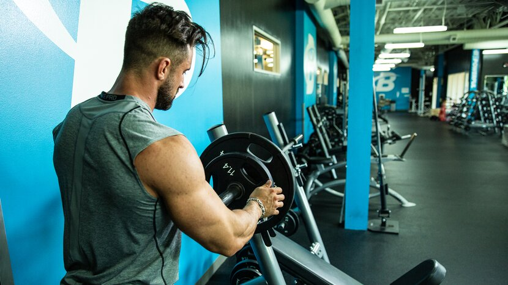
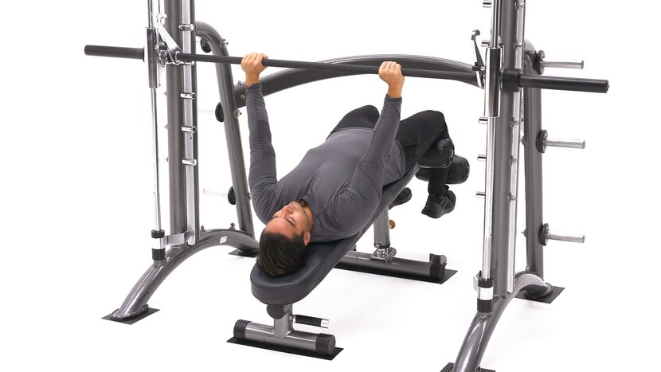
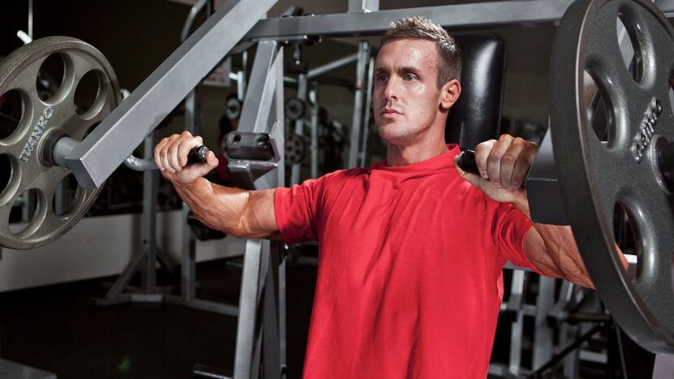
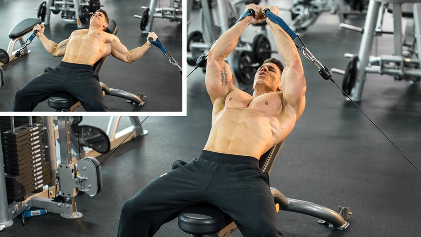
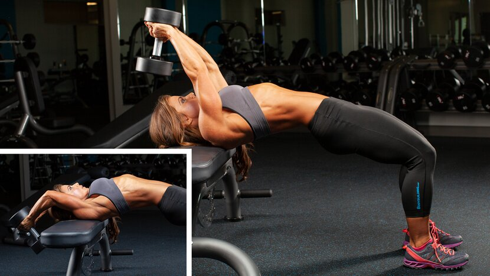
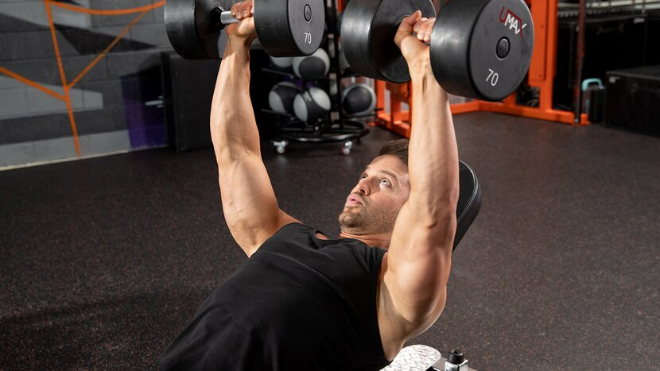
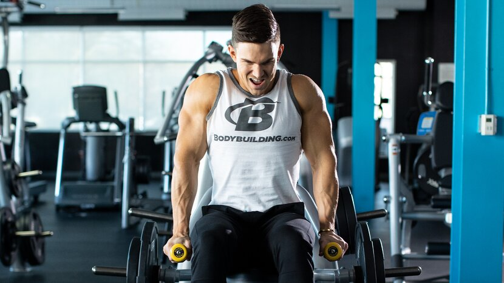

# 10 Best Chest Exercises for Building Muscle

---

**Chest | [Back](https://shop.bodybuilding.com/blogs/training/10-best-back-exercises-for-building-muscle) | [Shoulders](https://shop.bodybuilding.com/blogs/training/10-best-shoulder-exercises-for-building-muscle) | [Biceps](https://shop.bodybuilding.com/blogs/training/10-best-biceps-exercises-for-building-muscle) | [Triceps](https://shop.bodybuilding.com/blogs/training/10-best-triceps-exercises-for-building-muscle) | [Legs](https://shop.bodybuilding.com/blogs/training/3-moves-to-add-to-your-routine-to-improve-your-squat) | [Abs](https://shop.bodybuilding.com/blogs/training/10-best-ab-exercises-for-building-muscle)**

There are dozens of exercises you could do on chest day, but you probably don't want to spend your Monday—aka International Chest Day—doing them all. You just want to know the best exercises to build a muscular chest, so we've done the work to compare them for you.

Our choices are based on results in the lab, but also the weight room. Serious lifters know that measuring activation from electromyography (EMG) to pick the best muscle-building exercises is helpful, but far from perfect. So, we used a number of parameters, including:

* Ease of learning and performing
* Total muscle stimulation and intensity
* Popularity among diehard lifters and bodybuilders (This matters!)
* Availability of equipment in commercial gyms

Here are the best chest exercises for muscle growth, plus three complete chest workouts to put those movements into action. Along with growth-focused nutrition and supplementation, this can be your action plan for a bigger chest!

## 10 Best Chest Exercises

**[Barbell Bench Press](#barbell-bench-press) | [Dumbbell Bench Press](#dumbbell-bench-press) | [Incline Bench Press](#chest) | [Decline Press](#decline-press) |** **[Machine Chest Press](#seated-machine-press) | [Push-Up](#push-up) | [Dip](#chest-dip) | [Chest Fly](#cable-fly) | [Dumbbell Pull-Over](#pull-over) | [Machine Fly](#pec-deck-machine)**

### Barbell Bench Press

***Why it's on the list***: It's popular to hate on the bench press these days, but it's one of the most popular lifts in the gym for a reason. For one, the standard barbell bench allows you to move the most weight. It's also an easier lift to control than pressing with heavy dumbbells. The exercise is also relatively easy to spot—so don't be afraid to ask for one!

The bench press also responds well to classic protocols like 5x5 for muscle and strength, or even 10x10, aka German Volume Training, for pure mass. If you want to get serious, there are systematic bench press programs like Bench 300 to help you chase a big number.

**Barbell Bench Press Variations for Chest Growth:**

* Barbell bench press (medium, wide, or close grip)
* Barbell floor press
* Barbell bench press with chains
* Bench press with a neutral grip, "Swiss bar," or multi-grip bar
* Reverse-grip barbell bench press
* Barbell "guillotine" bench press
* Bench press with suspended weights
* Reverse band bench press

***In your workout:*** Bench toward the start of your chest workout for heavy sets in lower rep ranges, such as 5-8 reps. There are better moves for high-rep chest burnouts. Vary your grip width and style for more complete chest development.

### Dumbbell Bench Press

***Why it's on the list***: Whether dumbbell or barbell presses are better for growth is an age-old weight-room debate. Luckily, you can do both! But there's little doubt that the dumbbell variation has more versatility throughout the beginning, middle, and end of a chest workout.

Some other big plusses for dumbbells: Each side's musculature must work independently, creating more balanced strength and size. Dumbbells also allow a longer range of motion, which some studies say can lead to muscle growth. Plus, you can more easily tweak your grip to create variety and a new stimulus on chest day.

**Dumbbell Bench Press Variations for Chest Growth:**

* Dumbbell bench press
* Neutral-grip dumbbell bench press
* Close-grip dumbbell bench press
* Single-arm dumbbell bench press
* Alternating dumbbell bench press

***In your workout:*** At least some of the time, do flat dumbbell presses toward the start of your chest workout for heavy sets in lower rep ranges. They can also work well for high reps later in a chest workout, either flat or on an incline or decline.

***Here's what not to do:*** A few sets of the barbell bench press, then the same sets and reps for dumbbell. The similar nature of these movements was confirmed via EMG analysis, which demonstrated no significant differences between flat-bench dumbbell and barbell presses in regard to muscle activation.

### Incline Bench Press

***Why it's on the list***: Not only is the incline bench press a classic way to build the upper chest, many lifters find them to be a more comfortable "main lift" for the shoulders than flat benching. It's great with a barbell or multi-grip bar, but maybe be even better with dumbbells, since you can customize your grip to increase focus on the upper pecs.

**Pro tip**: Many benches are fixed at a very steep angle, which EMG results have shown works the front delts as much as the chest. If possible, go for a lower incline, such as 30 degrees, to focus squarely on the upper pecs.

Want to dial it in further? The same study suggests that bringing your grip in a bit closer helps to hammer the upper chest fibers significantly more.

**Incline Bench Press Variations for Chest Growth:**

* Barbell incline bench press (medium or close grip)
* Incline dumbbell bench press
* Smith Machine incline bench press
* Incline dumbbell bench with palms facing in
* Dumbbells-together incline bench press

***In your workout:*** As a primary lift, a few heavy sets of 6-8 can be your bread and butter. As a secondary lift, up it to 8-10. Many chest workouts start with flat-bench movements first, but every so often you should start with inclines, particularly if you're trying to bring up your upper chest.

### Decline Press

***Why it's on the list:*** The common thinking on decline is that it's for lower chest only. And while it is good for that, all-time greats, like six-time Mr. Olympia Dorian Yates in his 6-Week Blood and Guts program, favor it because it hits the entire chest and allows them to lift heavier and more comfortably than the flat bench.

If your gym has a comfortable decline press machine, like a plate-loaded hammer strength machine, use it. Along with the traditional double-arm press, you can sit sideways and press across your body one arm at a time. This unilateral chest move emphasizes shoulder adduction, one of the primary actions of the pec major.

**Decline Bench Press Variations for Chest Growth:**

* Decline barbell bench press
* Decline dumbbell bench press
* Decline Smith machine press
* Decline leverage press

***In your workout:*** Do free-weight presses early in your chest workout because they require more effort and stabilizer muscles than machines. A machine version could be the final heavy exercise in your workout before switching to lighter pump work.

### Machine Chest Press

***Why it's on the list:*** Free-weight pressing moves on a flat bench are great, but machine press and cable press variations have some unique benefits. For one, it's easier to slow down the repetition, both in the concentric and eccentric phases. Stack-loaded machines are also great for quickly doing dropsets.

Feel like a step down from free weights? It shouldn't. EMG research demonstrates that the machine bench press recruits the shoulders far less than free-weight variations. This allows you to really target your pecs.

**Machine Chest Press Variations for Chest Growth:**

* Machine chest press
* Plate-loaded chest press (flat, incline, decline)
* Cable chest press (seated, standing, lying)

***In your workout:*** Machine exercises make the most sense at the end of your workout for sets of at least 8-10 reps, plus dropsets or rest-pause sets if you can handle them. This is when you see if that pre-workout you've been taking can live up to its promises! Pump your pecs until they're seriously fatigued and finish your workout strong.

### Push-Up

***Why it's on the list:*** An obvious point in favor of push-ups is that they require no equipment and can be the centerpiece of a home chest workout, like in strength coach Paul Carter's program Jacked at Home: Bodyweight Muscle-Building Workouts. But they're also highly versatile, easy to adjust for range of motion, and can help strategically target different parts of your chest with a few simple tweaks to elevation or hand placement.

"Yeah, but they're just push-ups," you say. "They're definitely not enough to make you strong." Believe it or not, an in-depth analysis found that push-ups and bench presses are similar in both muscle activation and overall muscle gains. This doesn't mean push-ups should be all you do, but it means they definitely should have a place in your repertoire.

**Push-Up Variations for Chest Growth:**

* Push-up
* Feet-elevated push-up
* Hands-elevated push-up
* Suspended push-up
* Hand-release push-up
* Weighted push-up
* Banded push-up

***In your workout:*** Sets of push-ups to failure are a great way to burn out or add volume in the late stages of a workout, and they're awesome in a compound set with dips, a mechanical dropset after flyes or presses, or an antagonist chest-and-back superset with rows. Weighted push-ups and push-ups with resistance bands can even be a primary push movement, if needed.

### Dip

***Why it's on the list:*** Dips were a staple in the training programs of the golden-age greats for good reason: Nothing stretches the chest and makes it work quite like this bodyweight movement. You can add extra weight with a dip belt if you're seriously strong, or use band or machine assistance if you struggle with bodyweight reps. Plus, they are a great spotter-free alternative to the decline press.

All types of dips hit the chest heavily, but on chest day, it's worth making sure you're doing dips that emphasize the pecs. Put your feet up behind you, lean forward as far as possible, and allow your elbows to flare out slightly as you dip.

**Dip Variations for Chest Growth:**

* Chest dip
* Ring dip
* Machine-assisted dip
* Banded dip
* Machine dip

***In your workout:*** If you can do them for high reps, dips make a great finisher to a pro-level chest day. If you can't, you can do them earlier in your session in traditional strength- or muscle-building rep ranges, such as 6-8 or 8-10 reps. Dips also make a great superset pairing with push-ups for a big pump at the end of your workout.

### Chest Fly

***Why it's on the list**:* Looking for a way to isolate the pecs after your presses? It's time to fly. And when it comes to fly variations, you can't beat cables. They allow for continuous tension throughout the exercise's full range of motion, which is why they're a no-brainer on the list of 10 Best Muscle-Building Isolation Exercises.

Cable cross-overs are most lifters' go-to, and with good reason, but also consider trying a lying version on an incline bench. They're more stable than a standing press, allowing you to push further into fatigue. And if you're training with a partner, like in the BodyFit program Duel: 6-Week Partner-Based Muscle-Building Program, you can do a few dropsets for some real masochistic, muscle-building fun!

**Fly Variations for Chest Growth:**

* Incline cable fly
* Cable cross-over
* Low-cable cross-over
* Single-arm cable cross-over
* Dumbbell fly (flat, incline, decline)

***In your workout:***Do your flyes after your presses, either as your first isolation move, or as the final exercise in your workout. There's no need to go heavy! Stick to higher-rep sets, like 10-12 reps or slightly higher.

### Dumbbell Pull-Over

***Why it's on the list:*** Pull-overs have been a favorite torso builder of bodybuilders for decades. Dating back to the 1940s and earlier, lifters alternated them with 20-rep squats in workouts designed to expand the ribcage. The logic behind this approach may not stand up today, but the move is still worth including on a modern chest day.

Lean toward the incline version, which puts your chest fibers under tension for a longer range of motion. Use a bench that's 30-45 degrees and keep your elbows in a fixed comfortable angle. The more they bend and flex, the more this becomes a triceps movement.

**Pull-Over Variations for Chest Growth**

* Incline straight-arm pull-over
* Pull-over to press

***In your workout:*** Do pull-overs at the very end of your workout for sets of around 12 reps. On every set, hold the peak contraction of the last rep for a full 5 seconds.

### Machine Fly

***Why it's on the list:*** For the majority of lifters, the machine chest fly (aka, pec-deck) is a more effective, harder-to-screw-up alternative to dumbbell flyes. If your gym has one, it's a great move to get a great pump without having to balance any weights or put your shoulders at risk.

But does it work? EMG data shows that activation of the pectoralis major is statistically similar between the machine fly and bench press, which means that even though you'll likely be working in different rep ranges for each exercise, both are worthy components to chest day. The big difference? For the machine, you don't need a spotter and can more safely push the intensity and reach true muscle failure.

***In your workout******:*** As a pre-exhaust, hit a few sets of 10-15 before your presses.As a burnout, hit the machine fly last in your routine for sets of around 10-12. Experiment with dropsets, partial reps, and other intensity boosters. Don't be afraid to take this movement to failure, and know that you've earned your post-workout protein shake.

## Best Chest Workouts

* Hard and Heavy Chest Workout
* Workout to Build Your Upper Chest
* Machine Pump Chest Workout

### Hard and Heavy Chest Workout

If you're someone who celebrates International Chest Day each Monday like clockwork, this is for you. It's focused on heavy compound presses, but finishes with high-rep dips. Have anything left in the tank? Hit your triceps next.

**1. Barbell Bench Press - Medium Grip**

4 sets, 6-8 reps (rest 2 min. )

**2. Incline dumbbell bench press**

3 sets, 8-10 reps (rest 90 sec. )

**3. Cable cross-over**

3 sets, 10-12 reps (rest 1 min. )

**4. Chest dip**

If you can't perform at least 8 reps with bodyweight, perform band-assisted or machine-assisted reps.

3 sets, 12-15 reps (rest 90 sec. )

### Workout to Build Your Upper Chest

Want to build your shelf? This is your workout. It's great on its own, but is also an ideal approach if you like to do two chest days a week. That's the approach taken in the popular program 30-Day Chest with Abel Albonetti.

**1. Incline dumbbell bench press**

4 sets, 6-8 reps (rest 2 min. )

**2. Compound Set**

Perform the movements in order, resting as little as possible between movements and 90 sec. between sets.

**Incline cable chest fly**

3 sets, 10-12 reps (no rest)

**Decline Push-Up**

3 sets, 10-15 reps (rest 90 sec.)

**3. Incline Straight-Arm Pull-Over**

4 sets, 12 reps (rest 1 min.)

### Machine Pump Chest Workout

No bench press? No problem. This high-rep, short-rest workout will allow you to move solid weights and chase failure. Feel free to mix in some dropsets and leave the gym with that shirt feeling tight!

**1. Smith Machine Incline Bench Press**

3 sets, 10-12 reps (rest 90 sec.)

**2. Machine chest press**

At the end of the final set, perform a single dropset.

3 sets, 10-12 reps (rest 1 min.)

**3. Dip Machine**

At the end of the final set, perform a single dropset.

3 sets, 10-12 reps (rest 1 min.)

**4. Pec Deck Fly**

At the end of the final two sets, perform a single dropset.

3 sets, 12 reps (rest 1 min.)