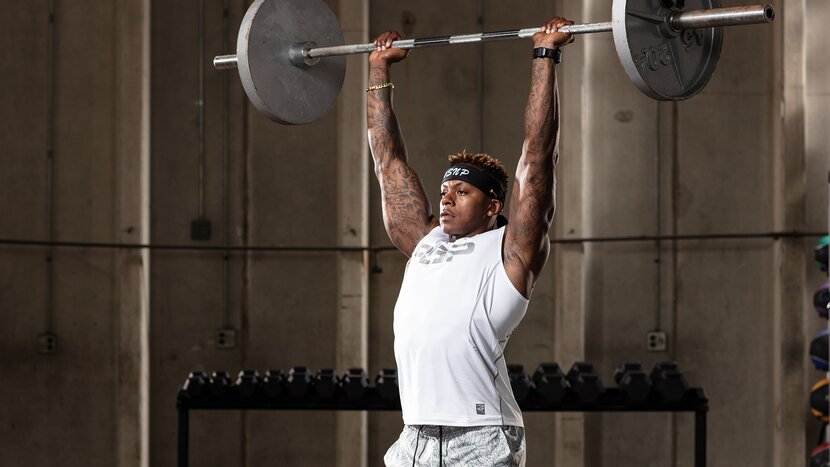
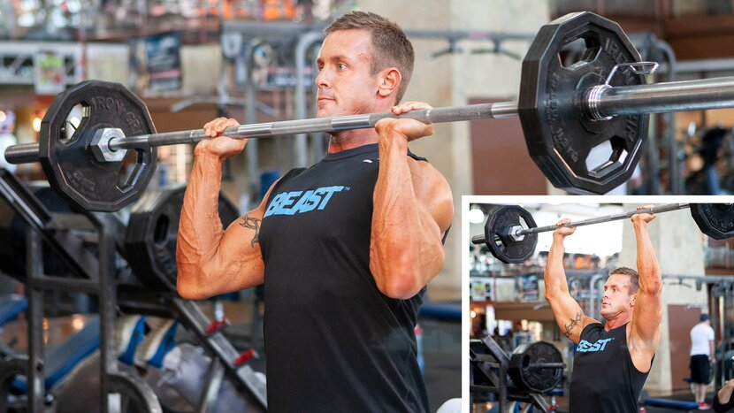
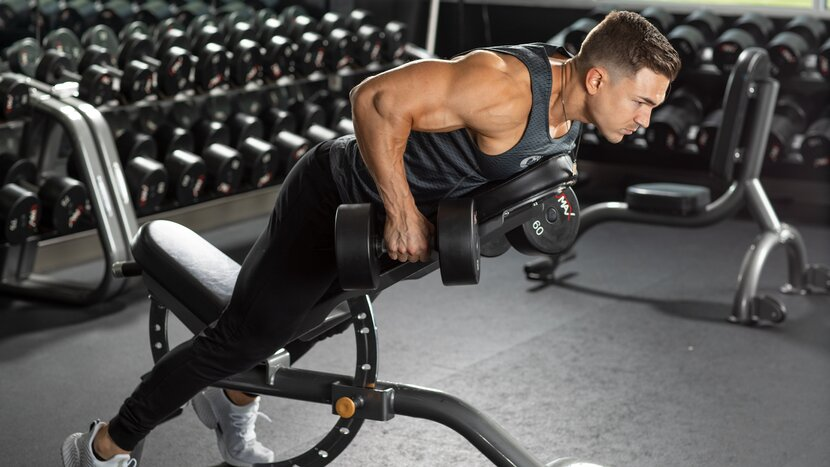
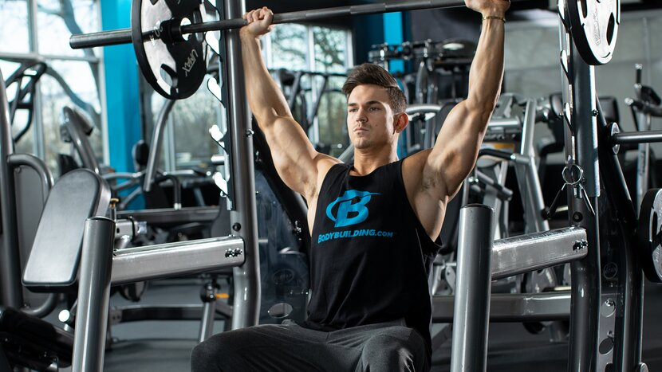
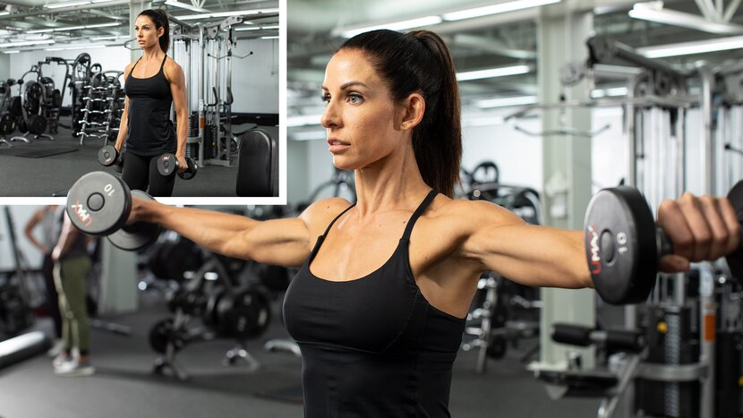
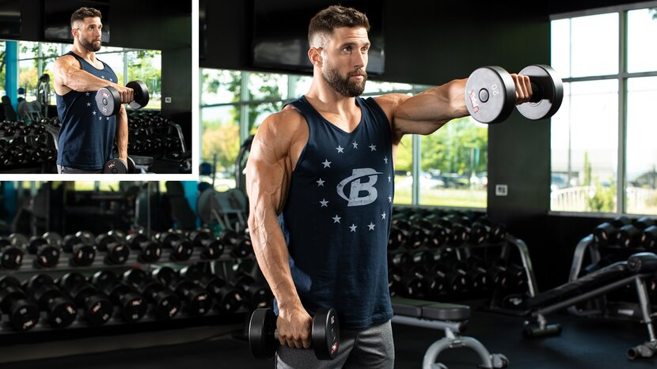
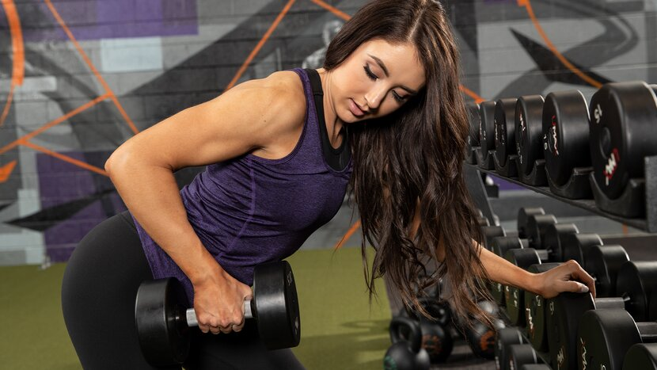

# 10 Best Shoulder Exercises for Building Muscle

---

**[Chest](https://shop.bodybuilding.com/blogs/training/10-best-chest-exercises-for-building-muscle) | [Back](https://shop.bodybuilding.com/blogs/training/10-best-back-exercises-for-building-muscle) | Shoulders | [Biceps](https://shop.bodybuilding.com/blogs/training/10-best-biceps-exercises-for-building-muscle) | [Triceps](https://shop.bodybuilding.com/blogs/training/10-best-triceps-exercises-for-building-muscle) | [Legs](https://shop.bodybuilding.com/blogs/training/leg-workouts-for-women-build-strong-sculpted-quads) | [Abs](https://shop.bodybuilding.com/blogs/training/10-best-ab-exercises-for-building-muscle)**

The way lifters train their shoulders is usually a balance of personal taste and injury history. Is putting heavy weight overhead the ultimate goal? Or does it make you wince just thinking about it? Are raises your bread and butter, or are they a low-priority accessory lift?

If you've read the other articles in the 10 Best series, you know we favor a little of both: a heavy muscle-building move like a press to start, followed by targeted isolation work after. This approach is a time-tested way to build the best shoulder workouts for both men and women. And it allows you to utilize a wide range of movements! Here's how we selected ours:

* Ease of learning and performing
* Total muscle stimulation and intensity
* Popularity among diehard lifters and bodybuilders (This matters!)
* Availability of equipment in commercial gyms

You'll find enough variations of each movement below to keep you busy for a long time. Read up, [eat and supplement to grow](https://shop.bodybuilding.com/products/bodybuilding-signature-whey-protein "Bodybuilding.com Signature 100% Whey Protein Powder"), then get to work with the three complete workouts below!

## 10 Best Shoulder Exercises

**[Push-Press](https://www.bodybuilding.com/content/10-best-muscle-building-shoulder-exercises.html#10-best-muscle-building-shoulder-exercises-push-press) | [Military Press](https://www.bodybuilding.com/content/10-best-muscle-building-shoulder-exercises.html#10-best-muscle-building-shoulder-exercises-military-press) | [Rear Delt Row](https://www.bodybuilding.com/content/10-best-muscle-building-shoulder-exercises.html#10-best-muscle-building-shoulder-exercises-rear-delt-row) | [Seated Dumbbell Press](https://www.bodybuilding.com/content/10-best-muscle-building-shoulder-exercises.html#10-best-muscle-building-shoulder-exercises-seated-dumbell-press) | [Seated Barbell Press](https://www.bodybuilding.com/content/10-best-muscle-building-shoulder-exercises.html#10-best-muscle-building-shoulder-exercises-seated-barbell-press) | [Upright Row](https://www.bodybuilding.com/content/10-best-muscle-building-shoulder-exercises.html#10-best-muscle-building-shoulder-exercises-upright-row) | [Arnold Press](https://www.bodybuilding.com/content/10-best-muscle-building-shoulder-exercises.html#10-best-muscle-building-shoulder-exercises-arnold-press) | [Rear Delt Fly](https://www.bodybuilding.com/content/10-best-muscle-building-shoulder-exercises.html#10-best-muscle-building-shoulder-exercises-rear-delt-fly) | [Lateral Raise](https://www.bodybuilding.com/content/10-best-muscle-building-shoulder-exercises.html#10-best-muscle-building-shoulder-exercises-lateral-raise) | [Front Raise](https://www.bodybuilding.com/content/10-best-muscle-building-shoulder-exercises.html#10-best-muscle-building-shoulder-exercises-front-raise)**

### Push-Press

***Why it's on the list:*** This press allows you to load up more weight, and do more reps, than just about any other overhead exercise, making it a great way to unlock new shoulder growth. It's rightfully considered a bit more of a whole-body movement than a pure shoulder move, since your lower body, core, delts, triceps, and upper pecs are all involved.

This isn't always a bad thing! Compound movements like this engage a great deal of muscle mass and boost muscle-building hormones better than movements that don't. It's a favorite of bodybuilders who are looking to build strength and athleticism in the offseason, like in Steve Cook's shoulder and arms workout.

**Push-Press Variations for Shoulder Development:**

* Barbell push-press
* Dumbbell clean and push-press
* Kettlebell push-press (double-arm or single-arm)
* Front squat push-press
* Dumbbell thruster

***In your workout:*** This doesn't need to be an "every workout" move. When you do use it, perform it first in your workout, after warming up well, for 3-4 sets of 6-8 reps. Stop each set before fatigue causes your form to crack.

### Military Press

***Why it's on the list:*** Like the push-press, this is a challenging full-body lift. It was once contested as a powerlift, and with a barbell, remains a popular lift for setting ambitious strength goals. But research has shown that dumbbells elicit a greater degree of muscle activation, even if you can't lift quite as much total weight.

Pro tip: Be sure to maintain a neutral hip position and learn how to brace your core to protect your lumbar spine. If you spend all of your time injured, you'll miss out on the gains!

**Military Press Variations for Shoulder Development:**

* Standing military press
* Dumbbell shoulder press (double-arm, single-arm, alternating)
* Dumbbell rotational shoulder press
* Double-kettlebell shoulder press

***In your workout:*** After a thorough warm-up, choose a challenging weight, but not one so heavy that you break form. Classic rep schemes like 5x5 for muscle and strength are great. For more pure size gains, go for sets of 6-8 or 8-10 where the last one is a struggle, but you're in no danger of failing the rep.

### Rear Delt Row

***Why it's on the list:*** What the heck is a row doing in an article about shoulder exercises? Remember, rowing movements don't just work the "back," they involve the rear delts to a significant degree, as well. And experts like physical therapist John Rusin, creator of the BodyFit resource Unstoppable: The Ultimate Guide to Training Through Injury, believe that a key to shoulder health is rowing twice or even three times as much as you press.

One more point in favor of rows, particularly on an incline bench: a 2014 study found that in addition to hitting the rear delts as well as flyes, they activated the middle delt significantly better than dumbbell shoulder presses, cable lateral raises, and even barbell upright rows. This makes it a no-brainer for creating a time-efficient shoulder workout.

**Rear Delt Row Variations for Shoulder Development:**

* Incline dumbbell row
* Bent-over dumbbell rear delt row

***In your workout:*** As part of a shoulder workout, do this immediately after press variations for sets of 8-10, or as a final high-rep movement for sets of 10-12 or more.

### Seated Dumbbell Press

***Why it's on the list:*** Swapping out the barbell for dumbbells on overhead presses works each side independently, which is great for balanced development. The range of motion is also a bit longer, which can help maximize muscle growth. Pressing in a seated position also removes the lower body, allowing you to focus squarely on the shoulders.

**Seated Dumbbell Press Variations for Shoulder Development:**

* Seated dumbbell press
* Seated kettlebell press

***In your workout:*** Do it first in your workout for solid, heavy sets of 6-8 reps. Going heavy? Have a spotter help you get the weights into the starting position and give you a spot (or even a forced rep or two) as you push toward failure.

### Seated Barbell Press

***Why it's on the list:*** Using a barbell rather than dumbbells may seem like a matter of taste, but there are functional reasons to pick the big bar. For one, you can put a bench in a rack and press off of the safety pins, allowing you to dial in your desired range of motion. Doing barbell-style presses on a Smith machine also allows you to safely push a bit closer to failure than other press variations and really focus on performing slow negatives.

**Seated Barbell Press Variations for Shoulder Development:**

* Seated military press
* Smith machine shoulder press
* Smith machine behind-the-neck press (if your shoulders can tolerate it)
* Machine shoulder press

***In your workout:*** Do these first in your workout and use challenging weights for sets of 6-8 reps. That's how bodybuilder Lawrence Ballenger starts his Boulder Shoulder workout before moving on to lighter lifts.

### Upright Row

***Why it's on the list:*** Upright rows have a reputation as a shoulder destroyer, but like anything, it's all about how you perform them. As personal trainer Jimmy Peña explains in the article, "How Wide Should My Grip Be on an Upright Row," don't take a close grip, which can internally rotate your shoulders. Instead, take a wider grip where your upper arms go directly out to your sides.

The science backs this up, too. A wider grip has been demonstrated to both significantly increase delt activation and also minimizing the biceps' role in the movement. You can also perform these one arm at a time to get the same effect.

**Upright Row Variations for Shoulder Development:**

* Barbell upright row
* Dumbbell upright row (double-arm and single-arm)
* Cable upright row
* Smith Machine upright row

***In your workout:*** Even though it's technically a multijoint movement, don't do this exercise first in your workout. Do it after your presses for 8-10 reps per set, in supersets with front raises, or as a burnout move at the end of your routine.

### Arnold Press

***Why it's on the list:*** Yes, this is just a dumbbell press with some rotation added in. Why give it a separate callout? Because the namesake of the move was definitely onto something!

Research has shown that the staple move of old-school muscle-building programs like the Blueprint to Mass hits both the front and medial delts more than other dumbbell press variations. Plus, many lifters simply find it more friendly to their shoulder joints. That's a big one-two punch.

**Arnold Press Variations for Shoulder Development:**

* Seated Arnold press
* Standing Arnold press
* Standing single-leg Arnold press

***In your workout:*** These are great first in your workout, or second after a more basic overhead press. Consider pyramiding up in weight and down in reps for 4 sets of 12, 10, 8, and 6, like in the 3-Move Shoulder Builder workout.

### Rear Delt Fly

***Why it's on the list:*** Why two rear-delt exercises on the list? Because these small muscles are often undertrained but are important for both posture and rotator-cuff health.

A bent-over version with dumbbells is great, either freestanding or with the head resting on a bench. Just don't cheat and sling the weights up with poor control! If you're hitting the rear pec-deck machine, use a neutral or palms-in grip—not palms-down—to maximally activate the muscle.

***In your workout:*** This is a great move to do later in a workout for 10-12 reps or more per set, either on its own or supersetted with lateral raises, like in The Simple Workout for Super Shoulders.

### Lateral Raise

***Why it's on the list:*** This is one of the most popular and best isolation exercises in the weight room, but it's tougher to master than it seems. Beginners usually benefit from two cues: lead with your elbows, and only go down until your arms are about 30 degrees out from your sides. Both will help your raises be better—and more difficult.

**Lateral Raise Variations for Shoulder Development:**

* Dumbbell lateral raise (double-arm and single-arm)
* Leaning cable lateral raise
* Cable lateral raise

***In your workout:*** If you really want to bring up your medial delts, use do this exercise first; if your front or rear delts need more work, do this exercise last. In either case, do it for at least 8-10 reps per set. Every once in a while, maybe after a scoop of your favorite pre-workout, take this to the next level by running the rack.

### Front Raise

***Why it's on the list:*** The "why" of this move is simple enough: raising your straight arm directly in front of you activates the anterior head of your deltoids. But it's not a must-do for everyone! Presses hammer the anterior delts, and these muscles already tend to be disproportionately large among individuals who overdo chest training compared to back training.

So, if you're only going to do one variation, which one is best? Single-sided dumbbell or cable raises are great because each side works independently, or alternating. This maximizes the mind-muscle connection, but also helps to build balanced shoulders.

**Front Raise Variations for Shoulder Development:**

* Barbell front raise
* Alternating dumbbell front raise
* Single-arm cable front raise

***In your workout:*** If you're going to do it, do it in the second half of your shoulder workout. It's a great last movement for a burnout, especially superset with lateral raises, as in Abel Albonetti's Brutal Mass-Building Shoulder Workout.

## Best Shoulder Workouts

### Hard and Heavy Shoulder Workout

For some of us, there's nothing better than putting heavy stuff overhead. This old-school free-weights-only shoulder workout starts off with heavy, powerful push-presses, then pumps up your lateral and rear delts with dumbbells. It pairs well with a two-move traps finisher for dessert.

**1. Push-press**

3 sets, 6-8 reps (rest 2 min.)

**2. Arnold press**

3 sets, 10-12 reps (rest 90 sec.)

**3. Incline dumbbell row**

3 sets, 8-10 reps (rest 90 sec.)

**4. Dumbbell Lateral Raise**

3 sets, 10-12 reps (rest 90 sec.)

### Beginner Shoulder Workout

Beginners don't need to get fancy or high-volume with shoulder training—especially if they're already hitting their front delts with any significant amount of chest training. Hit these three moves hard, nudge the weights up over time, and they can be enough to grow on.

**1. Seated dumbbell shoulder press**

4 sets, 8-10 reps (rest 2 min.)

**2. SUPERSET**

Perform the exercises in order. Don't rest between exercises and rest 1 min. between sets.

**Dumbbell Lateral Raise**

3 sets, 12 reps (no rest)

**Seated rear delt fly**

3 sets, 12 reps (rest 1 min.)

### Machine Pump Shoulder Workout

Experienced lifters know that shoulders grow well with some high-rep pump work in the mix. If you agree, you'll love this workout. It can be great on its own, or as a second shoulder day 72 hours after one focused more on free weights and presses. Pair it with a non-stim pre-workout loaded with pump-friendly NO-boosting ingredients and go to town.

**1. Machine shoulder press** 

After the final set, perform a single dropset.

4 sets, 10-12 reps (rest 1 min.)

**2. SINGLE-ARM CABLE LATERAL RAISE**

Perform all reps on one side, then switch to the other. Don't rest between sides and rest 1 min. between sets.

**Cable Lateral Raise**

After the final set, perform a single dropset.

4 sets, 10-12 reps (left side, no rest)

**Cable Lateral Raise**

After the final set, perform a single dropset.

4 sets, 10-12 reps (right side, rest 1 min.)

**3. SINGLE-ARM CABLE FRONT RAISE**

Perform all reps on one side, then switch to the other. Don't rest between sides and rest 1 min. between sets.

**Single-arm cable front raise**

After the final set, perform a single dropset.

4 sets, 10-12 reps (left side, no rest)

**Single-arm cable front raise**

After the final set, perform a single dropset.

4 sets, 10-12 reps (right side, rest 1 min.)

**4. Reverse Pec-Deck** 

After the final set, perform a single dropset.

4 sets, 12 reps (rest 1 min.)