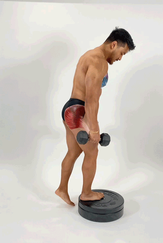

# 2 Types of Reverse Lunges to Grow Your Glutes: Step-by-Step Guide

---

*Two exercises to add to your leg day to build that booty.*

---

**MoveU**  
 December 14, 2022 • 2 min read

Reverse lunges are often easier for people who may struggle with knee issues. They’re also a popular exercise as they target the hamstrings, quads, and the glutes. Read along to learn more about two different types of reverse lunges and how they can help you get those booty gains on our blog today.

## Why Are Reverse Lunges Important?

Lunges are one of the most comprehensive lower body exercises ever. They help target every part of your lower body, strengthening your core, hips, glutes, quads, hamstrings, and calves. Doing them weekly increases stability, balance, strength, and reduces your chances of getting injured in the future. We love that lunges help with hip mobility as many of you struggle with tight hip flexors due to a more sedentary lifestyle (we’re looking at all of you with a desk job). Plus, lunges help grow your glutes and can lead to major glute gains.

## What Type of Lunges Are Best for Glute Growth?

There are plenty of different types of lunges out there. We highly recommend either the elevated lunge or the reverse lunge. Many people prefer the reverse lunge as it’s easier on their knees. Here’s a step- by-step guide on 2 types of lunges to help with those booty gains:

### How to Do Reverse Lunges to Target Your Glutes

A reverse lunge is one of the best lunge variations you can use for training your glutes. Since you’re stepping back in the sagittal plane you have more overall contribution from the hip extensors versus the knee extensors like the quads. Here’s how to do a reverse lunge:

* Engage your core and maintain an upright spine.
* Step forward with one leg, lowering your hips until both of your knees are bent at about a 90-degree angle. Make sure your front knee is directly above your ankle - you should be able to see your front toes. Your back knee should hover just above the floor.
* Press your front heel into the floor and activate your glutes as you push back up to the starting position.
* Repeat for 10 repetitions on one side, then switch legs. You can also alternate which leg steps forward for alternating lunges or use weights to make this more difficult.

### How to Do Elevated Reverse Lunges to Build Your Glutes

Once you get better at the above variation you can try the elevated reverse lunge variation by placing one or two plates below your grounded foot. It allows you to lengthen or stretch the glute even more. Try it out after your bridges or hip thrusts! Here’s how to do an elevated reverse lunge:

* Elevate your front leg by placing plates down in front of you (this helps you target your glutes more)
* Perform a reverse lunge, contract your core, and lower your back leg until your knee almost reaches the floor keeping your front knee bent at a 90-degree angle.
* Press into the ground with your foot to come back to your starting position.
* Repeat for 10 repetitions then change legs.

## Elevated Lunge Versus Reverse Lunge

An elevated reverse lunge takes you through a greater degree of hip flexion as you step back into a lunge. As you come back to your standing position you get to really target your glute as you come into more hip extension. So, an elevated reverse lunge can help you target your glutes more.

Elevated reverse lunges can put less stress on your joints and keep you more stable throughout the lunge, so they can be easier for people who may have an imbalance, less hip mobility, or knee issues.