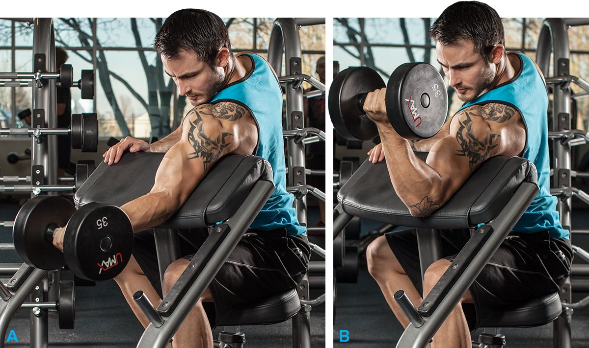
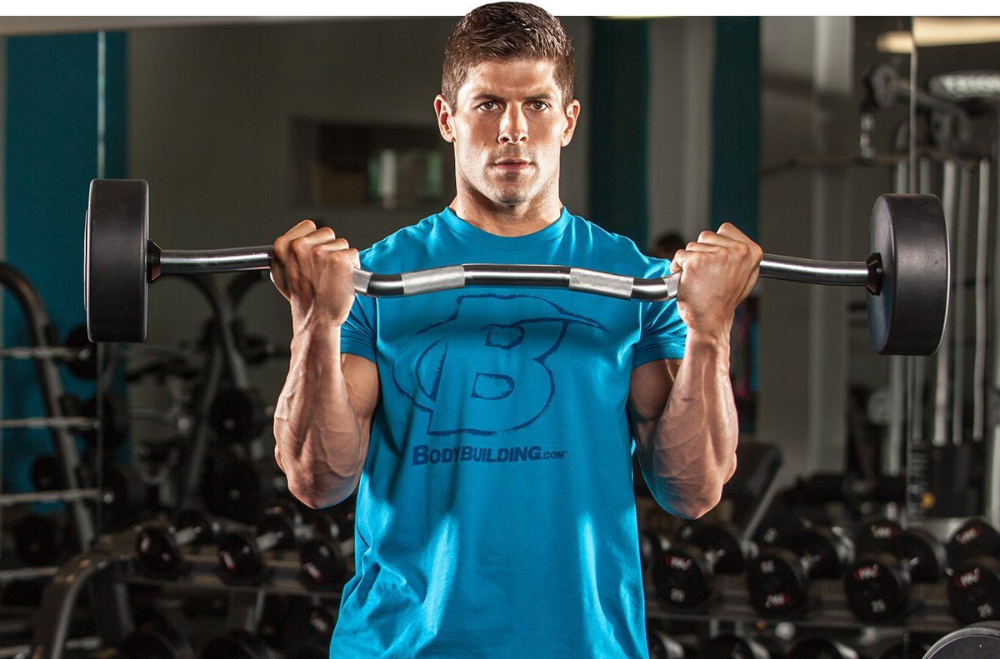
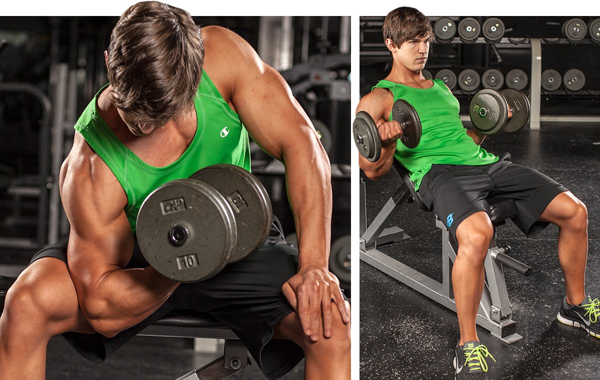
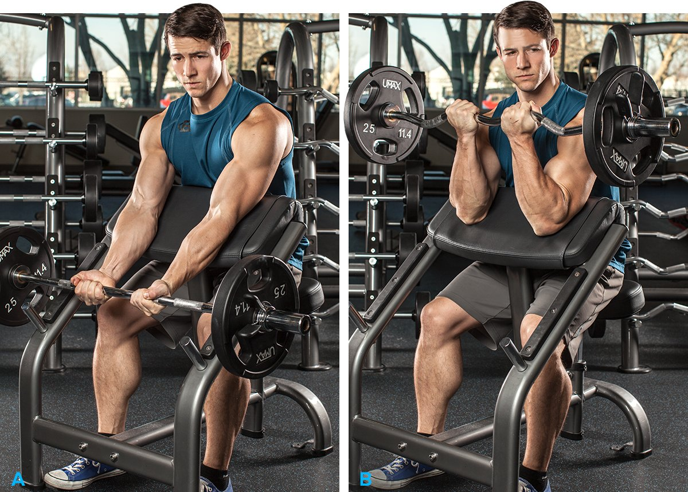

# Arm Workouts for Men to Build Bigger Biceps

---

This is a blanket statement, but I don't think it's too much of a stretch to say that every guy wants bigger guns. Even though they're a relatively small muscle group, big biceps are important to most men. Heck, they're practically a billboard proclaiming that their owner works out, takes care of himself, and has a solid measure of strength.

The exercise of choice to build your biceps is called the curl.

The exercise of choice to build your biceps is called the curl, but there are many variations that hit the three major components of the biceps muscle group: the long head, the short head, and the brachialis. It's not just the actual movements that make these five biceps routines unique. By manipulating volume and rep targets, and adding post-failure techniques, you can take a beginner's biceps workout and make it a major-mass builder, or even increase the speed of your workout for a leaning-out phase.

What's worth remembering: When your elbows are in front of the plane of your body (as when doing preacher curls), the biceps long head isn't able to fully stretch, so these kinds of exercises better target the short head. Also, when your arms are behind the plane of your body (as when doing incline-bench curls), the long head is fully stretched so it picks up the greater load. Even moving your hands in and out when doing barbell curls changes the emphasis, so it's worth exploring the many variations here.

You'll also want to try exercises that shift the position of your palms—whether supinated (palms up), pronated (palms down), or neutral (palms facing in). These subtle shifts make a decided difference in what area of your upper arm is engaged to the fullest.

One more thing: You don't have to be a guy to get the most out of these workouts. We know guys really want big arms, so these workouts are definitely geared toward getting you jacked, no matter your level of experience, but I encourage women to try them on for size as well!

### 1. Workout For Mass

Chin-ups aside, there aren't great multijoint movements that target the biceps. You'll want to start with the arm exercise that allows you to move maximum weight: the standing barbell curl. Use a shoulder-width grip here to work both biceps heads. Additional exercises require you to change elbow and hand position: The incline stretches the long head better, while the preacher is better for the short head. Neutral-grip moves like hammer curls hit your underlying brachialis muscle, and reverse-grip movements emphasize the brachioradialis.

One-Arm Dumbbell Preacher Curl

#### **Notes:**

These workout charts do not contain warm-up sets. Perform as many as you need, but never take your warm-up to failure.

Choose a weight that allows you to reach muscle failure by the target rep listed. This scheme follows a reverse pyramid, meaning you lighten the weight a bit on each set after your first set for slightly higher reps. But it's important to take each set to muscle failure.

If you have a spotter, do a few forced reps on your heaviest set of each exercise, which should be your first or second set. If you don't have a partner, do a dropset on your last set of each exercise, reduce the weight by about 25 percent when you reach muscle failure, and rep again to a second point of muscle failure.

**1. Barbell Curl**

4 sets, 6-8, 6-8, 8-10, 8-10 reps

**2. Alternate Incline Dumbbell Curl**

3 sets, 8, 8, 10 reps

**3. Single-arm dumbbell preacher curl**

3 sets, 10, 10, 12 reps

**4. Cable rope hammer curl**

3 sets, 10-12, 10-12, 12-15 reps

**5. Reverse Cable Curl**

3 sets, 10-12, 10-12, 12-15 reps

### 2. Routine To Get Ripped

This workout hits all areas of your biceps, including your forearms. Supersets boost the intensity of your training, and the session calls for a slightly higher rep range that will enrage your biceps pump. The seated curls are done through a shortened range of motion, and can hence be done after the full-range standing curls.

Supersets boost the intensity of your training, and the session calls for a slightly higher rep range that will enrage your biceps pump.

#### **Notes:**

Choose a weight with which you reach muscle failure by the target rep listed. You'll use the same weight on all three sets. Take each set to muscle failure.

Do hammer curls with both arms simultaneously; do one-arm curls by alternating arms.

Superset the pairs of exercises noted, resting only after you complete both moves.

**1. EZ-Bar Curl**

Superset with Seated Close-Grip Concentration Barbell Curl

3 sets, 12 reps

**2. Seated Close-Grip Concentration Barbell Curl**

3 sets, to failure

**3. Standing One-Arm Cable Curl**

Superset with One Arm Dumbbell Preacher Curl

3 sets, 12 reps

**4. Single-arm dumbbell preacher curl**

3 sets, 12 reps

**5. Hammer Curls**

Superset with Palms-Up Barbell Wrist Curl Over A Bench

3 sets, 12 reps

**6. Palms-up wrist curl over bench**

3 sets, 15 reps

### 3. Beginner's Workout

When training biceps, it's all about the curl. We've included three variations in this workout, starting with one that you can probably use the most weight with. With the last movement, try it both ways—curling both arms simultaneously one set, and alternating arms the next—to see which you prefer.

#### **Notes:**

Choose a weight at which you almost reach muscle failure, but don't go to failure during your first month.

The first two movements are done pyramid-style, increasing the weight after the first set for fewer reps.

**1. EZ-Bar Curl**

3 sets, 15, 12, 12 reps

**2. Machine Preacher Curls**

3 sets, 15, 12, 12 reps

**3. Seated dumbbell biceps curl**

2 sets, 12 reps

### 4. Emphasis On Biceps-Peak (Long Head)

When you flex your arm, that height you see is called the peak, and it gets taller as your long head gets bigger. This routine emphasizes long-head moves.

This routine emphasizes long-head moves.

#### **Notes:**

Choose a weight with which you reach muscle failure by the target rep listed.

The workout follows a pyramid, meaning you add weight on each set (for fewer reps), but take only your final set of each exercise to muscle failure.

**1. Close-grip barbell curl**

3 sets, 12, 10, 8 reps

**2. Alternating incline dumbbell biceps curl**

4 sets, 12, 10, 8, 6 reps

**3. Cable rope hammer curl**

3 sets, 12, 10, 8 reps

**4. Concentration curl**

3 sets, 12, 10, 8 reps

### 5. Emphasis On Short (Inner) Head

To achieve fully developed biceps, you can't rely on long-head exercises alone. To shift the emphasis to the short head, you'll use different angles that essentially don't allow the long head to fully stretch.

Preacher Curl

#### **Notes:**

Choose a weight with which you reach muscle failure by the target rep listed.

The scheme follows a straight-sets approach in which you use the same working weight for all three sets, trying to reach the same target-rep figure on each one (but don't stop if you can do more). You'll use a slightly lighter weight (for a higher rep target) on each successive exercise.

**1. Wide-grip barbell curl**

3 sets, 8 reps

**2. Preacher Curl**

3 sets, 10 reps

**3. High Cable Curls**

3 sets, 12 reps

### Training Tip

Keep your upper arms locked by your sides as you curl. If you bring them forward in an effort to raise the weight higher, the front delts will join the effort, and you might even be able to rest at the top, taking stress off the target muscle. Only on cheat curls should you be pulling your elbows slightly forward, and you should only be cheating on your last rep or two of a set.