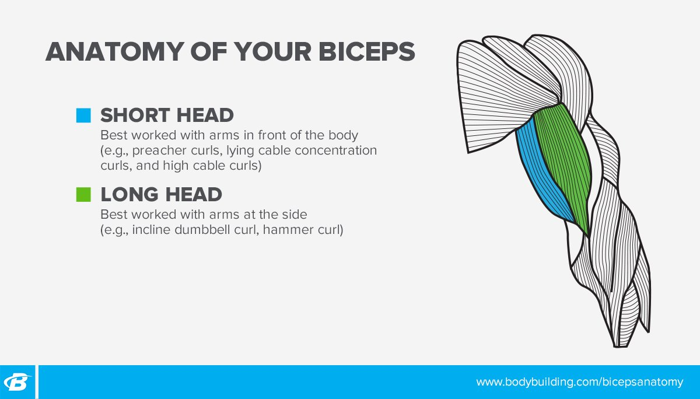

# Arm Workouts for Women: Build Shape, Size, and Strength!

---

*Girls need curls, too! If you want to really rock that tank top at the gym or go sleeveless during summer, then doing the best arm exercises for women is a must. Learn all about arm training and try three full workouts to sculpt your arms!*

---

**Joanne Lee Cornish**  
July 26, 2021 • 5 min read

**[Shoulder Workouts for Women](https://shop.bodybuilding.com/blogs/training/shoulder-workouts-for-women-add-shape-and-size) | [Back Workouts for Women](https://shop.bodybuilding.com/blogs/training/back-workouts-for-women-build-the-shape-you-want) | [Leg Workouts for Women](https://shop.bodybuilding.com/blogs/training/leg-workouts-for-women-build-strong-sculpted-quads?srsltid=AfmBOop31MLle6ekuzZDV6enCUB3CWuwah0Grxwbi5BzKg01acknv_fV) | [Butt Workouts for Women](https://shop.bodybuilding.com/blogs/training/glute-workouts-for-women-get-a-bigger-butt) | Arm Workouts for Women | [Upper-Body Workouts for Women](https://shop.bodybuilding.com/blogs/training/shape-building-upper-body-workouts-for-women) | [Strength Workouts for Women](https://shop.bodybuilding.com/blogs/training/these-workouts-are-how-strong-women-get-built)**

Arm day is constantly dubbed every guy's favorite day in the gym, perhaps second only to training chest. As a longtime pro bodybuilder, though, I think most guys are guilty of overtraining their arms—giving them far more volume than they need to grow—and just as many women undertrain theirs.

This is unfortunate! To many women are fixated on how to lose arm fat, rather than building the arms they want with strategic, well-designed workouts. Instagram might convince you to emphasize training only your lower body and abs, but overall muscle development is essential! And if you've been struggling for years to get that first pull-up, training your arms can definitely play a part in getting there.

Got your attention? Then let's get serious about biceps and triceps workouts for women!

### Arm Yourself with Education

**Biceps:** The biceps brachii and the brachialis are the two big muscles on the front part of the upper arm. The name comes from the Latin "biceps" meaning "two heads" and "brachii" meaning "of the arm." The two heads are generally known as the long head and short head of the biceps.

The biceps brachii has two functions. The first is to bend or "flex" the elbow, like when you pop that biceps pose. The second is rotation of the forearm, which is why coaches often cue to rotate a weight as you curl it.

The brachialis sits deep between the triceps and the biceps and is targeted by classic arm exercises like hammer curls and reverse curls. When developed, the brachialis can push the triceps and biceps apart, making the arm look bigger. As it pushes the biceps higher, it can add to the peak of the muscle.

**Training at home? Arm your gym with a complete [set of dumbbells](https://shop.bodybuilding.com/blogs/training/the-ultimate-full-body-dumbbell-workout?srsltid=AfmBOooqWp3zuDNVtB2DbDmhtUCZ8fe8EdBeenF5b6gcYC-_CR0ef9mQ) and reap the benefits daily.**

**Triceps:** The three heads of the triceps are the long head, the lateral head, and the medial (deep) head. As women age, we tend to hold more body fat in this area, making triceps development more of a priority as the years pass.

The long head of the triceps sits right in that troublesome posterior part of the upper arm. So, while the guys might focus on the horseshoe shape and thickness that develops the lateral head, women may want to prioritize long head exercises.

In doing this, it's important to remember that shoulder extension is ideal for long head activation. This means any exercise where the arm goes behind the body, such as in a triceps kick-back or a single-arm cable push-down. It also means keeping your form as perfect as possible on any overhead extension or dip.

### 

### Do I Need an Arm Day?

As a rule, for the first year of serious lifting, it's great to partner arm exercises with a larger muscle group. This could mean full upper-body workouts, or classic pairings like back-and-biceps and chest-and-triceps or shoulders-and-triceps. These approaches are popular because they work! They give you enough stimulus to grow without overdoing it and risking a tendon injury—which takes a long time to heal and is a common curse of the newbie lifter.

## Arm-Shaping Workouts

### Beginner Arm Workout for Women

Use this workout immediately after training a larger muscle group like back or chest. Keep your form strict!

**1. EZ-Bar Curl**

Add weight for the first 2 sets.

4 sets, 12, 10, 8, 8 reps (rest 1 min.)

**2. Dumbbell preacher curl**

Add weight for the first 2 sets.

4 sets, 12, 10, 8, 8 reps (rest 1 min.)

**3. EZ-bar skullcrusher**

Add weight for each set.

4 sets, 15, 12, 10, 6 reps (rest 1 min.)

**4. Low cable overhead triceps extension**

Add weight for the first 2 sets.

4 sets, 12, 10, 8, 8 reps (rest 1 min.)

**5. SINGLE-ARM CABLE TRICEPS KICK-BACK**

Perform all the reps on one side, then switch to the other. Don't rest between sides and rest 1 min. between sets.

**Single-arm rope kickback**

Add weight for the first 2 sets.

4 sets, 12, 12, 10, 10 reps (left side, no rest)

**Single-arm rope kickback**

Add weight for the first 2 sets.

4 sets, 12, 12, 10, 10 reps (right side, rest 1 min.)

### Quick 20-Minute Arm Workout for Women

Only have a small amount of time but want to hit your arms? This is the workout you need. Keep it fast paced! Rest only between each triset or superset for 60 seconds. If you're an advanced lifter or have a bit more time, you can add a fourth set.

**1. TRISET**

Perform the exercises in order, resting as little as possible between exercises and 1 min. between sets.

**EZ-bar skullcrusher**

3 sets, 15, 10, 8 reps (no rest)

**Band overhead triceps press**

3 sets, 12, 12, 10 reps (no rest)

**EZ-Bar Curl**

After the final set, rest 10-15 sec., then try to squeeze out 4-5 more reps.

3 sets, 8-10 reps (rest 1 min.)

**2. TRISET**

Perform the exercises in order, resting as little as possible between exercises and 1 min. between sets.

**Dumbbell preacher curl**

3 sets, 12, 10, 8 reps (no rest)

**Cross-body hammer curl**

3 sets, 20 reps (alternating, 10 reps per side, no rest)

**Triceps Extension**

After the final set, rest 10-15 sec., then try to squeeze out 4-5 more reps.

3 sets, 15, 12, 10 reps (rest 1 min.)

**3. SUPERSET**

Perform the exercises in order, resting as little as possible between exercises and 1 min. between sets.

**Overhead cable curl**

3 sets, 12, 12, 10 reps (no rest)

**Double-arm triceps kick-back**

3 sets, 12, 12, 10 reps (rest 1 min.)

**A high-volume pump-fest arm workout isn't complete without a [pre-workout](https://shop.bodybuilding.com/collections/pre-intra-workout)!**

### Advanced Arm Workout for Women

This one is all about volume! Because of the continual repetition of either the curling movement or extension movement, this workout is for lifters with at least a few years of experience in the gym, who are using a dedicated arm day to try to "bring up" this body part.

**1. CIRCUIT**

Perform the exercises in order, resting as little as possible between exercises and 1 min. between sets.

**Seated Band Incline Biceps Curl**

4 sets, 15, 12, 10, 8 reps (no rest)

**Drag curl**

4 sets, 15, 12, 10, 8 reps (no rest)

**Hammer Curl**

4 sets, 10, 10, 8, 8 reps (no rest)

**Single-arm dumbbell preacher curl**

4 sets, 10, 8, 6, 6 reps (left side, no rest)

**Single-arm dumbbell preacher curl**

4 sets, 10, 8, 6, 6 reps (right side, rest 1 min.)

**2. CIRCUIT**

Perform the exercises in order, resting as little as possible between exercises and 1 min. between sets.

Standing barbell overhead triceps extension

**Perform using an EZ-bar.**

4 sets, 15, 12, 10, 10 reps (no rest)

**EZ-bar skullcrusher**

4 sets, 15, 12, 10, 10 reps (no rest)

**Triceps dip**

Use a band or machine assistance as needed.

4 sets, 12 reps (no rest)

**Double-arm triceps kick-back**

4 sets, 12 reps (rest 1 min.)

**3. SUPERSET**

Perform the exercises in order, resting as little as possible between exercises and sets.

**Barbell Curl**

Perform as 21s: 7 reps at the bottom half of the movement, 7 reps at the top half of the movement, and 7 reps through the full range of motion.

3 sets, 21 reps (no rest)

**Triceps Extension**

Perform as 21s: 7 reps at the bottom half of the movement, 7 reps at the top half of the movement, and 7 reps through the full range of motion.

3 sets, 21 reps (no rest)