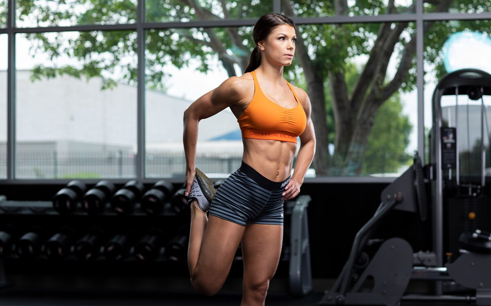
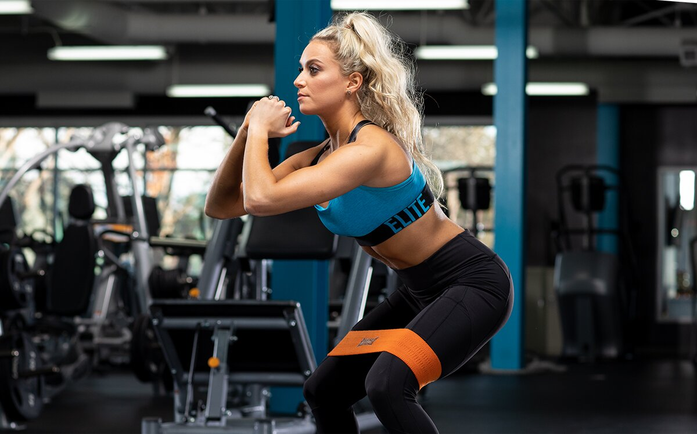
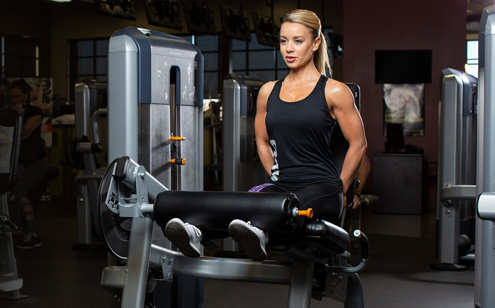

# Leg Workouts for Women: Build Strong, Sculpted Quads!

---

*Build your legs the right way with these expert-created thigh workouts for every experience level. These are the best leg exercises for women, arranged perfectly to achieve every physique goal!*

---

**Joanne Lee Cornish**  
July 23, 2021 • 13 min read

**[Shoulder Workouts for Women](https://shop.bodybuilding.com/blogs/training/shoulder-workouts-for-women-add-shape-and-size) | [Back Workouts for Women](https://shop.bodybuilding.com/blogs/training/back-workouts-for-women-build-the-shape-you-want) | Leg Workouts for Women | [Butt Workouts for Women](https://shop.bodybuilding.com/blogs/training/glute-workouts-for-women-get-a-bigger-butt) | [Arm Workouts for Women](https://shop.bodybuilding.com/blogs/training/arm-workouts-for-women-build-shape-size-and-strength) | [Upper-Body Workouts for Women](https://shop.bodybuilding.com/blogs/training/shape-building-upper-body-workouts-for-women) | [Strength Workouts for Women](https://shop.bodybuilding.com/blogs/training/these-workouts-are-how-strong-women-get-built)**

The four muscles that make up the front of the thigh, affectionately known as "the quads," are currently having a moment. Not coincidentally, it matches up with more women lifting weights—and squatting in particular. But having muscular or strong thighs, something that was once a point of shame for many, has rightfully become a point of pride. Forget leg "toning" workouts—quadzillas unite!

Ready to fearlessly build your quads? These nine lower-body workouts for women from my little black book are just what you need.

### **What Do the Quadriceps Do?**

All four muscles of the quadriceps work together to extend/straighten the knee, but they do all have their own unique attributes:

* **Rectus femoris:** This is the only one of the four that crosses the hip joint and works as a hip flexor. It is also the center muscle we admire on a lean, flexed thigh.
* **Vastus Intermedius, Vastus Lateralis, Vastus Medias:** These are the other three quads, and they do not cross the hip but attach to the femur anteriorly, laterally, and medially, as their names suggest. They're all important for knee strength and stability, but also muscle definition.

Although their function is the same for all of us, how our thighs appear is as random as the female shape itself. They can be long and lovely with a gap at the top, or short and strong with a sweep that makes skinny jeans hide in fear. Neither is better than the other, of course. Our thighs are certainly the result of our genetics, but also of our hours in the gym performing the best leg exercises for our goals.

So, let's start optimizing that work by dialing in your goals and digging into the workouts!

### Which Leg Workout Is Best for Me?

Do you want to build mass? Then squats and leg presses with heavy weight will be in your future. Do you want to build strong thighs, but with less outward flare and more detail? Then single-leg squats and lunges are a great foundation for your lower-body training. Or maybe you're a circuit gal, wanting to exhaust your legs top to bottom with a fast-paced workout using a variety of exercises.

And maybe you read that list and you want to do it all! Well, you can follow one of these workouts consistently for weeks to chase a specific goal, or you can rotate between them.

That's up to you! But no matter what you do, make sure you warm up thoroughly and correctly first.

### How Do I Warm Up for Leg Workouts?

Maybe you've been sitting down all day, or you just got out of bed, or you've been driving around before you get to the gym. In any of these cases, your body is not ideally primed to hit it hard on a major quad movement.

**The object of your warm-up is three-fold:**

* Get more blood moving through the muscles.
* Raise your core body temperature.
* Activate the target muscles so that your joints are in the right position to safely do hard work. You don't want to be feeling knee pain if you can help it!

Your warm-up doesn't have to be complicated, though. You can get on the floor with a foam roller, jump on the treadmill for a quick jog, or my favorite, do 5-10 minutes of yoga and some light [resistance band](https://shop.bodybuilding.com/collections/resistance-bands) work.

In your warm-up you should seek to stretch the hip flexors and incorporate some lateral work like band walks to activate the hip muscles, which will also help relax the lower back muscles.

Why focus on these? Tight muscles negatively impact their opposing partners. Tight hips flexors will stop the glutes and hamstrings from firing properly, and a tight lower back will make it difficult for you to contract your core during a squat, press, or lunge.

### Leg Workouts for Women

I like to classify training in terms of beginning, intermediate, and advanced lifters. Here's what those numbers mean to me:

* **Beginner:** Less than 6 months of consistent weight training
* **Intermediate:** 1-2 years of consistent weight training
* **Advanced:** 2 or more years of consistent weight training

I stress the experience level primarily because many women genetically have strong legs and want to jump straight into some pretty advanced moves. As already mentioned, many quad exercises require full-body muscle recruitment. Ladies may feel that their legs can take the pain, but with only a few weeks or months of training, I doubt that their lower back or shoulders can do the same.

## Beginner Workouts

Pick one of these workouts and do it 1-2 times per week, or rotate between the three on a weekly basis. They pair nicely with my Glute and Hamstring Workouts for Women when done with about 72 hours of space between them.

### Beginning Women's Quad Workout for Muscle Size

**1. SUPERSET**

Perform the exercises in order, resting as little as possible between exercises and 1 min. between sets.

**Leg Extension**

4 sets, 20, 15, 15, 12 reps (no rest)

**Lateral Band Walk**

4 sets, 15, 15, 12, 12 reps (right side, no rest)

**Lateral Band Walk**

4 sets, 15, 15, 12, 12 reps (left side, rest 1 min.)

**2. Barbell back squat to box**

Alternately, you can squat to a bench if you don't have a box.

4 sets, 15, 12, 10, 10 reps (rest 90 sec.)

**3. Leg Press**

Use either an angled or horizontal leg press. If you don't have a leg press, you can perform goblet squats, possibly with an added band for extra resistance.

4 sets, 20, 15, 15, 12 reps (rest 90 sec.)

**4. Walking Lunge**

4 sets, 40, 30, 30, 24 reps (alternating, 20, 15, 15, 12 reps per side, rest 1 min.)

**At all experience levels, leg work is hard work! Refuel with [protein](https://shop.bodybuilding.com/collections/protein) and power your results.**

### Beginning Women's Quad Workout for Conditioning and Fat Loss

**1. COMPOUND SET**

Perform the exercises in order, resting as little as possible between exercises and 1 min. between sets.

**Goblet Squat**

4 sets, 20, 15, 15, 12 reps (no rest)

**Dumbbell Split Squat**

Perform with body weight only.

4 sets, 12, 12, 10, 10 reps (right side, no rest)

**Dumbbell Split Squat**

Perform with body weight only.

4 sets, 12, 12, 10, 10 reps (rest 1 min.)

**2. Smith machine back squat**

If you're at home or don't have access to a Smith machine, a band-resisted squat can also work here.

4 sets, 12, 12, 10, 10 reps (rest 1 min.)

**3. SINGLE-LEG LEG PRESS**

Perform all of the reps on one side before switching to the other side. Don't rest between sides and rest 1 min. between sets.

**Single-Leg Leg Press**

4 sets, 15, 12, 12, 10 reps (right side, no rest)

**Single-Leg Leg Press**

4 sets, 15, 12, 12, 10 reps (left side, rest 1 min.)

**4. Thigh adductor**

4 sets, 20, 15, 15, 12 reps (rest 1 min.)

### Beginning Women's Quad Circuit Workout

**1. TRISET**

Perform the exercises in order, resting as little as possible between exercises and 2 min. between sets. After two weeks of performing this circuit, add a fourth set of 10-12 reps per exercise.

**Leg Extension**

3 sets, 15, 15, 12 reps (no rest)

**Walking Lunge**

3 sets, 30, 26, 24 reps (alternating, 15, 13, 12 reps per side, no rest)

**Dumbbell front squat**

Rest the dumbbells on your shoulders to stay more upright. Place small plates under your heels.

3 sets, 12 reps (rest 2 min.)

**2. TRISET**

Perform the exercises in order, resting as little as possible between exercises and 2 min. between sets. After two weeks of performing this circuit, add a fourth set of 10-12 reps per exercise.

**Leg Press**

3 sets, 20, 15, 12 reps (no rest)

**Dumbbell sumo squat**

3 sets, 12 reps (no rest)

**Bodyweight squat**

3 sets, 20, 15, 15 reps (rest 2 min.)

## Intermediate Workouts

The volume is higher on these workouts, and there are more intensity techniques like compound sets. I recommend doing only one of these workouts per week, although your quads will still get some work if you train glutes and hamstrings later in the week!

### Intermediate Women's Quad Workout for Muscle Size

**1. Barbell reverse lunge**

Perform in a Smith machine, if possible.

4 sets, 30, 30, 24, 20 reps (alternating, 15, 15, 12, 10 reps per side, rest 1 min.)

**2. Barbell back squat**

4 sets, 20, 15, 12, 10 reps (rest 90 sec.)

**3. COMPOUND SET**

Perform the exercises in order, resting as little as possible between exercises and 90 sec. between sets.

**Leg Press**

4 sets, 15, 12, 8, 8 reps (no rest)

**Lateral lunge**

4 sets, 24, 24, 20, 20 reps (alternating, 12, 12, 10, 10 reps per side, rest 90 sec.)

**4. COMPOUND SET**

Perform the exercises in order, resting as little as possible between exercises and 90 sec. between sets.

**Leg Extension**

4 sets, 12 reps (no rest)

**Dumbbell sumo squat**

4 sets, 10 reps (rest 90 sec.)

**Don't let your lower back hold you back on leg day! Lift stronger and safer with a [leather or nylon belt](https://shop.bodybuilding.com/blogs/training/how-when-to-use-a-weightlifting-belt?srsltid=AfmBOorZ_fEMxD96rStV_X4KG32weqBkwL0-t-ukQIbSwXzzBQvaybMw).**

### Intermediate Women's Quad Workout for Conditioning and Fat Loss

**1. SINGLE-LEG LEG PRESS**

Perform all of the reps on one side before switching to the other side. Don't rest between sides and rest 1 min. between sets.

**Single-Leg Leg Press**

4 sets, 15, 15, 12, 12 reps (no rest)

**Single-Leg Leg Press**

4 sets, 15, 15, 12, 12 reps (rest 1 min.)

**2. COMPOUND SET**

Perform the exercises in order, resting as little as possible between exercises and 90 sec. between sets.

**Hack Squat**

If you don't have a hack squat machine, you can perform goblet squats, possibly with an added band for extra resistance.

4 sets, 15, 20, 25, 25 reps (no rest)

**Barbell walking lunge**

4 sets, 40, 30, 20, 20 reps (alternating, 20, 15, 10, 10 reps per side, rest 90 sec.)

**3. COMPOUND SET**

Perform the exercises in order, resting as little as possible between exercises and 90 sec. between sets.

**Dumbbell step-up**

4 sets, 12 reps (right side, no rest)

**Dumbbell step-up**

4 sets, 12 reps (left side, no rest)

**Leg Extension**

4 sets, 20 reps (rest 90 sec.)

### Intermediate Women's Quad Circuit Workout

**1. TRISET**

Perform the exercises in order, resting as little as possible between exercises and 2 min. between sets.

**Barbell reverse lunge**

Perform using a Smith machine, if possible.

4 sets, 40, 30, 24, 24 reps (alternating, 20, 15, 12, 12 reps, no rest)

**Goblet Squat**

4 sets, 15 reps (no rest)

**Exercise ball Bulgarian split squat**

If you don't have an exercise ball, perform with your foot on a box, bench, or chair.

4 sets, 12, 12, 10, 10 reps (right side, no rest)

**Exercise ball Bulgarian split squat**

If you don't have an exercise ball, perform with your foot on a box, bench, or chair.

4 sets, 12, 12, 10, 10 reps (left side, rest 2 min.)

**2. TRISET**

Perform the exercises in order, resting as little as possible between exercises and 2 min. between sets. To save time and equipment, bring a fixed-weight bar to the leg extension machine to perform this triset all in one location.

**Barbell back squat**

4 sets, 12, 15, 20, 25 reps (no rest)

**Step-up with knee raise**

4 sets, 40, 30, 24, 20 reps (alternating, 20, 15, 12, 10 reps, no rest)

**Leg Extension**

4 sets, 15 reps (rest 2 min.)

## Advanced Workout

These are the kind of leg days that people make memes about! Expect to walk like a baby deer for a day or two afterward. Don't forget to prioritize recovery by eating right, eating adequate calories, and dialing in your macros.

### Advanced Women's Quad Workout for Muscle Size

**1. SUPERSET**

Perform the exercises in order, resting as little as possible between exercises and 1 min. between sets.

**Leg Extension**

After the final set, immediately drop the weight by 30-50% and perform a single dropset.

4 sets, 20, 15, 12, 12 reps (no rest)

**Thigh abductor**

After the final set, immediately drop the weight by 30-50% and perform a single dropset. If you don't have access to a thigh abductor machine, perform sets of 12-15 lateral band walks in each direction.

4 sets, 30, 30, 24, 24 reps (rest 1 min. )

**2. Barbell back squat** 

After the final set, immediately drop the weight by 30-50% and perform a single dropset, aiming for an additional 6 reps.

4 sets, 12, 10, 8, 8 reps (rest 90 sec.)

**3. Hack Squat** 

After the final set, immediately drop the weight by 30-50% and perform a single dropset. If you don't have a hack squat machine, you can perform goblet squats, possibly with an added band for extra resistance.

4 sets, 20, 15, 10, 10 reps (rest 90 sec.)

**4. COMPOUND SET**

Perform the exercises in order, resting as little as possible between exercises and 2 min. between sets.

**Leg Press**

After each of the final 2 sets, immediately drop the weight by 30-50% and perform a single dropset.

4 sets, 15, 20, 25, 30 reps (no rest)

**Exercise ball Bulgarian split squat**

If you don't have an exercise ball, perform with your foot on a box, bench, or chair.

4 sets, 15, 12, 10, 8 reps (right side, no rest)

**Exercise ball Bulgarian split squat**

If you don't have an exercise ball, perform with your foot on a box, bench, or chair.

4 sets, 15, 12, 10, 8 reps (left side, rest 2 min.)

**High-volume leg days are better with the fatigue-fighting ingredients in the [best pre-workouts](https://shop.bodybuilding.com/collections/pre-intra-workout). This is when it counts!**

### Advanced Women's Quad Workout for Conditioning and Fat Loss

**1. COMPOUND SET**

Perform the exercises in order, resting as little as possible between exercises and 2 min. between sets.

**Box jump**

Step down and reset between each rep.

4 sets, 20, 10, 20, 10 reps (no rest)

**Leg Extension**

4 sets, 12, 25, 12, 25 reps (rest 2 min.)

**2. COMPOUND SET**

Perform the exercises in order, resting as little as possible between exercises and 2 min. between sets.

**Barbell front squat**

Use squat shoes or place small plates under your heels. After each of the final 2 sets, immediately drop the weight by 30-50% and perform a single dropset. Alternately, perform goblet squats instead.

4 sets, 20, 15, 12, 10 reps (no rest)

**Lateral lunge**

4 sets, 40, 30, 24, 24 reps (alternating, 20, 15, 12, 12 reps per side, rest 2 min.)

**3. COMPOUND SET**

Perform the exercises in order, resting as little as possible between exercises and 2 min. between sets.

**Single-Leg Leg Press**

After the final set, perform a single dropset.

4 sets, 15, 15, 10, 10 reps (right side, no rest)

**Single-Leg Leg Press**

After the final set, perform a single dropset.

4 sets, 15, 15, 10, 10 reps (left side, no rest)

**Alternating lunge jump**

4 sets, 30, 26, 24, 20 reps (alternating, 15, 13, 12, 10 reps per side, rest 2 min.)

### Advanced Women's Quad Circuit Workout

**1. GIANT SET**

Perform the exercises in order, resting as little as possible between exercises and 2 min. between sets. To save time and equipment, bring a fixed-weight bar to the hack squat machine to perform this giant set all in one location.

**Hack Squat**

Perform as a reverse hack squat, facing the hack squat machine, with your feet wide and toes out.

5 sets, 20, 15, 12, 10, 20 reps (no rest)

**Hack Squat**

Perform facing forward, with your feet pointing straight forward.

5 sets, 10 reps (no rest)

**Barbell back squat**

5 sets, 15 reps (no rest)

**Barbell walking lunge**

5 sets, 30, 28, 26, 24, 20 reps (alternating, 15, 14, 13, 12, 10 reps per side, rest 2 min.)

**2. GIANT SET**

Perform the exercises in order, resting as little as possible between exercises and 2 min. between sets. To save time and equipment, bring a dumbbell bar to the leg press machine to perform this giant set all in one location.

**Single-Leg Leg Press**

5 sets, 20, 15, 12, 10, 20 reps (right side, no rest)

**Single-Leg Leg Press**

5 sets, 20, 15, 12, 10, 20 reps (left side, no rest)

**Goblet Squat**

5 sets, 12 reps (no rest)

**Sissy Squat**

If these cause your knees to hurt, simply perform quad lean-backs. Kneel on the ground with your knees hip-width apart. Flex your feet, squeeze your glutes, and lean back without overarching your back until you feel a stretch in the quads.

5 sets, 12, 12, 10, 10, 10 reps (rest 2 min. )