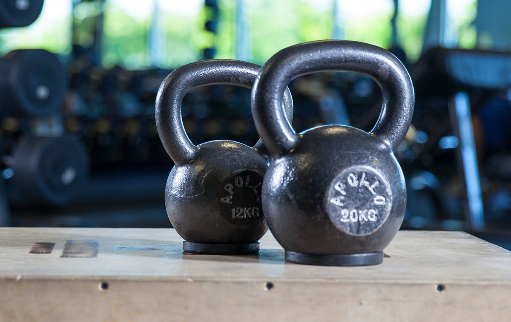

# The 12-Week Muscle-Building Kettlebell Master-Plan

---

**Geoff Neupert, CSCS**  
 May 27, 2021 • 7 min read

If you don't associate kettlebell exercises with building muscle, well, that's understandable. The way most people are using them in the gym is as a lightweight way to break a serious sweat, and nothing else. But make no mistake: Kettlebells can be a huge ally in the quest for mass. And, if you're someone who has been relying largely on barbells or dumbbells, they could be exactly what you've been looking for.

Part of the reason the kettlebell triggers newfound strength and muscle growth is because of its offset shape. It forces the body to stabilize its joints in a different manner from barbells, dumbbells, and other traditional bodybuilding equipment. This forces your muscles to contract in a different fashion than normal, and increases the demand placed upon them.

Want an example? Look no further than the extra depth that every lifter instantly discovers when they front squat with a pair of kettlebells in the rack position, versus a barbell across the back. With this new and increased range of motion comes increased muscular growth in your legs, and strength in your entire torso, from the inside out, including the all-important core musculature.

Best of all, the kettlebell lends itself to a simple, but very challenging programing. This 12-week program requires only two kettlebells and time for three workouts a week. But after one time through it, you'll find yourself more muscular in all the areas that matter: shoulders, upper back, upper chest, arms, legs, and posterior chain. When you go back to "traditional" weight training, don't be surprised if you destroy your old performances—and have to buy bigger shirts.

## **Get Programmed for Growth**

According to research by Brad Schoenfeld, PhD, there are three basic ways to stimulate muscle growth: [1]

* **Mechanical Tension:** Lifting heavier weights for lower reps, similar to the way powerlifters train; think multiple sets of 2-5 reps.
* **Muscular Damage:** Lifting moderate weights for medium to higher reps, similar to the way bodybuilders train; think multiple sets of 8-20 reps.
* **Metabolic Stress:** Doing either high reps or complexes where you don't set the weight down, producing intense burning and the release of metabolites like lactate.

In this program, you'll have a 4-week phase devoted to each pathway. But in all three phases, you'll utilize just three kettlebell exercises: the double-kettlebell military press, front squat, and swing. That may not sound like enough variety to grow on, but all major movement patterns are covered by these exercises:

* **Military Press:** Upper body pressing and pulling (due to the clean that accompanies the press)
* **Front Squat:** Lower body pushing and upper body pulling (you'll need to clean again!)
* **Swing (single or double kettlebell):** Lower body pulling

You'll perform these three days a week, on alternating days, using an A/B split. An A/B split is where you alternate workouts between Workout A and Workout B. So one week you'll go A/B/A, and the next, B/A/B. It's one of the most effective total-body approaches around.

Here's what will comprise your two workouts:

**Workout A:**

* Military Press
* Front Squat

**Workout B:**

* Swing

You'll perform each workout six times over a 4-week period. Look too easy? Keep reading.

## **Weeks 1-4: Mechanical Tension Focus**

Start the program with a pair of matching kettlebells you can press approximately 4-6 times. You'll use them through the entire program. By the end, they'll feel like toys.

You should be comfortable swinging these at least to waist height. If you're at all unsure or uncertain about your capability, drop back to swinging one kettlebell. You can use either the two-handed swing or the one-hand swing. More important than which variety you choose is that you focus on making each rep as explosive as possible.

### **Workout A: Presses and Squats**

Set your timer for 30 minutes. Your goal is to do as many sets of each exercise, with perfect form, as you can in that time. In terms of rest, don't rush it. Use as much as you need.

To perform the workout, clean the kettlebells to the rack position, then perform a set of military presses. Put the kettlebells down and rest momentarily. Then, when you're ready, clean the kettlebells back into the rack position and perform a set of front squats.

* **Workout 1:** Alternate between sets of 1 and 2 reps
* **Workout 2:** Sets of 2
* **Workout 3:** Ladders\* of 1,2,3 reps
* **Workout 4:** Sets of 3
* **Workout 5:** Ladders. 1,2,3,4
* **Workout 6:** Alternate between sets of 3 and 4. If you feel weak, stick with sets of 3.

\***Ladders:** Do a set of 1, then rest. Set of 2, then rest. Set of 3, then rest. Start over again at 1 rep.

### **Workout B: Swings**

Set your timer for 20 minutes. Your goal is to do as many sets of swings as you can, with perfect form, in that time. Again, with rest, don't rush it. Use as much as you need. On workouts 4 through 6, you're repeating workouts 1 through 3 so aim for more explosive swings or more total sets.

* **Workout 1:** Sets of 4
* **Workout 2:** Sets of 5
* **Workout 3:** Sets of 6
* **Workout 4:** Sets of 4
* **Workout 5:** Sets of 5
* **Workout 6:** Sets of 6

## **Weeks 5-8: Muscular Damage Focus**

To start this phase, determine your rep max (RM) with both the military press and the front squat using your two trusty kettlebells. A rep max is a set where you do as many reps as possible using perfect form. When your form falters at all, terminate the set.

From now on, you are going to work off of percentages of your RM. For example, if your military press RM is 10 and you see "50 percent RM" in the program, you'll do 5 reps. Always round down the number of reps if you hit a decimal point in your math. This will keep you from overtraining, and allow you to keep your force production high.

Finally, don't rush your reps. Your lowering phase (eccentric) should be 2-3 times slower than your lifting (concentric) phase.

### **Workout A: Presses and Squats**

Set your timer for 30 minutes. Your goal is to do as many sets of each exercise, with perfect form, as you can in that time. But note that there's more specific rest parameters here.

Clean the kettlebells to the rack position, then perform a set of military presses. Put the kettlebells down, and rest 60-90 seconds. Clean the kettlebells back into the rack position, and perform a set of front squats. Rest another 60-90 seconds before pressing again.

* **Workout 1:** 60% RM
* **Workout 2:** 70% RM
* **Workout 3:** 80% RM
* **Workout 4:** 60% RM
* **Workout 5:** 70% RM
* **Workout 6:** 80% RM

### **Workout B**

Do an RM test with your pair of kettlebells for the swing. If you're at 10 or over, then use the following program. If not, use these weeks to keep practicing with the one-handed swing, trying to build up to 20 reps per hand, each at chest height.

Set your timer for 20 minutes. Your goal is to do as many sets of swings as you can, with perfect form, in that time. During this phase, rest 90 seconds between sets. On workouts 4 through 6, you're repeating workouts 1 through 3 so aim for more explosive swings, or more total sets if you struggled to keep up the first time around.

* **Workout 1:** 60% RM
* **Workout 2:** 70% RM
* **Workout 3:** 80% RM
* **Workout 4:** 60% RM
* **Workout 5:** 70% RM
* **Workout 6:** 80% RM

## **Weeks 9-12: Metabolic Stress Focus**

Once again, find your RM for the military press and the front squat. You'll do this to measure your progress. Even a small increase in your RM numbers means an increase in strength, so I'd like you to test at the very end of the program as well, after taking a week off.

### **Workout A: Presses and Squats**

There's one big difference in these workouts: You'll clean the kettlebells to the rack position and perform a set of military presses, followed immediately by one set of front squats. Then, put the kettlebells down and rest. When your rest time is over, clean the kettlebells back into the rack position and repeat.

This slight variation may not seem like much, but it increases the time under tension you experience and triggers metabolic stress. This is due to the increased time in the rack position and the increased demand on your accessory respiratory muscles.

Furthermore, combined with this month's set up, you'll be challenged to your max capacity each and every set.

* **Workout 1:** 5 RM\* sets. Rest 3 min. between sets.
* **Workout 2:** 4 RM sets. Rest 2.5 min. between sets.
* **Workout 3:** 3 RM sets. Rest 2 min. between sets.
* **Workout 4:** 5 RM sets. Rest 3 min. between sets.
* **Workout 5:** 4 RM sets. Rest 2.5 min. between sets.
* **Workout 6:** 3 RM sets. Rest 2 min. between sets.

\*Your RM will drop due to fatigue as the sets progress. That's perfectly normal. Your first RM may also decrease between workouts. It does not mean you're getting weaker! It means there is fatigue in your system.

On workouts 4-6, you'll be repeating workouts 1-3, so aim for more total reps per RM set the second time through.

### **Workout B: Swings**

By this point, you should be able to comfortably swing a pair of kettlebells. Do an RM test with your pair of kettlebells for the swing. If you're at 10 or over, then use the following program. If not, keep on practicing with the one-handed swing, working up to 20 reps per hand, each at chest height.

To perform this workout, set your timer for 20 minutes, and try to reach the targeted minimum number of sets in that time. Your goal is to perform 10 sets of 10 reps. A systematic way to approach this is on a 2-minute cycle: 20-30 seconds of work, followed by 90 seconds of rest.

* **Workout 1:** 5-7 sets of 10 reps
* **Workout 2:** 6-8 sets of 10 reps
* **Workout 3:** 7-9 sets of 10 reps
* **Workout 4:** 6-8 sets of 10 reps
* **Workout 5:** 7-9 sets of 10 reps
* **Workout 6:** 8-10 sets of 10 reps

## **The Two Most Common Questions**

**What about ab work?:** You don't need to do any direct ab work on this program, unless you really want to. The amount of tension running through and across your abs will already be severe, especially combining the military presses and front squats in the same day.

However, if you can't live without ab training, I recommend you do hanging variations, like hanging leg raises, to decompress your spine from all the loading.

**What about food?:** Eating is good. Since this is a strength and muscle program, you need to eat a lot. How much is "a lot?" That depends on where you're starting, and how much you want to grow.

A tried-and-true starting point is to multiply your body weight (in pounds) by 15-20 for total calories. Nutrient breakdown? In my book, you can't beat the time-tested 30/40/30 split of protein/carbohydrates/fat when growth is the goal.

If you start putting on more fat than you'd like, cut back. Otherwise, your assignment is simple: Eat, sleep, lift, and grow.

##### **References**

1. Schoenfeld, B. J. (2010). The mechanisms of muscle hypertrophy and their application to resistance training. *The Journal of Strength & Conditioning Research, 24*(10), 2857-2872.