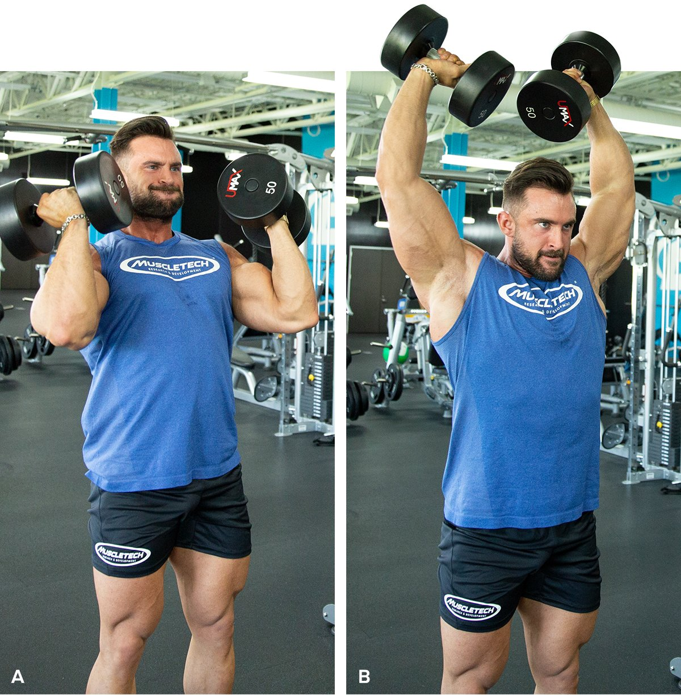

# The 3-Move Shoulder Builder

---

**Roger Lockridge**  
October 25, 2024 • 3 min read

**[Chest](https://shop.bodybuilding.com/blogs/training/5-ways-to-build-a-bigger-bench-press) | [Back](https://shop.bodybuilding.com/blogs/training/3-moves-to-a-brick-thick-back) | Shoulders | [Arms](https://shop.bodybuilding.com/blogs/training/biceps-and-triceps-workout-triple-threat-arm-assault) | [Quads](https://shop.bodybuilding.com/blogs/training/the-ultimate-machine-quad-workout-for-bigger-legs) | [Hamstrings](https://shop.bodybuilding.com/blogs/training/3-essential-moves-for-powerhouse-hamstrings) | [Calves](https://shop.bodybuilding.com/blogs/training/unlock-calf-growth-with-these-3-exercises) | [Abs](https://shop.bodybuilding.com/blogs/training/sculpt-a-6-pack-with-just-3-moves)**

Though building your body isn't necessarily easy, it doesn't have to be complicated. If you're trying to do every shoulder exercise under the sun, you're making your life harder than it needs to be.

To grow your shoulders to epic proportions, choose quality over quantity. Simplify your routine by mastering these three mass-building exercises.

### The 3-Move Shoulder Builder

**1. Standing Low-Pulley Deltoid Raise**

3 sets, 20, 15, 10 reps

**2. Arnold press**

3 sets, 12, 10, 8, 6 reps

**3. Dumbbell Lying Rear Lateral Raise**

3 sets, 12 reps

## **Technique Tips**

### **Single-Arm Cable Lateral Raise**

Dumbbell lateral raises are great, but there's an advantage to using cables instead. Cables help keep tension on the muscle throughout the entire rep, which means your shoulders are continuously working against resistance. More resistance through a greater range of motion equals more strength and better growth.

It's easier to isolate the lateral head of the delts if you do your raises one side at a time. This also helps improve balance and symmetry for better aesthetics and better performance.

Hold at the top of each rep for a one-second count before lowering slowly back to your starting position. This brief hold removes momentum and places more emphasis on the shoulders. Doing each rep with a pause is just as important as the total number of reps you do, so don't skip out on that burn! Add weight to the stack with each set.

### **Arnold Press**

Arnold Schwarzenegger liked the traditional seated dumbbell press but thought there was something more he could do to make his shoulders pop when he stood onstage. He found that twisting the dumbbells as he pressed them up worked all three heads of the shoulders. The front delts are still the primary focus, but working every part of the shoulder in one exercise was a game-changer, which is why we call this move the Arnold press to this day.

You can do this exercise seated on the end of a bench to challenge your core and maintain stability, or you can use a seated bench with a back to brace yourself. To recruit the entire shoulder complex, sit perfectly upright. If you want to focus more on the front delts, lean the bench back to a very slight incline. Keep in mind, though, this shift will also recruit a bit of your pecs.

Don't be afraid to go heavy and push yourself, since you're working the entire shoulder. You should be able to control the weight you use and not lock out at the top. The goal is to reach muscle failure while keeping the work in the shoulders and avoiding injury. Locking out shifts focus to the triceps, and choosing a weight you can't control risks shoulder injury. Start with a weight you know you can handle. Increase the weight with each set as you drop the reps.

### **Dumbbell Lying Rear Lateral Raise**

It can be tough to work the rear delts because you can't see their activity, and it's very easy to use momentum. Lying chest down on an incline bench helps you execute a strict rear delt raise while giving you the best opportunity to see and feel those target muscles working.

Set the bench at a lower incline, about 15 degrees or so, and position yourself chest down on the bench with your feet on the floor. Hold the dumbbells with a neutral grip and lift them up and to the sides until parallel to your shoulders.

To make this movement even more effective, hold the dumbbells so your pinkies are up against the inside of the handle instead of in the middle. As subtle as this tweak might be, actively lifting the weight with your pinkies helps engage the rear delts so they do more work. Use straps if you feel your grip might hold you back as you work toward failure. Don't try to set a record with weight. Focus on proper execution and contraction.