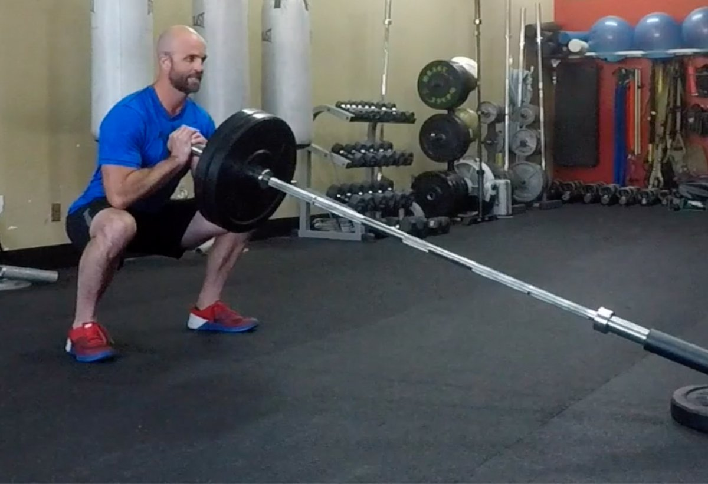

# The 5 Essential Landmine Exercises

---

*There may be no better tool than the landmine to give every lifter access to high-quality strength training. Get to know it through these moves, and prepare to be converted!*

---

**Jason Wanlass**  
 March 16, 2021 • 5 min read

If you have access to a landmine at your gym, then you are one lucky lifter. This humble-looking apparatus, which is basically a short tube mounted to a swivel joint, usually stuck off in some corner of the gym, is one of the most versatile, effective fitness tools for increasing functional strength and enhancing athletic performance.

By inserting one end of an Olympic bar into the [landmine](https://www.bodybuilding.com/fun/boom-3-landmine-exercises-for-mass-construction.html), you can load the other end of the bar to perform a variety of angular and rotational strength exercises. In a pinch, you can also just shove a barbell into the corner of the room—hopefully not through the drywall—to stabilize it.

What makes the landmine so special? Think of it this way: Your training regimen should always include the foundational athletic movements of pressing, pulling, squatting, lunging, and rotation. However, the barbell-loaded versions of the first four of those movements are often the hardest to pull off with good form—even though they're the first variations most lifters try. The landmine makes each of these movements more accessible, so lifters with mobility restrictions, injuries, or simply sketchy movement patterns can lift with minimal risk of injury.

Start with these five moves. Any of them can be woven into your existing program, or they can be combined into a full-body, single-implement circuit.

### **Keys to Safe Landmine Lifting**

* Focus on form and adapting to the exercises for the first few sessions. Begin with lighter weight when starting out. It doesn't take much load to tax you physically with the landmine.
* Once you're accustomed to the movements, add weight! One of the great benefits of the landmine is that it is plate-loadable in both large and small increments.
* Due to the unique arc-shaped bar path, the lower the weighted end of the landmine is to the floor, the greater the resistance. For this reason, it's harder to do a movement while kneeling than while standing.
* Keep the bar in line with your shoulder and close to your body on pressing movements for safety's sake.
* Pivot your feet and rotate at the hips on rotational exercises.
* In landmine exercises, the barbell moves in an arc, not a straight line. Get used to it.

### **1. Landmine Squats**

**Benefits:**

* Builds strength, muscle, and explosiveness in the legs
* Helps beginners learn the proper squat pattern, since the arc of the bar naturally travels back, making it easier to sit back and stay upright at the bottom of the squat
* Great alternative for those who can't perform regular squats because of injury or mobility issues
* Easier on joints than traditional barbell back and front squats

If everyone who performed a questionable back squat in your gym started doing landmine squats instead, the world would be a far less injured place. Hit these for reps, and you'll give your legs all the work they want, without your back paying the price.

**How to do it:** Begin by holding the bar against your chest, and squat down until your thighs are parallel to the floor. Use your elbows as a reference point for proper squat depth: When they touch the tops of your thighs (or just inside your knees if you take a wider stance), you're deep enough. Maintain an upright posture. Fully extend your legs and contract your glutes to return to a standing position.

### 2. Landmine Thruster

**Benefits:**

* Develops total-body strength and power
* Works the legs, butt, shoulders, back, core…pretty much everything
* Huge metabolic demand
* Easier to perform and more shoulder-friendly than barbell thrusters

Hate that moment in a barbell thruster where you have to make the awkward transition between a front squat rack and a press? That's understandable. The thruster version is just as brutal from a workload perspective, but far more forgiving in terms of wrist, shoulder, and T-spine mobility. End your WOD with these, and you won't regret it.

**How to do it:** The set up for thrusters is the same as landmine squats. Begin by holding the bar against your chest, and squat down until your thighs are parallel to the floor. But as you return to the starting position, explosively press the weight forward by fully extending your arms as you extend your legs.

### **3. Rotational Single-Arm Press**

**Benefits:**

* Builds rotational strength and power
* Great for learning to generate power from the glutes
* Strong training carryover, particularly for rotational sports (e.g., baseball, tennis, golf, and boxing/MMA)

Landmine-press variations are popular with strength coaches because the slight forward path of the bar makes it more shoulder-friendly than strictly vertical press variations. The rotational variation offers still other benefits, bringing in the core and glutes to encourage proper pressing form, full-body muscle integration, and keeping the shoulder in a strong position.

**How to do it:** Begin by angling your body about 45 degrees toward the landmine. Hold the loaded bar in your right hand, and position it at chest level just inside your right shoulder. Descend into a quarter-squat as you shift your weight slightly to your right rear leg.

Generate power by driving and rotating from the back of your right hip, with your waist and shoulder simultaneously following as you pivot from your right foot. Fully extend your right arm at the top of the movement as you shift your weight to your front leg, keeping the bar in line with your shoulder.

### **4. Landmine Antirotation**

**Benefits:**

* Builds core-stabilization strength
* Helps prevent low-back pain

These go by a number of names: landmine 180s, twists, and rotations are some of the most popular. I like the term "antirotations," because it gives a clearer picture of the objective, which is to resist the weight's trajectory.

The biggest priority in building a strong core—not just one that looks strong—is strengthening it to stabilize and restrict movement. The landmine allows you to work the core's antirotator function by using a standing posture with movement, almost like a standing, dynamic plank. Get strong at these, and you have a strong core, period.

**How to do it:** Begin by holding the bar with both hands at chest level. Use your arms to move the bar in a broad arc back and forth in front of you. Use your arms only, keeping your core and hips still.

### 5. Split Squat/Row Combo

**Benefits:**

* High metabolic demand
* Builds full-body strength and coordination
* Helps tie together upper- and lower-body musculature, as well as posterior chain

Sure, you can also do a standard bodybuilder-style row with the landmine, which often goes by the name of a [Meadows row](https://www.bodybuilding.com/exercises/detail/view/name/single-arm-landmine-row). Personally, I prefer this version, which is almost like a full-body row. As you rise from the split squat into the row, you simultaneously fire your opposite side glute and lat, strengthening both and tying them together in the cross-body athletic-gait pattern that is essential for athletes.

**How to do it:** Begin with your back facing the landmine in a split-stance position with the leg closest to the bar behind you. Using an open grip, pick up the bar with the arm closest to the bar, gripping just below the collar. Keep tension on the bar and descend into a split squat, stopping just before your back knee touches the ground. Return to an upright position by extending your front leg while simultaneously rowing the bar.