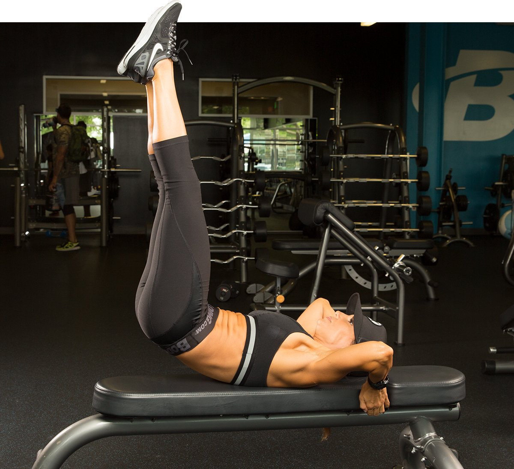
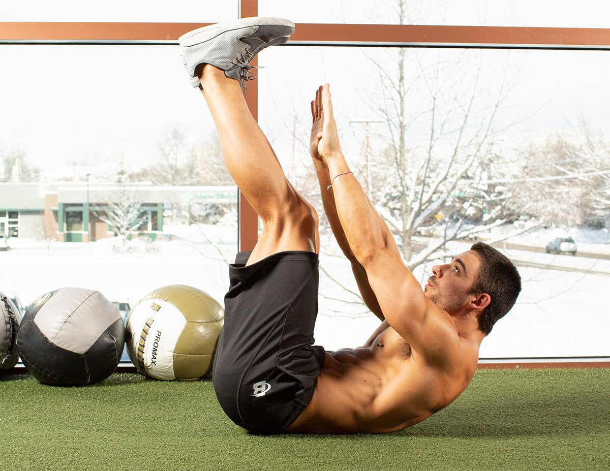
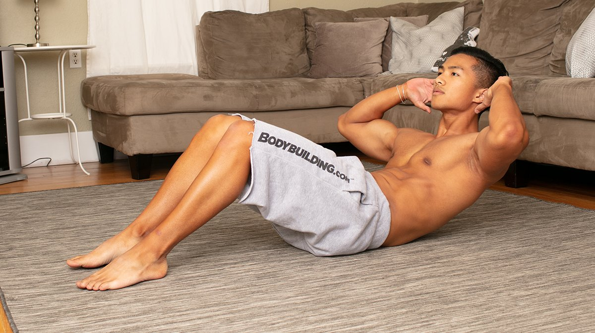

# The Best Ab Workout For A Six Pack

---

How do you train to get six-pack abs? You can do it with long and complicated training, like many people do, but in my book, the best ab workout is the one you'll do over and over again.

Yes, it's true that that abs are earned in the kitchen—not the gym. But if six-pack abs are your goal, it's also important to pick the right ab workout for the job.

This workout is composed of seven ab exercises carefully chosen to work both the upper and lower ab muscles. Hit this workout hard three times a week, stick to a healthy diet that goes easy on the calories, do some lifting and the right amount of cardio, and you'll soon see some serious six-pack progress.

## The "Magnificent 7" Ab Circuit

**1. CIRCUIT**

Perform the exercises in order with no rest between exercises and 2 min. rest between rounds.

**Sit-up**

3 sets, 12-15 reps (no rest)

**Lying Leg Raise**

3 sets, 12-15 reps (no rest)

**V-up**

3 sets, 12-15 reps (no rest)

**Seated leg tuck**

3 sets, 12-15 reps (no rest)

**Toe Touch**

3 sets, 12-15 reps (no rest)

**Crunches**

3 sets, 12-15 reps (no rest)

**Reverse crunch**

3 sets, 12-15 reps (rest 2 min.)

### How to Do This Core Routine

This is a fairly advanced ab workout, so how you do it matters.

Beginners are better off performing just three out of the seven exercises for two sets each of as many reps as possible, with a minute of rest between sets. From there, build up your fitness and endurance by adding exercises and sets and cutting back on your rest periods.

A reasonable goal is to be able to do the seven exercises in a big circuit all at once, rest a minute or two, and repeat it two more times by the end of 12 weeks.

As you build up to that, feel free to break up the workout in different ways. For instance, I like to perform supersets like this:

**Repeat 3 times:**

* Exercise 1 and 2, rest 30 sec.
* Exercise 3 and 4, rest 30 sec.
* Exercise 5 and 6, rest 30 sec.
* Exercise 7, rest 60 sec.

Perform each set to momentary muscle failure, or until you can't easily do another rep.

Note that I haven't included any direct oblique work. In my experience, direct oblique work only leads to a wider waistline. Besides, obliques get enough stimulation from exercises like squats, deadlifts, and other full-body weight training.

### When to Work Your Abs

For most people, performing this routine a minimum of three days per week will be plenty. An advanced bodybuilder could do it just about every day.

Personally, I like to head to the gym early and do abs and cardio first thing in the morning, then come back in the afternoon for weight training. That way, I get to spike up my metabolism twice a day.

If you'd rather do the workout in one session, I recommend either performing the ab routine as a warm-up for your weight training or after your training if you're going to be doing heavy lifting like squats or deadlifts. Then perform your cardio last.

### How to Make This Ab Routine Easier or Harder

If you can't do an exercise, due to lower-back injuries for instance, feel free to substitute it with an exercise that doesn't bother your back.

If, on the other hand, you have a healthy lower back and would like to add extra mass to your abs, do the workout three times a week and use some resistance in the exercises, such as holding a small plate or dumbbell.

### How to Perform the Exercises

#### Exercise 1: Sit-up

*Primary Target: Upper Abs*

1. Lie flat on your back on the floor with your knees bent and your legs secured under a piece of heavy furniture or bench.
2. Place your hands by your chest.
3. Flexing your abdominals, raise your torso until you are in nearly a sitting position.
4. Retaining tension on the abs, lower your torso to the beginning position. (Note: Maintain full control throughout the movement. Avoid the temptation to rock back and forth.)

#### Exercise 2: Leg Lift

*Primary Target: Lower Abs*

1. Lie flat on your back on the floor with your legs straight in front of you.
2. Place your hands at your sides by the floor for support.
3. Flexing your lower abdominals, raise your legs until they are perpendicular to the floor.
4. Retain tension as you lower your legs to the beginning position. (Note: Maintain full control throughout the movement. Avoid the temptation to let your legs drop on the negative portion of the movement.)

#### Exercise 3: V-up

*Primary Target: Upper and Lower Abs*

1. Lie flat on your back on the floor with your legs straight in front of you.
2. Place your hands at your sides by the floor for support.
3. Flexing your lower abdominals, raise your legs until they are perpendicular to the floor.
4. At this time, raise your shoulders and torso as far as possible from the ground in a curling movement without raising your back from the floor.
5. Maintaim tension as you lower your legs to the beginning position, then bring your torso to the starting position as well. (Note: Maintain full control throughout the movement. Avoid the temptation to rock back and forth.)

#### Exercise 4: Seated knee tuck

*Primary Target: Lower Abs*

1. Sit on the floor (or on the edge of a chair or exercise bench) with your legs extended in front of you and your hands holding on to the sides for support.
2. Keep your knees together and pull them in toward your chest until you can't go any farther.
3. Keeping the tension on your lower abs, return to the start position and repeat the movement until you've completed your set.

#### Exercise 5: Toe-Toucher

*Primary Target: Upper and Lower Abs*

1. Lie on the floor with your legs touching and extended in front of you, and your hands by your side.
2. Lift your legs up as high as possible while at the same time bringing your torso toward them and reaching your hands toward your toes.
3. Return to the start position and repeat the movement until you have completed your set.

#### Exercise 6: Crunches

*Primary Target: Upper Abs*

1. Lie flat on your back on the floor with your legs bent at the knees.
2. Place your hands by your chest.
3. Raise your shoulders and torso as far as possible from the ground in a curling movement without raising your lower back from the floor.
4. Retaining tension on the abs, bring your torso to the starting position. (Note: Maintain full control throughout the movement. Avoid the temptation to rock back and forth.)

#### Exercise 7: Reverse Crunch

*Primary Target: Upper and Lower Abs*

1. Lie flat on your back on the floor with your legs straight in front of you.
2. Place your hands palms down at your sides for support.
3. Slowly bend your legs at the knees  and bring them toward your chest.
4. Once your knees are by your chest, raise your shoulders and torso as far as possible from the ground in a curling movement without raising your back from the floor.
5. Return your legs to the starting position and bring your torso back to the floor.

This is just one of the many great ab workouts you'll find at Bodybuilding.com. Keep exploring to find the right ones for you!