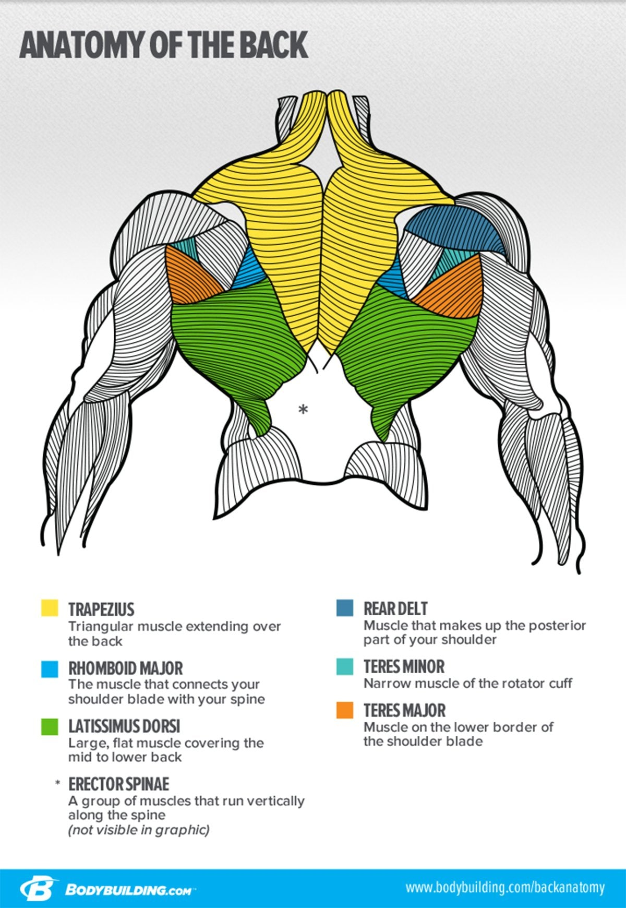
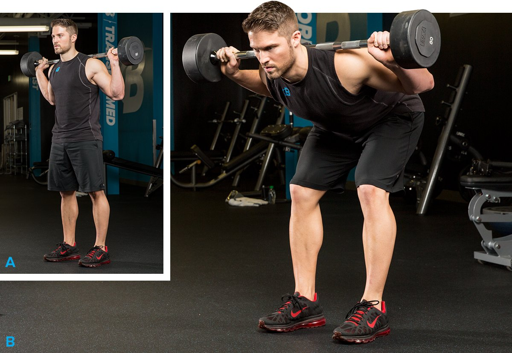

# The Best Workouts to Build a Bigger Back

---

**[Bigger Arms](https://shop.bodybuilding.com/blogs/training/the-best-workouts-to-build-bigger-arms) | Bigger Back | [Bigger Chest](https://shop.bodybuilding.com/blogs/training/the-best-workouts-to-build-a-bigger-chest) | [Bigger Legs](https://shop.bodybuilding.com/blogs/training/the-best-workouts-to-get-bigger-legs) | [Bigger Shoulders](https://shop.bodybuilding.com/blogs/training/the-best-workouts-to-get-bigger-shoulders) | [Muscular Abs](https://shop.bodybuilding.com/blogs/training/the-best-ab-workouts-to-build-a-muscular-six-pack)**

If you're someone who's guilty of only working out your "show muscles" like chest, arms, abs, and shoulders, this is the recipe to earn all the other growth you've been missing. A thick, dense, and well-balanced upper body needs a big back—period!

So, let's break down how to turn your back into wide, thick wings of muscle. Along with a growth-focused approach to nutrition and supplementation, these beginner-friendly workouts to train your back are what you need to earn size that will show up from all angles.

### The Secret to Growing a Bigger Back

The back is a large and complex muscle group, comprising not only the lats, but also the lower back, upper and lower traps, rear delts, and a number of smaller muscles. With all that going on, it's not an easy muscle group to train optimally, even if you think you're using the best back exercises. Sure enough, I hear it all the time: "I can't feel my back contracting when I work out!"

You're not alone. And the answer is to dial in your technique and weight selection. With many muscle groups, you are able to use poor form or too much weight and still feel the target muscle working. It's different with the back—unless you use rock-solid form and pick the right weights, you can do a full workout and not feel much in your back at all.

These are my tips to not only have better back workouts, but to feel the back muscles working:

* Don't squeeze the bar or handle too hard, or your forearms and biceps will take over. Use lifting straps on back day, then train your grip on arm day.
* Pause for 1-2 seconds at the top of each rep, when your shoulder blades are pinched together or pulled down, then pause again in the stretched position. Yes, this means you will have to use less weight!
* Use weight that allows you to control and feel each rep—and no more! This isn't powerlifting. Too many beginners use way too much weight and never feel the muscle working.

### 

### How to Use These Workouts

Perform one back workout per week, preferably on a Monday or Tuesday. You can do a little light biceps work afterward, but you don't have to. They'll get plenty of work during your back workout, and then again later in the week.

Perform Workout 1 for 4-6 weeks, then move to Workout 2. Keep going until you get through Workout 5. Once you're through Workout 5, you can start over with Workout 1 confident that you're bigger and stronger than you were before.

While you're on this program, use Bodybuilding.com's macronutrient calculator to make sure you're eating enough calories, protein, carbs, and fats to support your goal of muscle gains. To grow your back, you must be in a caloric surplus, meaning that you are eating more calories than you burn.

**Along with protein, a couple of key supplements to consider with these workouts are:**

* **[Creatine monohydrate](https://shop.bodybuilding.com/collections/creatine):** to help build muscle and strength
* **[Pre-workout](https://shop.bodybuilding.com/collections/pre-intra-workout):** to fight fatigue during tough back workouts

### Back Workout 1, Weeks 1-4

**1. Barbell Row**

3 sets, 6-8 reps (rest 90 sec.)

**2. Seated Row**

3 sets, 8-12 reps (rest 90 sec.)

**3. Close-grip pull-down**

3 sets, 12 reps (rest 1 min.)

**4. Barbell shrug**

3 sets, 6-8 reps (rest 90 sec.)

**5. Back extension**

Hold a weight plate in front of your chest for extra resistance.

3 sets, 12 reps (rest 90 sec.)

### Back Workout 2, Weeks 5-8

**1. Dumbbell bent-over row**

3 sets, 8-12 reps (rest 90 sec.)

**2. Reverse-grip bent-over row**

3 sets, 6-8 reps (rest 90 sec.)

**3. SINGLE-ARM PULL-DOWN**

Perform all of the reps on one side before switching to the other side. Don't rest between sides and rest 1 min. between sets.

**Single-arm pull-down**

3 sets, 15 reps (left side, no rest)

**Single-arm pull-down**

3 sets, 15 reps (right side, rest 1 min.)

**4. Standing dumbbell shrug**

3 sets, 8-12 reps (rest 1 min.)

**5. Good Morning**

3 sets, 12-15 reps (rest 90 sec.)

###

### Back Workout 3, Weeks 9-12

**1. Lat pull-down**

3 sets, 8-12 reps (rest 90 sec.)

**2. Reverse-grip lat pull-down**

3 sets, 8 reps (rest 1 min.)

**3. Incline dumbbell row**

3 sets, 12 reps (rest 90 sec.)

**4. Barbell behind-the-back shrug**

3 sets, 12 reps (rest 1 min.)

**5. Barbell stiff-legged deadlift**

3 sets, 8 reps (rest 90 sec.)

### Back Workout 4, Weeks 13-16

**1. Full Range-Of-Motion Lat Pulldown**

3 sets, 8-12 reps (rest 90 sec.)

**2. Close-Grip Front Lat Pulldown**

3 sets, 12 reps (rest 1 min.)

**3. SINGLE-ARM DUMBBELL ROW**

Perform all of the reps on one side before switching to the other side. Don't rest between sides and rest 1 min. between sets.

**Single-Arm Dumbbell Row**

3 sets, 8-12 reps (left side, no rest)

**Single-Arm Dumbbell Row**

3 sets, 8-12 reps (right side, rest 1 min.)

**4. Back extension**

Hold a weight plate in front of your chest for extra resistance.

3 sets, 8 reps (rest 90 sec.)

### Back Workout 5, Weeks 17-20

**1. Barbell Row**

3 sets, 8 reps (rest 90 sec.)

**2. Reverse-grip lat pull-down**

3 sets, 6-8 reps (rest 90 sec.)

**3. SINGLE-ARM DUMBBELL ROW**

Perform all of the reps on one side before switching to the other side. Don't rest between sides and rest 1 min. between sets.

**Single-Arm Dumbbell Row**

3 sets, 8-12 reps (left side, no rest)

**Single-Arm Dumbbell Row**

3 sets, 8-12 reps (right side, rest 1 min.)

**4. Barbell behind-the-back shrug**

3 sets, 8-12 reps (rest 1 min.)

**5. Good Morning**

3 sets, 8 reps (rest 90 sec.)

**A better back day deserves a better protein shake. Do the work and enjoy your reward!**