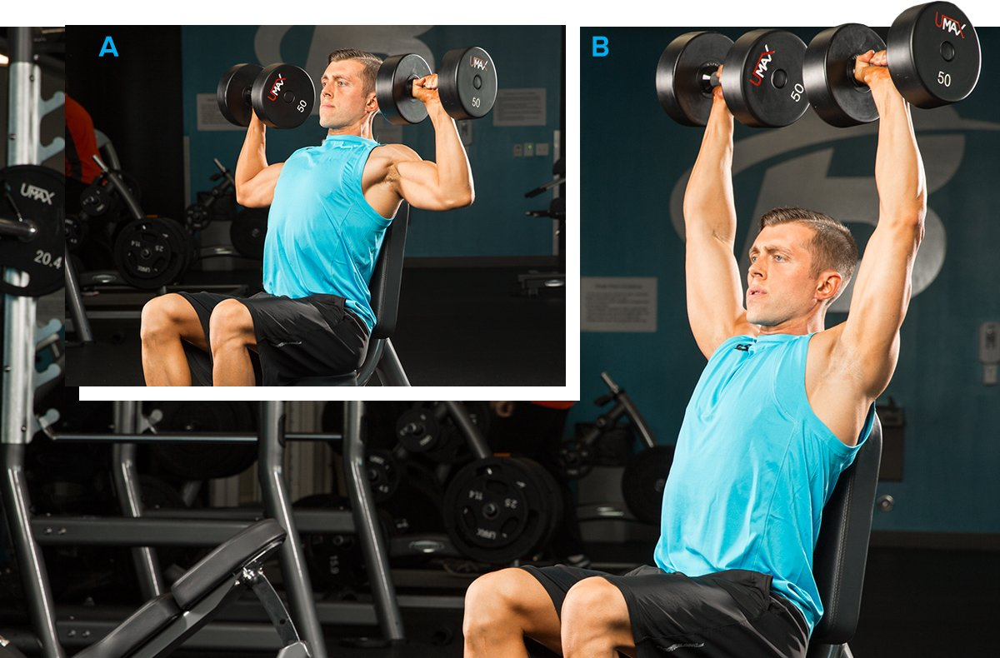

# The Best Workouts to Get Bigger Shoulders

---

**[Bigger Arms](https://shop.bodybuilding.com/blogs/training/the-best-workouts-to-build-bigger-arms) | [Bigger Back](https://shop.bodybuilding.com/blogs/training/the-best-workouts-to-build-a-bigger-back) | [Bigger Chest](https://shop.bodybuilding.com/blogs/training/the-best-workouts-to-build-a-bigger-chest) | [Bigger Legs](https://shop.bodybuilding.com/blogs/training/the-best-workouts-to-get-bigger-legs) | Bigger Shoulders | [Muscular Abs](https://shop.bodybuilding.com/blogs/training/the-best-ab-workouts-to-build-a-muscular-six-pack)**

Want a bigger upper body? Craving those V-taper aesthetics? Both goals demand building big shoulders.

Your shoulders are already working all day long, helping you do everything from brushing your teeth to shooting hoops to driving to work. So you've got to work them hard with the best shoulder exercises to get them to hear the message to grow! These beginner-friendly shoulder workouts will do just that.

Each workout here combines the best shoulder exercises like presses and raises with just enough intensity and volume to build 3D delts. With a growth-focused approach to nutrition and supplementation, these workouts will deliver serious size and surprising strength gains.

### Know Your Shoulders to Grow Your Shoulders

The shoulders consist of three "heads" of a single muscle group: the front (anterior), side (lateral), and rear (posterior) deltoids. But in training, it's best to treat them as three small muscle groups.

Many beginners make the mistake of treating the heads as one muscle and train it like they do chest: with presses, presses, and more presses. The problem? This training approach heavily recruits the anterior head with little work to the middle and posterior head of the shoulder girdle.

Without middle and posterior development, the shoulders will look narrow from both the front and the side. It can also result in imbalances, which is why physical therapist and strength coach John Rusin recommends paying as much attention—or even more—to the rear and lateral deltoids.

The shoulders contain both fast-twitch and slow-twitch fibers, but slightly more slow-twitch. This means they'll respond to both moderate (6-8) rep ranges and higher (8-12). But bodybuilders know that building seriously impressive shoulders demands a serious pump—so expect to see sets of 12-15 in there, too!

### How to Use These Shoulder Workouts

Perform one shoulder workout per week. If you're really trying to bring up your shoulders, do it first thing each week on Monday while you're fresh from a day off. Otherwise, Wednesday or Thursday are classic days for shoulders, maybe with some traps thrown in afterward.

Perform Workout 1 for 4-6 weeks, trying to increase the weight you use each workout. On most exercises, you'll add weight until the final set, which you should take close to muscle failure. Then move to Workout 2 and repeat the process until you get through Workout 5. Once you're through Workout 5, you can start over with Workout 1 confident that you're bigger and stronger than you were before.

While you're on this program, use Bodybuilding.com's macronutrient calculator to make sure you're eating enough calories, protein, carbs, and fats to support your goal of muscle gains. To grow your shoulders, you must be in a caloric surplus, meaning that you are eating more calories than you burn.

**Along with protein, a couple of key supplements to consider with these workouts are:**

* **[Creatine monohydrate](https://shop.bodybuilding.com/collections/creatine):** to help build muscle and strength
* **[Pre-workout](https://shop.bodybuilding.com/collections/pre-intra-workout):** to fight fatigue

### Shoulder Workout 1, Weeks 1-4

**1. Barbell Strict Overhead Press**

Add weight with every set.

3 sets, 6-8 reps (rest 2 min.)

**2. SINGLE-ARM LATERAL RAISE**

Perform all of the reps on one side before switching to the other. Don't rest between sides and rest 90 sec. between sets.

**Single-arm lateral raise**

Add weight with every set.

3 sets, 12 reps (left side, no rest)

**Single-arm lateral raise**

Add weight with every set.

3 sets, 12 reps (right side, rest 90 sec.)

**3. Front Plate Raises**

Add weight with every set. Pause for 3 sec. at the top of each rep.

3 sets, 12 reps (rest 1 min.)

**4. Lying rear delt fly**

3 sets, 15 reps (rest 1 min.)

### Shoulder Workout 2, Weeks 5-8

**1. Seated Dumbbell Side Raise**

Add weight with every set.

3 sets, 8-12 reps (rest 90 sec.)

**2. Dumbbell Seesaw Press**

Add weight with every set.

3 sets, 12-16 reps (alternating, 6-8 rep per side, rest 90 sec.)

**3. Incline dumbbell reverse fly**

Add weight with every set.

3 sets, 12 reps (rest 1 min.)

**4. Dumbbell Lateral Raise**

Add weight with every set.

3 sets, 15 reps (rest 1 min.)

### Shoulder Workout 3, Weeks 9-12

**1. Seated rear delt fly**

Add weight with every set.

3 sets, 8-12 reps (rest 90 sec.)

**2. Seated dumbbell shoulder press**

Add weight with every set.

3 sets, 6-8 reps (rest 90 sec.)

**3. SINGLE-ARM CABLE LATERAL RAISE**

Perform all of the reps on one side before switching to the other. Don't rest between sides and rest 1 min. between sets.

**Cable Lateral Raise**

Add weight with every set.

3 sets, 8-12 reps (left side, no rest)

**Cable Lateral Raise**

Add weight with every set.

3 sets, 8-12 reps (right side, rest 1 min.)

**4. Barbell rear delt bent-over row**

3 sets, 12 reps (rest 1 min. )

### Shoulder Workout 4, Weeks 13-16

**1. Arnold press**

Add weight with every set.

3 sets, 6-8 reps (rest 90 sec.)

**2. SINGLE-ARM BENT-OVER REAR DELT FLY**

Perform all of the reps on one side before switching to the other. Don't rest between sides and rest 1 min. between sets.

**Single-Arm Rear Delt Raise**

Add weight with every set.

3 sets, 12 reps (left side, no rest)

**Single-Arm Rear Delt Raise**

Add weight with every set.

3 sets, 12 reps (right side, rest 1 min.)

**3. SINGLE-ARM SIDE-LYING REAR FLY**

Perform all of the reps on one side before switching to the other. Don't rest between sides and rest 1 min. between sets.

**Single-arm side lying rear fly**

Add weight with every set.

3 sets, 12 reps (left side, no rest)

**Single-arm side lying rear fly**

Add weight with every set.

3 sets, 12 reps (right side, rest 1 min.)

**4. Alternating dumbbell front raise**

3 sets, 24 reps (alternating, 12 reps per side, rest 1 min.)

### Shoulder Workout 5, Weeks 17-20

**1. SINGLE-ARM LATERAL RAISE**

Perform all of the reps on one side before switching to the other. Don't rest between sides and rest 1 min. between sets.

**Single-arm lateral raise**

Add weight with every set. Pause for 3 sec. at the top of each rep.

3 sets, 8 reps (left side, no rest)

**Single-arm lateral raise**

Add weight with every set. Pause for 3 sec. at the top of each rep.

3 sets, 8 reps (right side, rest 1 min.)

**2. Military press**

Add weight with every set.

3 sets, 6-8 reps (rest 90 sec.)

**3. Incline dumbbell reverse fly**

3 sets, 12 reps (rest 1 min.)

**4. Dumbbell Lateral Raise**

3 sets, 15 reps (rest 1 min.)