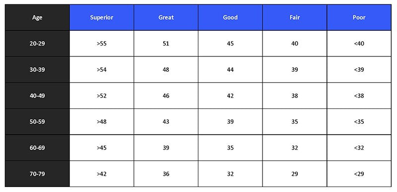

# The Importance of VO2 Max Testing, Regardless of Your Fitness Goals

---

*Heart health as the key to peak human health.*

---

**Ken Yu**  
 February 16, 2023 • 5 min read

Most people understand the importance of cardiovascular training, yet many still have questions concerning which type of cardio routine is best. Should you go on a low and slow treadmill walk in zone 2, log a long bike ride in zone 3, sprint a middle distance run in zone 4, and/or blast through a High Intensity Interval Training (HIIT) workout in zone 5?

To answer these questions, you should first determine your current fitness level by finding out your VO2 max. Your VO2 max is the maximum (max) rate of volume (V) of oxygen (O2) that your body is able to consume during physical exertion (1). A high VO2 max is a good predictor of peak athletic performance as well as longevity by quantifying how well your heart, lungs, and muscles are performing (2).

If you are an athlete looking to improve your performance numbers, a VO2 max test can provide you with a baseline measurement of your current physiological capabilities. This number can allow you to design a more effective training program and then evaluate the effectiveness of that training protocol by retesting your VO2 max.

Even if endurance training is not your main goal, improving your VO2 max is still impeccably important. A high VO2 max is a strong and independent predictor of all-cause and disease-specific mortality (2). One study with over 100,000 participants showed that people with the highest level of fitness have a five fold decrease in mortality rate as compared to people with the lowest level of fitness (3). It has also been shown that improving your cardiovascular fitness helps improve your life expectancy at all levels with no upper limit (3).

There are three main ways of testing your VO2 max. First you can take a cardiopulmonary exercise test at a medical facility or exercise lab. The test will require you to wear a mask to measure your oxygen and carbon dioxide levels while performing cardiovascular exercise, such as treadmill running, stationary biking, or rowing. The medical personnel will monitor your outputs at increasing levels of intensity to identify your cardiovascular numbers. Second, you can go to a licensed private facility like [Dexafit](https://www.dexafit.com/services/vo2-max-testing) where you can take a performance based VO2 max test using medical grade equipment to determine your VO2 max. Third, you can approximate your score by taking one of the following fitness tests.

In the Cooper Test, you run or walk as fast as you can for exactly 12 minutes and your distance will correlate to your VO2 Max (4). Here is the formula: (35.97 x miles) - 11.29 or you can use an online [calculator](https://exrx.net/Calculators/MinuteRun). If you run 1.5 miles in 12 minutes then you have an approximate VO2 max of 42.6.

In the 1.5 Mile Run Test, you run 1.5 miles or 6 standard track laps and use your time to calculate your score using a [chart](https://www.acsm.org/docs/default-source/publications-files/hrpfam5_table-8-9-updated.pdf?sfvrsn=e82139fc_4) or online [calculator](https://www.trainermetrics.com/fitness-assessment-calculations/vo2max-one-and-half-mile-run/). For example a 25 year old male who finishes in 10 minutes will have VO2 max of 52 as opposed to finishing in 18 minutes will have VO2 max of 41.

In the Modified Bruce Protocol, you will need a wearable heart rate monitor such as your whoop, Oura ring, Apple Watch, FitBit, or Polar H10 and a motorized adjustable incline treadmill. You will walk on the treadmill in 3 minute stages, with an increase in speed and grade after each stage. The test will end if you cannot walk/run any more or your heart rate reaches 85% of your estimated max heart rate (220 - age) (5). Here are the stages:

* **00:00 - 03:00 - Stage 1: speed = 1.7 mph, grade = 0%**
* **03:01 - 06:00 - Stage 2: speed = 1.7 mph, grade = 5%**
* **06:01 - 09:00 - Stage 3: speed = 1.7 mph, grade = 10%**
* **09:01 - 12:00 - Stage 4: speed = 2.5 mph, grade = 12%**
* **12:01 - 15:00 - Stage 5: speed = 3.4 mph, grade = 14%**
* **15:01 - 18:00 - Stage 6: speed = 4.2 mph, grade = 15%**
* **18:01 - 21:00 - Stage 7: speed = 5.0 mph, grade = 15%**
* **21:01 - 24:00 - Stage 8: speed = 6.0 mph, grade = 15%**

Your total duration will be your score, which can be found on a [chart](https://www.researchgate.net/figure/Modified-Bruce-test-protocol_tbl2_234118542) or an online [calculator](https://www.omnicalculator.com/sports/bruce-protocol-mets).

Once you have taken your VO2 Max test, you should receive a double digit number in milliliters per kilogram of body weight per minute (6). To put this number in context, one metabolic equivalent (MET) is the amount of oxygen consumed while sitting at rest and one MET is equal to 3.5 ml O2/kg/min (7). It generally takes approximately 10 MET to run a one mile at 10:00 pace which is approximately 35ml. The average 30 year old person should be above the 35 ml range. However, elite athletes can score over 90 ml, such as professional cyclist Oskar Svenson, who reached a VO2 max of 97.5 and 1984 Olympic marathon champion runner Joan Benoit, who reached a VO2 max of 78.6 (8).

This absolute VO2 max number varies greatly based on your age, weight, height, and gender. Also starting around the age of 40, a sedentary person’s VO2 max will decline by 10% each decade while an active person’s VO2 max will only decline by 5% each decade. Improving VO2 max at any age is paramount to helping prevent this decline (9).

The easiest way to think about your future health span is to work backwards by asking yourself how fit you want to be in your 80’s. For example, if you want to run a marathon in under four hours and 30 minutes in your 80’s you would need to run at a 10 minute per mile pace which requires a minimum VO2 Max of 35ml (10). Assuming you are continuously exercising, you will lose 5% of your VO2 max every 10 years. Therefore, you would need to have a 37ml VO2 Max at age 70, 39ml VO2 Max at age 60, 41ml VO2 Max at age 50, and 43ml VO2 Max at age 40.

Perhaps, you just want to be able to climb four flights of stairs (60 Steps) in under a minute in your 80’s. This would require you to produce 6 METs or minimum VO2 max of 21ml (11). Assuming you lose 10% every 10 years because you are less active, you would need to have a 19ml VO2 Max at age 70, 21ml VO2 Max at age 23, 41ml VO2 Max at age 50, and 25ml VO2 Max at age 40 (7).

Here is a relative guideline to median scores by age group (12):

How do you improve your VO2 Max? Studies have shown that exercising at any intensity above ~60% of your VO2 max will improve maximal oxygen uptake. However, working at high intensity, near-maximal intensity of around 90,% may be the ideal range for eliciting the greatest amount of VO2 max improvement (13).

One study tested four exercise groups to see which had the highest increase in VO2 max. Group 1 performed a long, slow distance run at 70% of maximal heart rate (HR max). Group 2 performed a lactate threshold run at 85% HR max. Group 3 performed 4x4 intervals, where they ran for 4 minutes at 90% and then actively rested for 4 minutes at 70% HR max. Group 4 performed 15/15 interval runs where they would run 15 seconds at 95% HR max and then 15 seconds of active rest at 70% HR max. The high-intensity aerobic interval training of Group 3 & 4 resulted in significant increase in VO2 max as compared to lower threshold training of Group 1 & 2. Surprisingly, the 4x4 group outperformed the 15/15 group (14).

There’s great benefit to trying to increase your VO2 Max, as it can help extend your life expectancy, elongate your health span, and drastically improve your performance. Try to get your heart rate above 60% at least once a week for a minimum benefit or run 4x4 interval sprints to maximize your VO2 Max improvement. Take care of your heart, and your body will take care of you.

**Works Cited**

1. <https://pubmed.ncbi.nlm.nih.gov/17218891/>
2. <https://pubmed.ncbi.nlm.nih.gov/29293447/>
3. <https://jamanetwork.com/journals/jamanetworkopen/fullarticle/2707428>
4. <https://www.ncbi.nlm.nih.gov/pmc/articles/PMC4795745/>
5. <https://www.ncbi.nlm.nih.gov/pmc/articles/PMC6960105/>
6. <https://pubmed.ncbi.nlm.nih.gov/29229271/>
7. <https://pubmed.ncbi.nlm.nih.gov/2204507/>
8. <https://www.topendsports.com/testing/records/vo2max.htm>
9. <https://pubmed.ncbi.nlm.nih.gov/2405832/>
10. <https://www.ncbi.nlm.nih.gov/pmc/articles/PMC4348610/>
11. <https://www.escardio.org/The-ESC/Press-Office/Press-releases/Test-your-heart-health-by-climbing-stairs>
12. [https://www.acsm.org/docs/default-source/publications-files/hrpfam5*table-8-9-updated.pdf?sfvrsn=e82139fc*4](https://www.acsm.org/docs/default-source/publications-files/hrpfam5_table-8-9-updated.pdf?sfvrsn=e82139fc_4)
13. <https://www.ncbi.nlm.nih.gov/pmc/articles/PMC4836566/>
14. <https://pubmed.ncbi.nlm.nih.gov/17414804/>