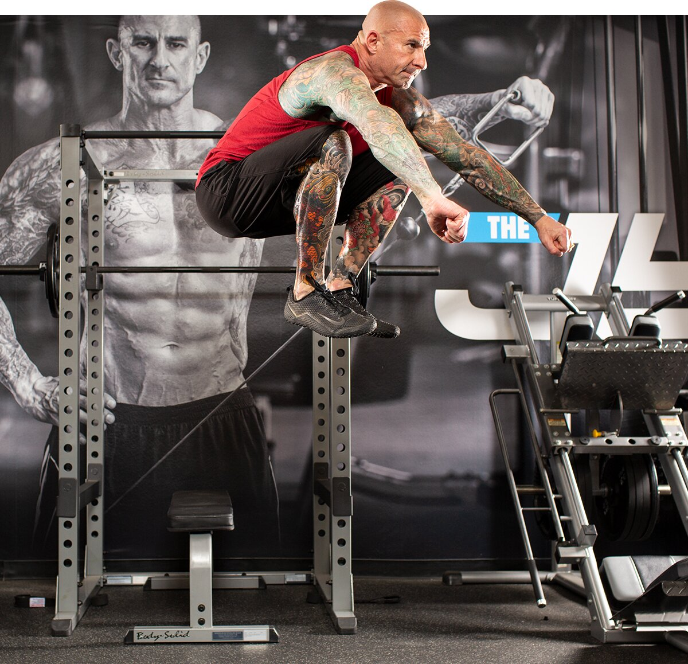

# The Ultimate Fat-Burning HIIT Cardio Workout Program

---

*Better results in less time. What's not to love about high-intensity interval training? Melt fat fast with this scientifically proven program!*

---

**Jim Stoppani, Ph.D.**  
 April 07, 2021 • 7 min read

Not every new fitness trend lives up to the hype. But high-intensity interval training, aka HIIT, has been exactly what its name promises: a big "hit."

This form of cardio workout intersperses intervals of all-out exercise with recovery periods of either low-intensity exercise, such as walking, or complete rest. It's a huge departure from the "steady state" cardio that most people do at a moderate intensity for 30-60 minutes.

And it's definitely not just for "cardio people." Serious lifters are getting on the HIIT train, too! Cardioaccelleration, the technique at the core of my popular Shortcut to Shred program, is a style of HIIT. And the HIIT approach discussed below can also work with my other popular programs, such as Shortcut to Size or Beginner-to-Advanced Bodybuilder to help you stay lean and conditioned while making muscle gains.

Follow this protocol and commit to a cutting-focused nutrition and supplement approach, and you can go from a beginner to a conditioned HIIT beast in just eight weeks. Let's get to work!

### 

### **The Beginner-To-Advanced 8-Week HIIT Program**

* Don't perform these workouts as fasted cardio as it will limit the intensity you can bring. If nothing else, have a protein shake or some BCAAs 30-60 minutes beforehand.
* Don't forget the brief warm-up and cool-down with each workout. Don't just leap into a sprint!
* During the "sets," don't just pick up the pace a little. Go all-out!
* During the recovery periods, slow way down. Recover all you can, so you can bring the intensity to the sets.
* Perform each workout 2-4 times per week. Start with 2, then bump up to 3-4 as your conditioning and recovery increase.
* If you need to spend more than two weeks at a particular phase before moving up, do so! If 15 intervals is way out of reach, do 10 and build up to 15.

You can do this conditioning routine using a wide variety of exercises. Pick one of these or something else that you enjoy, and don't be afraid to mix things up every once in a while.

#### **Good Options for HIIT Workouts**

* Jumping rope
* Jumping jack (or other fast bodyweight move)
* Bench skip
* Running in place
* Stationary bike
* Vertical jump
* Jump squat
* Bodyweight squat
* Lightweight goblet squat
* Kettlebell swing

Use your imagination. Just follow the work-to-rest intervals as indicated. And definitely wear a shirt you don't mind sweating in!

## Phase 1

### Weeks 1-2 || 1:4 Work-to-Rest Ratio

**1.Stationary bike**

Perform at a brisk but sustainable pace for 5 min. as a warm-up.

1 set, 5 mins

**2. Stationary bike**

Perform sprints at max effort. Continue pedaling at low intensity during your rest periods. Perform up to 10 rounds of 15 sec. intervals. Alternately, perform the same protocol using a different cardio exercise of your choice.

10 sets, 15 sec (rest 1 min.)

**3. Stationary bike**

Perform at a brisk but sustainable pace for 5 min. as a cool-down.

1 set, 5 mins

## Phase 2

### Weeks 3-4 || 1:2 Work-to-Rest Ratio

**1. Stationary bike**

Perform at a brisk but sustainable pace for 5 min. as a warm-up.

1 set, 5 mins

**2. Stationary bike**

Perform sprints at max effort. Continue pedaling at low intensity during your rest periods. Perform up to 10 rounds of 30 sec. intervals. Alternately, perform the same protocol using a different cardio exercise of your choice.

10 sets, 30 sec (rest 1 min. )

**3. Stationary bike**

Perform at a brisk but sustainable pace for 5 min. as a cool-down.

1 set, 5 mins

## Phase 3

### Weeks 5-6 || 1:1 Work-to-Rest Ratio

**1. Stationary bike**

Perform at a brisk but sustainable pace for 5 min. as a warm-up.

1 set, 5 mins

**2. Stationary bike**

Perform sprints at max effort. Continue pedaling at low intensity during your rest periods. Perform up to 15 rounds of 30 sec. intervals. Alternately, perform the same protocol using a different cardio exercise of your choice.

15 sets, 30 sec (rest 30 sec.)

**3. Stationary bike**

Perform at a brisk but sustainable pace for 5 min. as a cool-down.

1 set, 5 mins

## Phase 4

### Weeks 7-8 || 2:1 Work-to-Rest Ratio

**1. Stationary bike**

Perform at a brisk but sustainable pace for 5 min. as a warm-up.

1 set, 5 mins

**2. Stationary bike**

Perform sprints at max effort. Continue pedaling at low intensity during your rest periods. Perform up to 15 rounds of 30 sec. intervals. Alternately, perform the same protocol using a different cardio exercise of your choice.

15 sets, 30 sec (rest 15 sec.)

**3. Stationary bike**

Perform at a brisk but sustainable pace for 5 min. as a cool-down.

1 set, 5 mins

### **Does HIIT Work?**

The research is stacking up to show that HIIT helps people from a broad range of backgrounds burn serious calories and improve cardiovascular conditioning, both during and [after the workout](https://www.researchgate.net/publication/246632341_A_Comparison_Of_The_Effects_Of_Continuous_Aerobic_Intermittent_Aerobic_And_Resistance_Exercise_On_Resting_Metabolic_Rate_At_12_And_21_Hours_Post-Exercise_2153). [Trained and untrained](https://www.ncbi.nlm.nih.gov/pubmed/17898114), [men](https://journals.lww.com/nsca-jscr/FullText/2011/04000/Aerobic_and_Anaerobic_Changes_with_High_Intensity.31.aspx) and [women](https://pubmed.ncbi.nlm.nih.gov/17170203/), [overweight](https://www.tandfonline.com/doi/abs/10.1080/00913847.2015.1037231) beginners and [athletes](https://www.frontiersin.org/articles/10.3389/fphys.2018.01012/full)—they all see benefits.

But get this: It can help you add muscle, too! One study in the [Journal of the International Society of Sports Nutrition](https://pubmed.ncbi.nlm.nih.gov/19210788/) reported that male subjects following a six-week high-intensity interval program while supplementing with beta-alanine gained more than 2 pounds of lean mass after three weeks—despite no lifting during the program. The program wasn't anything wild, either: Just 15 minutes, three days per week, at a 2:1 ratio of exercise to rest.

If you're wondering if the beta-alanine in your Pre-JYM or other pre-workout will help you in HIIT, the answer is sure! But as I note in my Expert Guide to Carnosyn Beta-Alanine, you'll still need to take it daily outside of your pre-workout for at least two weeks to make it effective.

**Beta-alanine is the perfect supplement for HIIT training. It helps fight fatigue and that burning lactate feeling, allowing you to work harder, longer.**\*

### **Boost Testosterone with HIIT Workouts**

In a study from 2009, researchers in [New Zealand](https://pubmed.ncbi.nlm.nih.gov/19675486/) found that competitive cyclists performing four weeks of 30-seconds-on, 30-seconds-off sprints boosted their testosterone levels significantly.

Specifically, a group peddling at a lighter resistance increased test levels by about 60 percent—not shabby—while another group peddling against extra resistance increased their testosterone levels by almost 100 percent. More recently, another [study in 2017](https://www.ncbi.nlm.nih.gov/pmc/articles/PMC5551442/) found that a similar six-week HIIT protocol increased free testosterone production in masters athletes.

### **More Variety, Less Boredom**

Personally, I can't think of anything more monotonous than being stuck on a cardio machine for 30-60 minutes straight!

With HIIT workouts, the intensity bursts may be more grueling, but they are short and simple. That makes the workout more "fun" (irony quotes intentional), while raising your heart rate and conditioning your cardiovascular fitness to a greater degree.

Another benefit of HIIT is that you can do it almost anywhere with any piece of equipment—or without any equipment at all! Although it can be done on gym machines, you can also do bodyweight moves, or even with bands, like in my [Cardioaccelleration Band Workout](https://www.bodybuilding.com/content/cardioacceleration-band-workout.html).

The possibilities are virtually limitless. Think of it as "conditioning" rather than cardio, because you'll be training like an athlete—and looking like one!