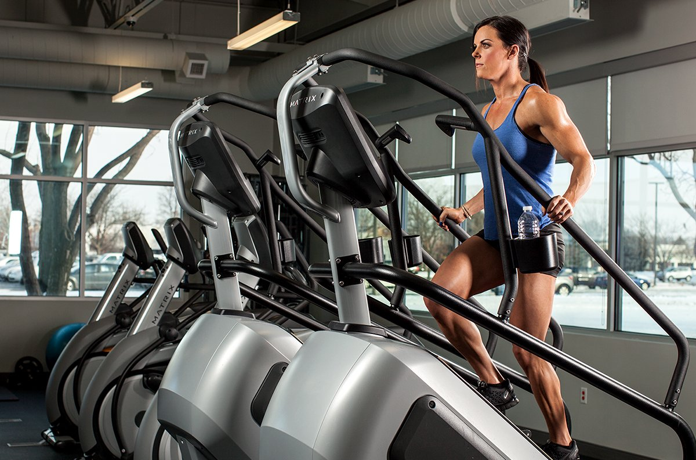
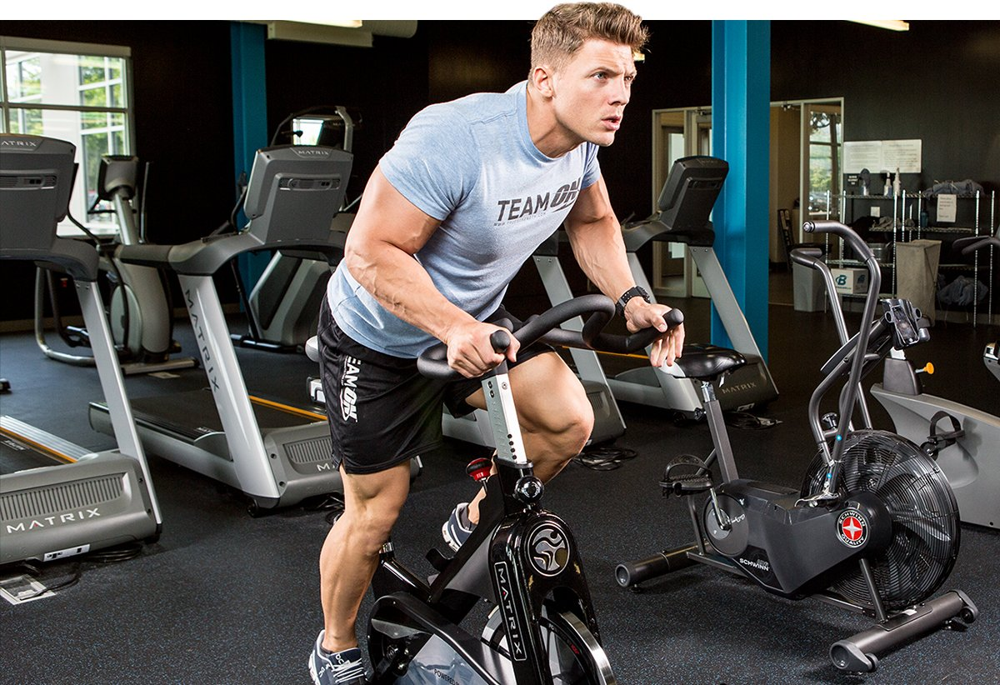
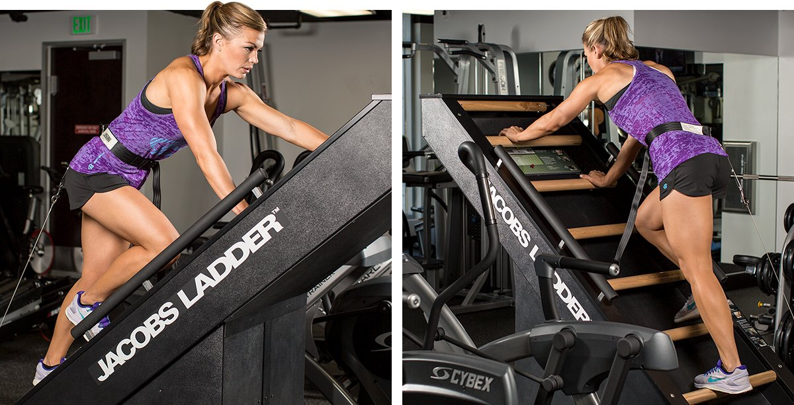
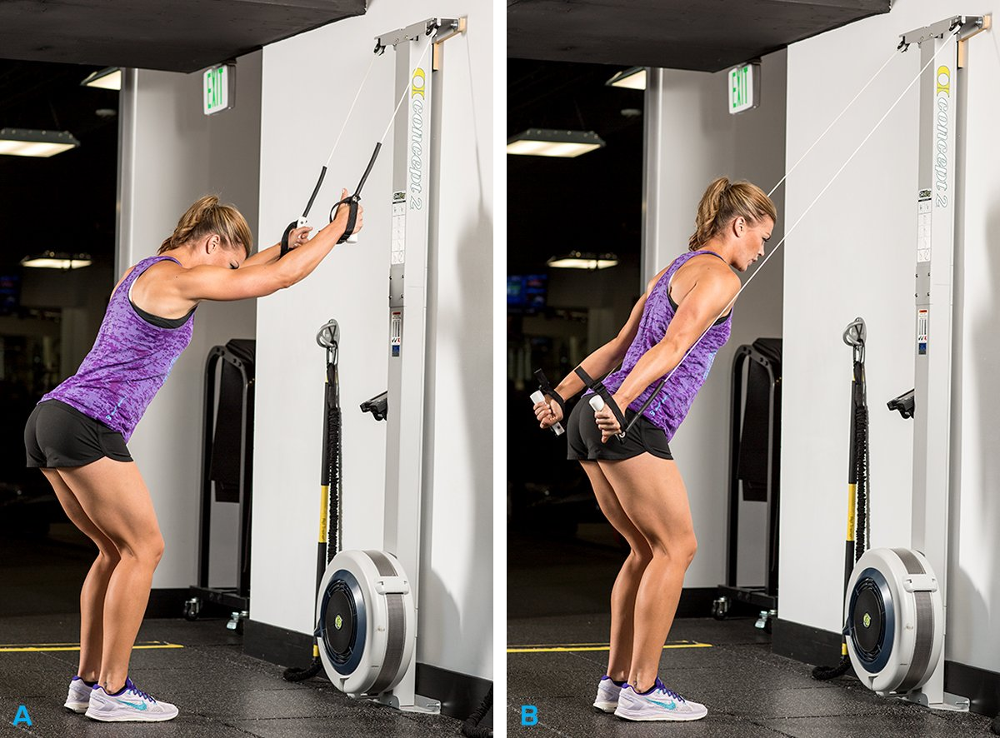
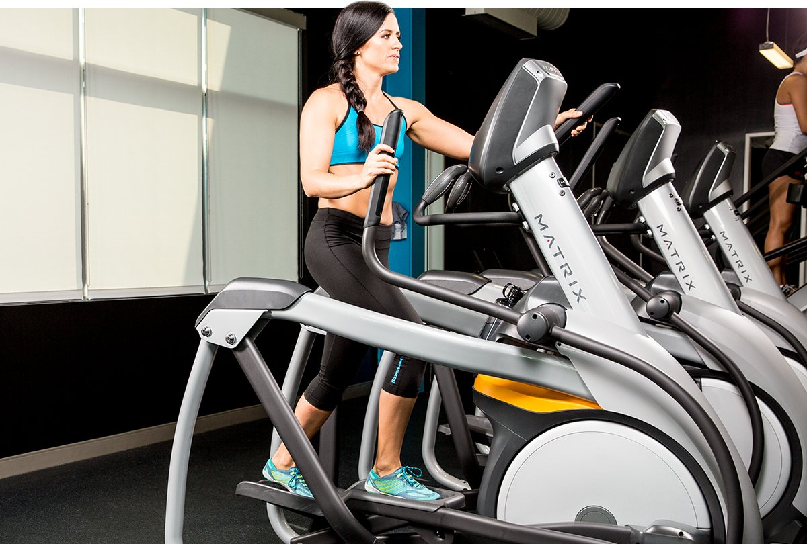

# 10 Best And Worst Exercise Machines For Cardio

---

*Not all cardio equipment is created equal! We've assembled a list of the best—and worst—exercise machines to shred fat and lose weight!*

---

**Cassie Smith And Krissy Kendall, PhD**  
 March 04, 2021 • 5 min read

Real talk: cardio isn't very fun. Unless you're one of those weirdo runners, most of us struggle to get through the 30 minutes we know we're supposed to do.

The reality is, you can spend a lot less time and burn a lot more calories if you're smart about which piece of equipment you use for your cardio training. So, instead of jumping on your usual elliptical machine, we've put together some better options for you.

These are our picks in order from best to worst pieces of cardio equipment based on effectiveness (most calories burned in the shortest amount of time, improved aerobic fitness); functionality (how well it crosses over to daily activities), and availability (likelihood of it being in your local gym).

### 1. Treadmill

* **Effectiveness:** A
* **Functionality:** A+
* **Availability:** A+

The OG is always the best bet. Unlike some of the other cardio equipment, the treadmill allows you to move the way your body is meant to move. And, it's super easy to use —just press start and push the arrows to adjust the speed or grade! Even walking on an incline can be a bitch.

To get the most out of your time, unplug your headphones from the television, let go of the handles, and do some real work!

### 2. Stair Mill

* **Effectiveness:** A
* **Functionality:** A-
* **Availability:** A-

Every booty loves the stair mill. What could be more functional than walking up a never-ending flight of stairs? We suggest intervals for the best workout. Just try not to support too much of your upper body on the handles; you might feel like you're still doing work, but your workout will be much less intense and you'll burn fewer calories.

### 3. Rowing Machine

* **Effectiveness:** A+
* **Functionality:** B+
* **Availability:** B

Not every gym has a rowing machine, but we think this is one of the most effective ways to do cardio. It's a full-body, big range-of-motion movement that can be hard as hell. Just 10 minutes of intervals on this bad boy will torch some major calories. But unless you're a serious rower, it's not necessarily a movement your body needs to be good at.

The biggest drawback to this machine is that poor technique can limit its effectiveness. Pulling that handle way above your head serves no other purpose than amusing onlookers.

### 4. Airdyne

* **Effectiveness:** A+
* **Functionality:** B
* **Availability:** B

If you've spent any time on an Airdyne bike, you know how shitty it can be. While this bike looks like it came straight from the '80s and gets an F for appearance, we give it an A+ for the ass-kicking it delivers. The harder your pedal, the higher the wind resistance becomes.

We dare you to try intervals of pushing as hard as you can for 30 seconds and resting for 1 minute. Bonus points if you can keep your lunch from making a second appearance.

### 5. Spin Bike

* **Effectiveness:** A
* **Functionality:** B
* **Availability:** A

The spin bike has a little less oomph than the Airdyne, but it can be a really great choice for cardio. Do a long-distance session, some high-intensity intervals, or go to a spin class. New riders beware—sitting on the less-than-comfortable saddle for an extended period of time can lead to some awkward bruising the next morning.

### 6. Jacob's Ladder

* **Effectiveness:** B+
* **Functionality:** B-
* **Availability:** C-

The most difficult part of getting a good workout on a Jacob's ladder is feeling awkward on the machine. Once you get the pattern down, though, you can have yourself a fun, full-body workout. The downside to this never-ending ladder is that it's not available in most commercial gyms.

### 7. Skierg

* **Effectiveness:** B+
* **Functionality:** C
* **Availability:** D

Move over NordicTrack—there's a new skier in town. The SkiErg, which kind of looks like a standing rowing machine, delivers one grueling upper-body workout. To get more of your lower body involved, try standing in a partial-squat position. If you can find a SkiErg, you can do some effective workouts that will get your heart rate up in no time.

However, the exercise has a really specific movement pattern that you'll almost never do in real life—unless you're training to make the roster for the 2018 Winter Olympics. We've heard there's one spot left.

### 8. ARC Trainer

* **Effectiveness:** C
* **Functionality:** D
* **Availability:** B

We think the Arc Trainer a big ol' pile of *why*. The machine makes your body move in an unnatural pattern and doesn't fit tall or short people very well. If your knees are so bad that you can't run or walk, then swim or bike.

### 9. Elliptical

* **Effectiveness:** D
* **Functionality:** F
* **Availability:** A

We're putting the elliptical below the Arc trainer, because the Arc trainer offers more versatility. However, we have the same problems with the elliptical; it's just unnatural and ineffective. Further, setting the resistance at a level any lower than a 10 is about as effective at burning calories as sitting on the couch.

The elliptical's only plus side is that it's a low-impact option. However, we think the bike or swimming are much more effective options if you're limited by an injury.

### 10. Recumbent Bike

* **Effectiveness:** D
* **Functionality:** F
* **Availability:** B

With your upper body, torso, and even your butt at rest, the recumbent bike asks your body to do almost nothing but move your legs. If you're looking for a chair to sit in while you read a book or catch up on your favorite Netflix episodes, this is your guy.

### Science!

As staunch evidence-based haters, we think it's only fair to share some of the information that helped us to make these decisions.

A study out of the Journal of American Medical Association compared several indoor exercise machines, (Airdyne, cross-country-skiing simulator, cycle ergometer, rowing ergometer, stair stepper, and treadmill), and found that walking or running on the treadmill had the highest rates of energy expenditure and aerobic demands compared to all other machines.[1]

In fact, the researchers found energy expenditure to be 40 percent greater for treadmill walking and running compared with cycling. Furthermore, the treadmill and rowing ergometer were the only two pieces of equipment that elicited VO2-max values that met guidelines for enhancing cardiorespiratory fitness.

Supporting the previous findings, researchers out of Dublin City University (Dublin, Ireland) conducted a similar study and found that that the treadmill, ski simulator, and rowing ergometer led to the greatest energy expenditure when compared to the cycle ergometer and health rider.[2]

### Get Your Cardio On

Now that you're all educated, you can go out into the world and make some better cardio decisions! We encourage everyone to put our list to the test. Spend a week or so doing cardio on each of these machines and see which one you feel is the most effective. When you find that special someone, you'll know it.

##### References

1. Zeni, A. I., Hoffman, M. D., & Clifford, P. S. (1996). [Energy expenditure with indoor exercise machines](https://www.ncbi.nlm.nih.gov/pubmed/8618368). *JAMA, 275*(18), 1424-1427.
2. Moyna, N. M., Robertson, R. J., Meckes, C. L., Peoples, J. A., Millich, N. B., & Thompson, P. D. (2001). [Intermodal comparison of energy expenditure at exercise intensities corresponding to the perceptual preference range](https://www.ncbi.nlm.nih.gov/pubmed/11474346). *Medicine and Science in Sports and Exercise*, 33(8), 1404-1410.