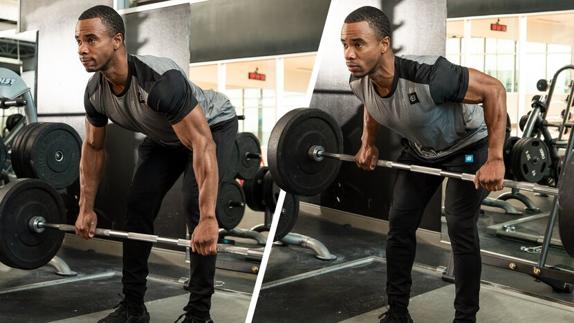
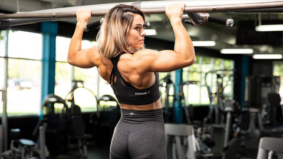
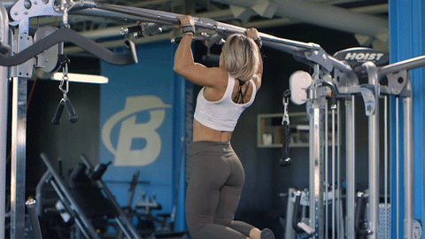
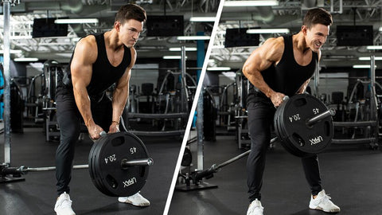
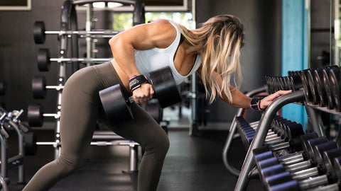
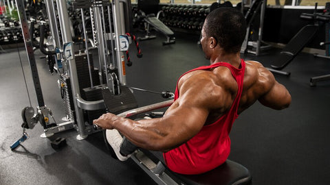

# 10 Best Back Exercises For Building Muscle

---

**[Chest](https://shop.bodybuilding.com/blogs/training/10-best-chest-exercises-for-building-muscle) | Back | [Shoulders](https://shop.bodybuilding.com/blogs/training/10-best-shoulder-exercises-for-building-muscle) | [Biceps](https://shop.bodybuilding.com/blogs/training/10-best-biceps-exercises-for-building-muscle) | [Triceps](https://shop.bodybuilding.com/blogs/training/10-best-triceps-exercises-for-building-muscle) | [Legs](https://shop.bodybuilding.com/blogs/training/leg-workouts-for-men-get-thicker-quads-glutes-and-hams) | [Abs](https://shop.bodybuilding.com/blogs/training/10-best-ab-exercises-for-building-muscle)**

 When you crack your exercise toolkit open each week on back day, you've got a seemingly endless array of movements available. If you're overwhelmed by the sheer number of row variations, or you draw a total blank when thinking of new exercises to try, consider this list your new back blueprint.

We took the science into account--and more. Head-to-head exercise comparison research is a bit limited, and often misleading. So rather than going strictly off of electromyography (EMG) to pick the best muscle-building exercises, we selected the following ones on a number of factors including:

* Ease of learning and performing
* Total muscle stimulation and intensity
* Popularity among diehard lifters and bodybuilders (This matters!)
* Availability of equipment in commercial gyms

Here are the best back exercises for muscle growth, plus three complete back workouts incorporating the movements that you can plug into your split right away.

## 10 Best Back Exercises

**[Deadlift](#deadlift) | [Bent-Over Row](#bent-over-row) | [Pull-Up](#pull-ups) | [T-Bar Row](#t-bar-row) | [Seated Row](#cable-row) | [Single-Arm Smith Machine Row](#smith-machine-row) | [Lat Pull-Down](#lat-pull-down) | [Single-Arm Dumbbell Row](#single-arm-dumbbell-row) | [Dumbbell Pull-Over](#dumbbell-pull-over) | [Chest-Supported Row](#chest-supported-rows)**

### 1. Deadlift

***Why it's on the list:*** This mighty pull is far more than a back exercise. It hits the entire posterior chain, from your calves to your upper traps, but it's also a time-tested standout for overall backside development.

And no, it's not just for powerlifters! Legendary bodybuilder Jay Cutler builds his back day around deadlifts, as well. Technique is uber-important, but once you nail it, you can progress to lifting monster weights that recruit maximum muscle, release muscle-building hormones, and help you get big.

**Deadlift variations for back growth:**

* Barbell deadlift (from the floor)
* Barbell rack pull
* Romanian deadlift (barbell, dumbbell)
* Snatch-grip deadlift (from the floor or elevated pins)
* Trap bar deadlift

When back development is the goal, stick to one of these variations. Others, like sumo deadlifts, have been shown in EMG studies—and in the trenches—to focus more on other muscle groups than the back. The same goes for single-leg deadlifts and stiff-legged deadlifts.

***In your workout:*** If you're going heavy (sets of fewer than about 6 reps), do deadlifts first so you're fresh. If you're doing deads for repetitions, you can do them later in your workout. They may not be as sexy, but moderate-weight deadlifts are just as valuable as grinding max-effort PRs.

### 2. Bent-Over Row

***Why it's on the list:*** This is a total back-builder: upper back, lower back, lats, traps, spinal erectors—the whole deal. And the science backs it up. It's a staple of the best back workouts for men, but make no mistake, it's great for back workouts for women, as well.

**Bent-over row variations for back growth:**

* Overhand grip bent-over rows
* Underhand grip bent-over rows
* Pendlay rows (each rep starts from the floor)
* Bent-over dumbbell or kettlebell rows

***In your workout:*** Do heavy bent-over rows toward the start of your back workout in lower rep ranges, such as 6-8 or 8-10, in order to save your lower back. If you're wrecked from deadlifts, skip it or do it on a second back day later in the week.

### 3. Pull-Up

***Why it's on the list:*** It's always a good idea to have an overhead pulling movement in your back routine, and the pull-up is one of the best. Each variation has its own advantages: Wide-grip variations are great for the upper lats, while close-grip chins or neutral-grip pull-ups have a greater stretch and overall range of motion. Mix it up!

****

**Pull-up variations for back growth:**

* Wide-grip pull-ups (overhand grip)
* Chin-ups (underhand grip)
* Neutral grip pull-ups (palms facing inward)
* Behind-the-head pull-ups
* Pull-ups on gymnastic rings
* Weighted pull-ups or chins
* Machine-assisted pull-ups
* Band-assisted pull-ups
* Spotter-assisted pull-ups

Don't discount those last three! Especially for heavier lifters, assisted variations are great back-builders. Do what you need to do to get into a muscle-building rep range.

***In your workout:*** If you're a pull-up pro, you can do some light sets as a warm-up. If they're tougher for you, you can treat them more as a strength movement toward the start of your workout. Assisted variations make for great burnouts at the end of a back workout.

### 4. T-Bar Row

***Why it's on the list:*** The T-bar row may seem at first glance like another variation of the bent-over row, but serious lifters know there's a big difference. For one, you can pile on more weight!

You also typically have a choice of hand positions and width. A wider grip will put more emphasis on the lats, while a neutral grip will better target the middle back (rhomboids, teres, and traps).

**T-bar row variations for back growth:**

* T-bar row
* Lying T-bar row
* Landmine row holding a wide T-handle (overhand grip)
* Landmine row holding the bar

***In your workout:*** Do this toward the front half of your workout, especially if you're going to go heavy. Because it's slightly easier on the lower back, you could do it after deadlifts, but stay mindful of using strict form. If you find yourself cheating or struggling to maintain a flat back, a chest-supported row may be a better choice.

### 5. Seated Row

***Why it's on the list:*** Unlike every free-weight variation here, the classic seated row maintains constant tension throughout every inch of the movement.

Plus, many gyms have a wide range of handles that you can clip onto a seated cable row with a carabiner, giving you all manner of wide and narrow grips and different hand positions.

**Seated row variations for back growth:**

* Cable row (narrow, wide, medium, overhand, underhand, neutral grip)
* Single-arm cable row (seated, kneeling, half-kneeling)
* High-cable standing row
* Machine seated row
* Plate-loaded high row

***In your workout:*** Like machines, cables can be loaded up pretty heavily without overly taxing you. These are best done toward the end of your workout, so don't be afraid to go slightly higher-rep here, like 10-12 or even 12-15 reps.

### 6. Single-Arm Smith Machine Row

***Why it's on the list:*** While some gym rats consider the Smith machine taboo, you shouldn't. The fixed plane of the movement allows you to pull heavy with lots of stability, making for a humbling exercise.

Treat it like a cross between a dumbbell row and a machine row, utilizing benefits of each. The single-arm version, with the elbows pulling back close to your sides, is especially effective at targeting the lower portion of the lats.

**Smith Machine row variations for back growth:**

* Single-arm Smith machine row (sideways to machine)
* Smith machine bent-over row
* Smith machine bodyweight inverted row

***In your workout:*** Do it about midway through your workout, after your heavy overhand pulls. And don't be afraid to throw on some wrist straps! Your goal is to hammer your back, not be constantly limited by your grip strength.

### 7. Lat Pull-Down

***Why it's on the list:*** Your first impulse may be to reach for the wide-grip bar, but back-focused EMG research suggests that use of a close neutral grip activates the lats similarly to a regular grip. This grip also allows for a longer range of motion and increased time under tension for the lats, which is great for building muscle.

Slow down the rep tempo on these, squeeze hard at the bottom of each rep, and allow a good stretch at the top.

**Lat pull-down variations for back growth:**

* Neutral-grip pull-down (narrow, medium, wide)
* Overhand-grip pull-down (narrow, medium, wide)
* Underhand-grip pull-down (narrow, medium, wide)
* Rope handle pull-down
* Single-arm pull-down
* Half-kneeling or full-kneeling pull-down

***In your workout:*** When used as a mass-building exercise, it's best placed toward the middle or end of your workout for sets of 8-12 reps. It's great as a pump-focused finishing move, as well.

### 8. Single-Arm Dumbbell Row

******

***Why it's on the list:*** This is a classic unilateral exercise—meaning each side works independently. It's also one that allows you to move a lot of weight, particularly if you use straps.

You'll get a greater range of motion when training unilaterally, and you'll be better able to support your lower back by placing one hand on a bench. Allowing a slight degree of rotation of the trunk has been shown to activate a greater amount of "core" musculature, as well.

**Single-arm dumbbell row variations for back growth:**

* Single-arm row with one hand on a bench
* Single-arm row with one hand and one leg on a bench
* Single-arm arc row, reaching forward at the front of each rep
* Single-arm barbell row (landmine to the rear)
* Single-arm "Meadows row" (landmine to the side)

***In your workout:*** This is a "meat and potatoes" back exercise. Do it in the middle or end of your workout for sets of 8-12 or higher.

### 9. Dumbbell Pull-Over

***Why it's on the list:*** Pull-overs for back? Absolutely! This single-joint move allows you to really target and torch your lats, particularly if you're strategic about what variation you choose.

In particular, performing this movement on a decline puts your lats under tension for a longer range of motion than when using a flat bench.

**Pull-over variations for back growth:**

* Decline bench pull-over (dumbbell, barbell, weight plate)
* Flat bench pull-over (dumbbell, barbell, weight plate)
* Cable pull-over
* Straight-arm pull-down

***In your workout:*** In almost all cases, single-joint movements should be done last in your body-part routine. Keep the reps on the higher end for a nice finishing pump, around 12-15 per set.

### 10. Chest-Supported Row

***Why it's on the list:*** Unlike T-bar rows or bent-over rows, this increasingly popular movement doesn't torch the lower back—and that's its appeal. It allows you to go as heavy as you want on a row variation, without risk of that "oops, I tweaked something" moment.

The bench also enforces strict technique, making it a favorite accessory movement for heavy lifters and anyone looking to improve their posture and build overall back muscle.

**Chest-supported row variations for back growth:**

* Incline bench chest-supported row (dumbbell, kettlebell, cable)
* Seal row (barbell row on an elevated flat or incline bench)

***In your workout:*** This isn't an exercise meant to go heavy or early in a back workout, except perhaps as a warm-up for other rows. Think 8 reps at minimum, and more likely 12-15.

## Best Back Workouts

**[Hard and Heavy Back Workout](#hard-and-heavy-back-day) | [Row-to-Grow Back Workout](#row-to-grow-back-day-workout) | [Machine Pump Back Workout](#machine-pump-back-day-workout)**

### Hard and Heavy Back Workout

This is a classic "clangin' and bangin''' back day focused on heavy compound movements, but finishing with high-rep pull-overs. It's the perfect main course before switching to a quick pump-focused biceps workout for dessert.

**1. Rack pull**

3 sets, 6-8 reps (rest 2 min.)

**2. T-Bar Row**

If you don't have access to a T-bar, use a chest-supported row variation.

3 sets, 6-8 reps (rest 90 sec.)

**3. Neutral-grip pull-up**

If you can't perform at least 6 reps, use the assisted pull-up machine or perform band-assisted reps.

3 sets, 6-10 reps (rest 90 sec.)

**4. Bent-Arm Dumbbell Pull-over**

Perform on a decline bench, if possible.

3 sets, 12-15 reps (rest 90 sec.)

### Row-to-Grow Back Workout

If you want width, you must row. This workout is great on its own, but is also an ideal approach if you like to do two back days a week, one focused more on horizontal pulls, the other on vertical pulls. That's the approach taken in the popular program 30-Day Back with Abel Albonetti.

**1. Reverse-grip bent-over row**

4 sets, 6-8 reps (rest 2 min.)

**2. Single-Arm Dumbbell Row**

Perform all of the reps on one side before switching to the other. Don’t rest between sides and rest 90 sec. between sets.

3 sets, 8-10 reps (left side, no rest)

3 sets, 8-10 reps (right side, rest 90 sec.)

**3. Wide-Grip Seated Cable Row**

3 sets, 10-12 reps (rest 1 min.)

### Machine Pump Back Workout

Who says you need free weights to train your back? This high-rep, short-rest workout will allow you to move serious poundage for high reps without posing a serious challenge to your lower back or core. If you like training back on machines, try YouTube star Calum Von Moger's full program Building Von Moger: 6-Week Mass Program on BodyFit.

**1. Smith machine bent-over row**

Use an underhand grip and don’t hesitate to use lifting straps.

4 sets, 10-12 reps (rest 1 min.)

**2. Close-grip pull-down**

Alternately, perform close-grip machine-assisted pull-ups.

4 sets, 10-12 reps (rest 1 min.)

**3. Seated Row**

Use a wide-grip handle with either an overhand or neutral grip.

4 sets, 12 reps (rest 1 min.)