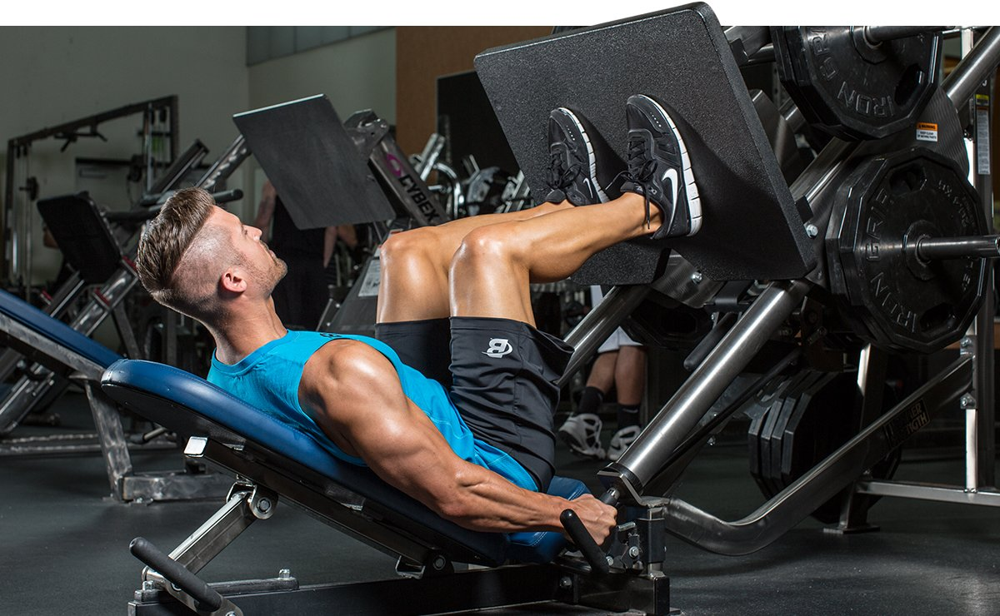
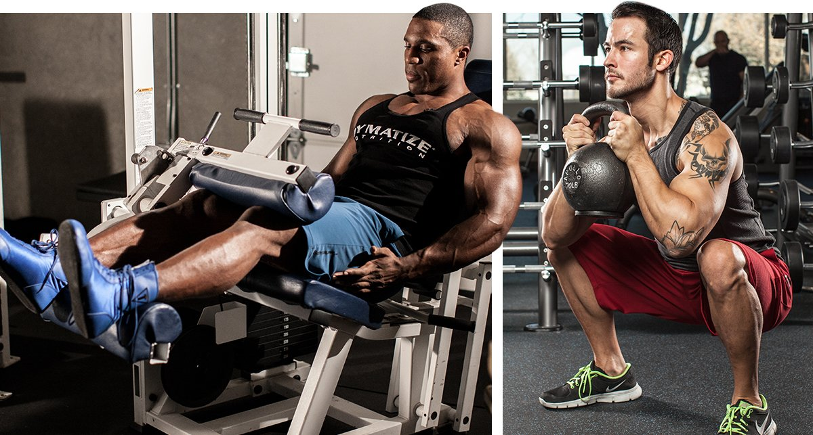
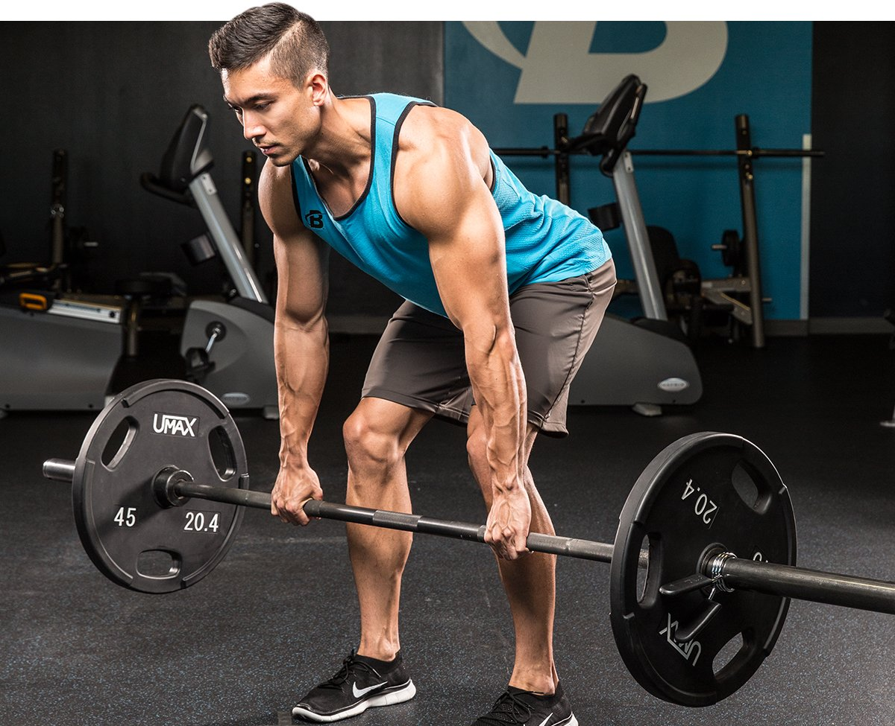

# Leg Workouts For Men: Get Thicker Quads, Glutes, and Hams

---

"Leg day"—the very phrase conjures up images of nausea, days of hobbling, and legs that feel like jello. The feelings may be universal, but bodybuilders looking to annihilate legs have countless workout options at their disposal. While most workouts start with some variation of the squat—widely acclaimed as the best lower-body movement—exercise choice, foot position, and advanced training techniques all allow you to emphasize one particular area of the legs over others. That's great if you want to thicken up your quads, fill out your glutes, or beef up your hamstrings because of a weakness—or simply because you want to prioritize an area for a length of time.

Each of the seven leg workouts below has a different focus. Find one that suits your needs for the next 4-8 weeks before switching to another specialized program. Or simply follow a solid overall mass-building plan like the one listed under Goal 1.

While we can provide any number of formulas for advanced leg growth, you're still on your own when it comes to generating the intensity to survive a high-octane workout and withstanding the pain. Nail those last two factors and you'll leave your wheels no choice but to grow.

## Goal 1: More Overall Leg Mass

Mass-building comes with a set of rules. That means starting your workout with the most challenging exercises and heaviest loads, hitting the thighs from a variety of angles, keeping the volume (number of total sets and reps) high, and training to muscle failure.

Altering your foot placement on the leg press allows you to recruit leg musculature in slightly different ways. Putting your feet up higher on the sled shifts some of the emphasis from the quads to the hams and glutes because a greater degree of hip flexion/extension is taking place. Also, don't shortchange the depth of your knee bend—which should reach 90 degrees—by going too heavy—that also limits glute and hamstrings activation. Unless you're following a pre-exhaust routine, save the single-joint movements for last.

The workout follows a reverse-pyramid protocol, which allows you to take more total sets to muscle failure. As the rep target goes up, be sure to lighten the weight commensurately. The workouts target four muscle groups: quads, glutes, hamstrings, and calves. To shorten the workout, you could eliminate exercises for calves, hamstrings, or both; if so, hit calves and hammies on a different training day.

#### Notes

* Do as many warm-up reps as you need, but never take them to muscle failure.
* Choose a weight that allows you to reach muscle failure by the target rep listed.
* If you have a spotter, do a few forced reps on your 1-2 heaviest sets of each exercise.

**1. Barbell Squat**

4 sets, 6-8, 6-8, 8-10, 8-10 reps (Lighten the weight after your first 2 sets.)

**2. Leg Press**

4 sets, 8-10, 8-10, 10-12, 10-12 reps (Alternate 2 different foot positions.)

**3. Dumbbell Walking Lunge**

3 sets, 10, 12, 14 steps per side

**4. Leg Extensions**

3 sets, 10 reps (Do a single dropset on each set.)

**5. Romanian Deadlift**

3 sets, 8, 10, 12 reps

**6. Lying Leg Curls**

3 sets, 8, 10, 12 reps

**7. Standing Calf Raises**

4 sets, 12, 12, 20, 20 reps

## Goal 2: Greater Leg Definition

Simply doing more work with light weight for high reps isn't enough to get you lean. To keep your metabolism high, you still need that stimulus for building and keeping muscle size. That will help boost excess post-exercise oxygen consumption (EPOC), which roughly translates to the number of calories you burn after your workout is over.

That's why the first exercise here is done straight-sets-style, but the rest of the workout consists of supersets with multijoint exercises, along with reduced rest periods and a high volume of work.

#### Notes

* Do as many warm-ups as you need, but never take them to muscle failure.
* Choose a weight that allows you to reach muscle failure by the target rep listed.
* The first exercise is done with heavier weights, which is key for maintaining muscle tissue and keeping your metabolism high during periods of dieting.
* Strive to keep your rest periods short and your heart rate up, making this as much a cardio activity as a muscle-building one.

**1. Smith machine back squat**

4 sets, 8-10 reps (2 sets with your feet underneath and 2 sets with your feet out front.)

**2. Leg Press** 

Superset with Goblet Squat

3 sets, 10-12 reps (No rest.)

**3. Goblet Squat** 

Superset with Leg Press

3 sets, 10-12 reps (Rest only as needed.)

**4. Barbell reverse lunge** 

Superset with Leg Extension

3 sets, 10-12 reps per leg (No rest.)

**5. Leg Extensions** 

Superset with Barbell Reverse Lunge

3 sets, 12-15 reps (Rest only as needed.)

**6. Lying Leg Curls** 

Superset with Donkey Calf Raise

4 sets, 10-12 reps (No rest.)

**7. Weighted donkey calf raise** 

Superset with Lying Leg Curls

4 sets, 12-15 reps (Rest only as needed.)

## Goal 3: Starting Strong

Learning to squat can be a challenge, which is why the simple goblet version is a great place to start. The idea here is to learn and practice movement patterns before loading them with heavier weights or graduating to more complex moves.

This workout is largely machine based, which allows for a more controlled introduction to weight training. As your coordination improves and your muscles strengthen, move on to more challenging free-weight moves and heavier loads.

#### Notes

* Do as many warm-ups as you need, but never take them to muscle failure.
* Choose a weight that allows you to approach muscle failure by the target rep listed, but stop a rep or two short. Proper technique starts to give way when you push to muscle failure, and your priority here is learning good form.
* Start the workout with more challenging multijoint movements. Because they recruit a larger amount of muscle mass, rest periods are correspondingly longer.

**1. Goblet Squat**

4 sets, 10-12 reps (90 sec. rest.)

**2. Leg Press**

3 sets, 10-12 reps (90 sec. rest.)

**3. Leg Extensions**

3 sets, 10-12 reps (60 sec. rest.)

**4. Seated Leg Curl**

3 sets, 10-12 reps (60 sec. rest.)

**5. Standing Calf Raises**

3 sets, 15 reps (60 sec. rest.)

## Goal 4: Emphasize Your Quads

Because multijoint leg movements work your legs from top to bottom, it's impossible to completely isolate one area over another. However, you can emphasize one area over another. In this case, we're trying to maximize the range of motion of the knee joint while limiting the range of motion at the hip joint. One way to do this is by changing up your foot position on machine exercises.

The front squat also emphasizes the quads more than, say, a barbell back squat does by shifting your center of gravity forward. With heavy partials, you're not going deep, so you can really overload the quads; put on up to 30 percent more weight than you normally use, but go only part of the way down.

This workout follows a reverse-pyramid protocol, which allows you to take more total sets to muscle failure. As the rep target goes up, be sure to lighten the weight commensurately. Note that this workout covers only quads and glutes; add hamstring and calf exercises as desired.

#### Notes

* Do as many warm-ups as you need, but never take them to muscle failure.
* Choose a weight that allows you to reach muscle failure by the target rep listed.
* This scheme follows a reverse pyramid, meaning you lighten the weight after your first 1-2 sets for slightly higher reps.
* If you have a spotter, do a few forced reps on your 1-2 heaviest sets of each exercise.

**1. Barbell front squat**

4 sets, 6-8, 6-8, 8-10, 12 reps (Lighten the weight after your first 2 sets.)

**2. Hack Squat**

3 sets, 8, 10, 12 reps (Keep feet low and hip-width apart on the platform.)

3 sets, 6 heavy partial reps (Descend only about halfway down.)

**3. Leg Press**

3 sets, 8, 10, 12 reps (Keep feet low on the platform.)

**4. Leg Extensions**

3 sets, 10, 10, 12 reps (Last 2 sets are dropsets.)

## Goal 5: Emphasize Your Glutes

While you tried to minimize hip flexion/extension in the quad-focused workout, here you want to maximize it. Do that by choosing exercises and foot positions that allow the glutes to be trained through their full range of motion. Be sure to descend fairly deep in all squatting motions; otherwise, you'll limit glute activation.

The workout again follows a reverse-pyramid protocol, which allows you to take more total sets to muscle failure. As the rep target goes up, be sure to lighten the weight commensurately. The last exercise, the Romanian deadlift, is considered a hamstring exercise, but it focuses on the upper region as well as the glutes, especially the glute-ham tie-in.

Add knee-joint hamstring and calf exercises as desired for a complete leg workout.

#### Notes

* Do as many warm-ups as you need, but never take them to muscle failure.
* Choose a weight that allows you to reach muscle failure by the target rep listed.
* This scheme follows a reverse pyramid, meaning you lighten the weight after your first 1-2 sets for slightly higher reps.
* If you have a spotter, do a few forced reps on your 1-2 heaviest sets of each exercise.

**1. Barbell back squat**

4 sets, 6-8, 6-8, 8-10, 12 reps (Lighten the weight after your first 2 sets.)

**2. Leg Press**

3 sets, 8, 10, 12 reps (Keep feet high on the platform.)

**3. Barbell reverse lunge**

3 sets, 10-12 reps per leg (No rest.)

**4. Single-leg cable hip extension**

3 sets, 8, 10, 12 reps

**5. Romanian Deadlift**

4 sets, 8, 8, 12, 12 reps

## Goal 6: Emphasize Your Hamstrings

Hams shouldn't be an afterthought, and not just for aesthetic reasons; they also support knee-joint integrity. Most bodybuilders are familiar with the family of leg-curl movements, which can be done lying, seated, standing, or with one knee supported on a bench. Don't forget to work the hams from the hip joint as well, which means doing Romanians.

Often confused with the stiff-legged deadlift (a lower-back exercise) and even the conventional deadlift (with Romanians, the plates never touch the floor), it's an effective move for the upper hams where they tie in with the glutes. Good form is critical with RDLs—keep your back flat and never try to achieve excessive range of motion if it causes your back to round.

Don't forget, your hams also get worked when you squat deep and when you control the speed of the descent in squatting motions. However, that amount of work isn't enough to let you skip dedicated hamstring exercises. If you decide to split your quad and ham workouts into two different days, separate them by at least 48 hours to ensure full recovery. Or tack this workout onto the end of a quad/glute workout, occasionally even doing it prior.

This workout again follows a reverse-pyramid protocol, which allows you to take more total sets to muscle failure. As the rep target goes up, be sure to lighten the weight commensurately.

#### Notes

* Do as many warm-ups as you need, but never take them to muscle failure.
* Choose a weight that allows you to reach muscle failure by the target rep listed.
* This scheme follows a reverse pyramid, meaning you lighten the weight after your first 1-2 sets for slightly higher reps.
* If you have trouble doing the floor glute-ham raise at the end of your workout, do it earlier when you're less fatigued.
* Alternate seated and lying leg curls for the standing single-leg curls so you're including all three at least once every three workouts.

**1. Romanian Deadlift**

4 sets, 6-8, 6-8, 8-10, 12 reps (Lighten the weight after your first 2 sets.)

**2. Standing Leg Curl**

3 sets, 8, 10, 12 reps

**3. Glute ham raise**

3 sets, bodyweight sets to failure

## Goal 7: Pre-exhaust Your Legs

This workout starts by targeting just your quads with a single-joint movement. By the time you get to the multijoint exercises that follow, your quads will already be highly fatigued—but your glutes and hams will have been spared. Neither muscle group will be the weak link in those follow-up exercises; you'll be pushing your quads, however, to their limit.

  

This more advanced method of training is a great way to rise above a plateau. Even though you'll be significantly stronger on your leg extensions—which you normally do toward the end of your workout—keep the reps relatively high to avoid overtaxing the knee joint. With the quads prefatigued, everything that follows will feel harder, so lighten the weights up here, too.

#### Notes

* Do as many warm-ups as you need, but never take them to muscle failure.
* Choose a weight that allows you to reach muscle failure by the target rep listed.
* By flip-flopping the exercises, you'll be a little stronger on your single-joint moves but weaker on multijoint ones, so adjust your weights accordingly.

**1. Leg Extensions**

5 sets, 8-10 reps

**2. Smith machine back squat**

4 sets, 8-10, 8-10, 10-12, 12 reps (Lighten the weight after your first two sets.)

**3. Hack Squat**

3 sets, 10 reps

**4. Dumbbell Lunges**

3 sets, 12 reps (per side)