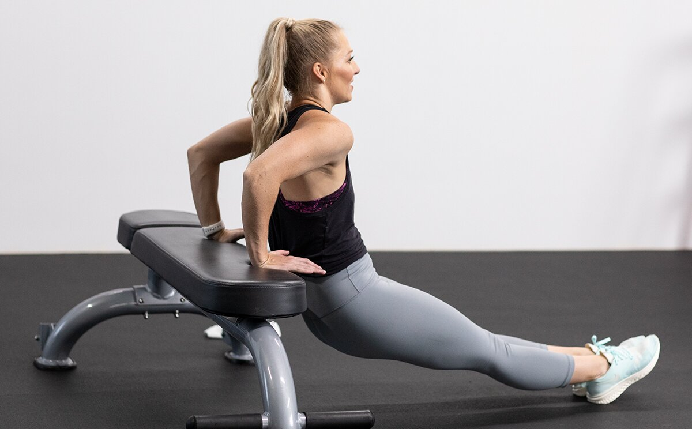
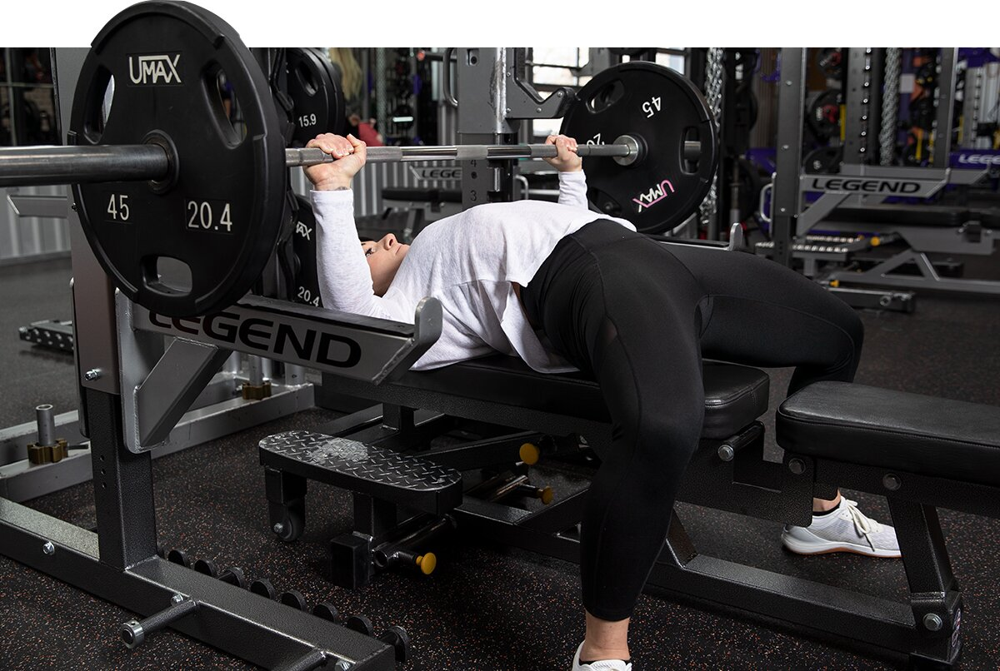

# Shape-Building Upper Body Workouts for Women

---

*The best upper body workouts for women don't need to be complicated. You can be in-and-out of the gym in about 30 minutes and then back again the next day to train your lower body!*

---

**Julie Germaine**  
July 22, 2021 • 5 min read

**[Shoulder Workouts for Women](https://shop.bodybuilding.com/blogs/training/shoulder-workouts-for-women-add-shape-and-size) | [Back Workouts for Women](https://shop.bodybuilding.com/blogs/training/back-workouts-for-women-build-the-shape-you-want) | [Leg Workouts for Women](https://shop.bodybuilding.com/blogs/training/leg-workouts-for-women-build-strong-sculpted-quads) | [Butt Workouts for Women](https://shop.bodybuilding.com/blogs/training/glute-workouts-for-women-get-a-bigger-butt) | [Arm Workouts for Women](https://shop.bodybuilding.com/blogs/training/arm-workouts-for-women-build-shape-size-and-strength) | Upper-Body Workouts for Women | [Strength Workouts for Women](https://shop.bodybuilding.com/blogs/training/these-workouts-are-how-strong-women-get-built)**

These days, it's almost impossible to escape the IG booty pose, not to mention the ubiquitous peach emoji. There's certainly nothing wrong with having a great behind, but true lifters know that it's only one part of a well-defined physique and it's just as important to train and sculpt the upper body!

So, what is the best way to do it? Train on an upper/lower-body workout schedule. This approach not only allows you to bring more intensity than full-body training to each session, but it's also not as demanding on your schedule or lifestyle as training just one muscle group per workout. That's why experienced lifters like IFBB bikini pro Tawna Eubanks prefer to hit two upper and two lower workouts per week.

Here are three upper-body workouts—beginner, intermediate, and advanced—to help you build and shape your arms, back, and shoulders while tightening your core to create that flawless hourglass shape!

## **Beginner Upper-Body Workout**

If you are new to resistance training or are just getting back into the swing of things after some time off, this no-equipment-required beginner workout will get you started on your building upper body. Because it uses bodyweight movements to target the shoulders, chest, back, and core, it can also be your go-to upper-body workout at home! You'll perform each exercise for 30 seconds, and then rest for 30 seconds before moving on to the next exercise.

Once you complete the full routine, repeat the entire sequence 2 more times for a total of 3 rounds. This workout should take no more than half-an-hour to complete from warm-up through to your post-workout protein. Perform it three-times-a-week as part of your fitness routine to begin building upper-body strength and definition right away!

### Beginner Upper-Body Workout

**1. WARM-UP CIRCUIT**

Perform the exercises in order with no rest between exercises.

Arm circle

Perform 12 reps forward, then 12 reps backward.

1 set, 24 reps (no rest)

Standing torso twist stretch

1 set, 24 reps (alternating, 12 reps per side, no rest)

**Standing side bend stretch**

Perform for 30 sec. per side.

1 set, 60 sec (no rest)

**Cross-Body Toe Touch**

1 set, 30 sec (no rest)

**Jumping Jack**

1 set, 30 sec

**2. CIRCUIT**

Perform the exercises in order, resting 30 sec. between exercises and rounds. Perform as many reps as possible in the allotted time.

**Feet-elevated push-up**

3 sets, 30 sec (rest 30 sec.)

**Tabletop Hip Thrust**

3 sets, 30 sec (rest 30 sec.)

**Bench Dip**

3 sets, 30 sec (rest 30 sec.)

**Superman Lat Pull**

3 sets, 30 sec (rest 30 sec.)

**Push-Up to Side Plank**

3 sets, 30 sec (right side, rest 30 sec.)

**Push-Up to Side Plank**

3 sets, 30 sec (left side, rest 30 sec.)

## **Intermediate Upper-Body Workout**

If you have some workout experience under your belt, or you've completed a few weeks of the beginner workout listed above, you can challenge yourself with this intermediate upper-body routine. Perform 3 sets of each exercise, 1-2 times per week, with at least two full days off in between workouts. Train your lower body or perform cardio on your days off.

This workout requires a set or two of [dumbbells](https://shop.bodybuilding.com/blogs/training/the-ultimate-full-body-dumbbell-workout?srsltid=AfmBOooqWp3zuDNVtB2DbDmhtUCZ8fe8EdBeenF5b6gcYC-_CR0ef9mQ), but feel free to use whatever weights you have available. Since this is an intermediate workout, you can adjust it to fit your goals. To build muscle, aim for a rep range of 8-12. If you have limited equipment or don't have the ability to use heavier weights, increase your repetition to 20-30.

### Intermediate Upper-Body Workout

**1. WARM-UP CIRCUIT**

Perform the exercises in order with no rest between exercises.

**Arm circle**

Perform 12 reps forward, then 12 reps backward.

1 set, 24 reps (no rest)

**Standing torso twist stretch**

1 set, 24 reps (alternating, 12 reps per side, no rest)

**Standing side bend stretch**

Perform for 30 sec. per side.

1 set, 60 sec (no rest)

**Cross-Body Toe Touch**

1 set, 30 sec (no rest)

**Jumping Jack**

1 set, 30 sec

**2. Seated dumbbell shoulder press**

3 sets, 8-20 reps (rest 2 min.)

**3. Dumbbell bent-over row**

3 sets, 8-20 reps (rest 2 min.)

**4. Dumbbell front raise**

3 sets, 8-20 reps (rest 2 min.)

**5. CONCENTRATION CURL**

Perform all of the reps on one side before switching to the other side. Rest 1 min. between rounds.

**Concentration curl**

3 sets, 8-20 reps (right side, no rest)

**Concentration curl**

3 sets, 8-20 reps (left side, rest 1 min.)

**6. SINGLE-ARM SIDE LYING REAR FLY**

Perform all of the reps on one side before switching to the other side. Rest 1 min. between rounds.

**Single-arm side lying rear fly**

3 sets, 8-20 reps (right side, no rest)

**Single-arm side lying rear fly**

3 sets, 8-20 reps (left side, rest 1 min.)

**7. AB CIRCUIT**

Perform the exercises in order, resting as little as possible between exercises and for 2 min. between rounds.

**Double crunch**

3 sets, 12 reps (no rest)

**Lying Leg Raise**

3 sets, 12 reps (no rest)

**Ab bicycle**

3 sets, 30 reps (alternating, 15 reps per side, no rest)

**Standing Dumbbell Knee Crunch**

3 sets, 24 reps (alternating, 12 reps per side, rest 2 min.)

## **Advanced Upper-Body Workout**

Push past training plateaus with this advanced upper-body routine. It is designed for experienced exercisers who have full gym access, but if you are training at home, you can use at-home substitutes for gym-based exercises.

To encourage your body to grow and become stronger, your No. 1 goal is to fatigue the muscle bellies fully during each set. Restrict your rest periods to less than 1 minute to maximize muscle-building potential. This workout uses supersets and dropsets to keep it under an hour, so be ready to work hard and lift heavy!

### Advanced Upper-Body Workout

**1. WARM-UP CIRCUIT**

Perform the exercises in order with no rest between exercises.

**Arm circle**

Perform 12 reps forward, then 12 reps backward.

1 set, 24 reps (no rest)

**Standing torso twist stretch**

1 set, 24 reps (alternating, 12 reps per side, no rest)

**Standing side bend stretch**

Perform for 30 sec. per side.

1 set, 60 sec (no rest)

**Cross-Body Toe Touch**

1 set, 30 sec (no rest)

**Jumping Jack**

1 set, 30 sec

**2. SUPERSET**

Perform the exercises in order with no rest between exercises and no more than 1 min. of rest between sets.

**Machine shoulder press**

5 sets, 15, 12, 12, 8, 6 reps (no rest)

**Barbell pull-over to press**

5 sets, 12 reps (rest 1 min.)

**3. TRISET**

Perform the exercises in order with no rest between exercises and no more than 1 min. of rest between sets.

**Barbell Bench Press - Medium Grip**

5 sets, 12, 12, 12, 8, 8 reps (no rest)

**EZ-bar skullcrusher**

5 sets, 12 reps (no rest)

**Lying Windshield Wipers**

5 sets, 12 reps (alternating, 6 reps per side, rest 1 min.)

**4. TRISET**

Perform the exercises in order with no rest between exercises and no more than 1 min. of rest between sets.

**Banded Chin-Up**

Alternately, use an assist machine.

3 sets, 12 reps (no rest)

**Dip**

Alternately, use an assist machine.

3 sets, 12 reps (no rest)

**Alternating hanging knee raise**

3 sets, 24 reps (alternating, 12 reps per side, rest 1 min.)

**5. TRISET**

Perform the exercises in order with no rest between exercises and no more than 1 min. of rest between sets.

**Seated Row**

3 sets, 12 reps (no rest)

**Concentration curl**

3 sets, 12 reps (right side, no rest)

**Concentration curl**

3 sets, 12 reps (left side, no rest)

**Decline Plate Twist**

3 sets, 30 reps (alternating, 15 reps per side, rest 1 min.)

**6. TRISET**

Perform the exercises in order with no rest between exercises and no more than 1 min. of rest between sets.

**Plate Hyperextension**

Perform a dropset of 10 additional reps after the last set.

3 sets, 15 reps (no rest)

**Standing face pull**

Perform with a 2-sec. hold.

3 sets, 12 reps (no rest)

**Overhead Triceps Extension**

Perform a dropset of 10 additional reps after the last set.

3 sets, 12 reps (rest 1 min.)

**The best upper-body workouts are even better with fatigue-fighting ingredients in the [best pre-workouts](https://www.bodybuilding.com/content/the-best-pre-workout-supplements-of-2021.html).**