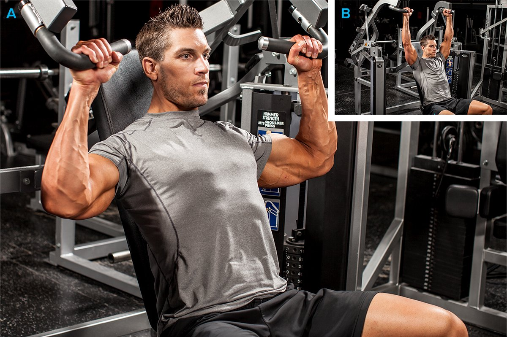
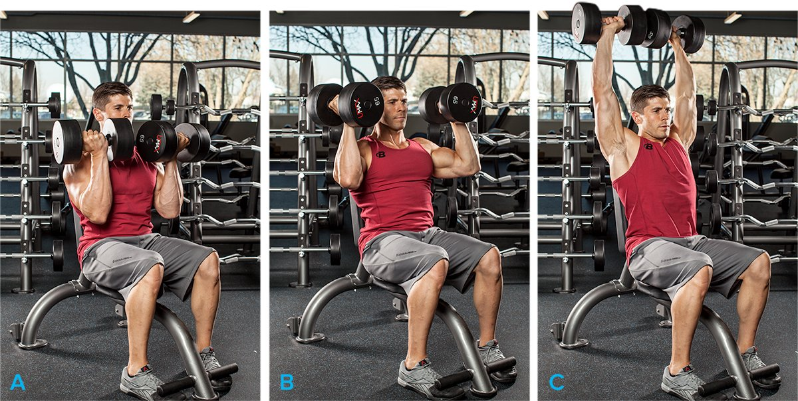
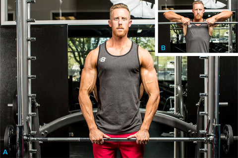

# Shoulder Workouts For Men: Get Bigger Delts

---

No two people work out exactly the same. Whether it's choice and sequence of exercises, how many sets to complete of each move, how heavy to go and reps completed, length of rest periods, or advanced training techniques and finishing moves, each lifter has his or her own workout DNA.

Among the 9.5 million users of BodySpace, there are probably 9.5 million different shoulder workouts. Individuality can be a good thing, but certain principles make some routines better than others, especially for specific goals. So rather than present you with 9.5 million ways to train your delts—which would make this article slightly time-consuming to read—I've whittled it down to seven really great ones, each with a unique training goal.

Pay especially close attention to how exercise choice and order, weight/rep targets, volume, and advanced-training principles can be manipulated to fine-tune a routine for a specific goal. If you find one you like, try it for 4-8 weeks, then go back to your regular workout or try another from the list.

These workouts are just the start, though. You'll find dozens of full programs to keep your shoulders growing in the BodyFit by Bodybuilding.com Muscle-Building Workout Plans. Once you master the routines here, use BodyFit to take your entire upper body to the next level.

Upright Cable Row

#### Workout Notes

* These workouts don't include warm-up sets. Do as many as you need, but never take warm-ups to muscle failure.
* Choose a weight that allows you to reach muscle failure by the target-rep listed.
* If you have a spotter, do a few forced reps on your heaviest sets of overhead presses. If you don't have a partner, do a dropset on your last set of each exercise, reducing the weight by about 25 percent when you reach muscle failure and continuing on to a second point of muscle failure.

### Goal: Overall Delt Mass

To build mass, always start your workout with the most demanding exercises—multi-joint overhead presses, in the case of the delts—which allow you to push the most weight. In this mass workout, a second multi-joint move is next, followed by single-joint moves for each of the three delts heads: front, middle, and rear. This is the foundation for a solid mass workout. Keeping the total volume fairly high also promotes muscle growth.

You can make the workout more challenging in several ways. For the overhead press, start by using dumbbells, which are slightly more difficult to control and have a slightly longer range of motion than a barbell. We'll also follow a reverse-pyramid scheme, which allows you to take more total sets to muscle failure. For the first 2 sets, you'll use a fairly heavy weight for a low rep target—just 6—to promote even greater strength gains than you might normally get when shooting for a slightly higher rep target. As you become increasingly fatigued, decrease the weight by about 5 pounds per side on subsequent sets. Finally, on your two heaviest sets, enlist a spotter who can provide you just enough help to keep the weight moving.

Front Barbell Raise

Because the front delts get so much work on chest day, and the middle delts take the brunt of the weight on overhead pressing moves, it's not uncommon for the rear delts to be the smallest—and weakest—of the three. In this workout, you'll do them before the other two, while you have a bit more energy in the tank. Feel free to rearrange the order of the single-joint moves based on your weaknesses, though. If you judge your delts to be fairly balanced, simply rotate the order of the single-joint movements from one workout to the next.

### Delt-Mass Routine

**1. Seated dumbbell shoulder press**

4 sets, 6, 6, 8, 10 reps

**2. Barbell upright row**

3 sets, 8, 8, 10 reps

**3. Seated rear delt fly**

3 sets, 8, 10, 12 reps

**4. Side Lateral Raise**

3 sets, 8, 10, 12 reps

**5. Overhead bar front raise**

3 sets, 8, 10, 12 reps

### Goal: Greater Delt Definition

Lifting light weights for high reps is no longer considered the best approach to better defining the deltoids. This workout focuses on a stimulus to boost size first (moderate weight for moderate reps), then a high volume of work combined with supersets to increase the number of calories burned both during the workout and after (called excess post-exercise oxygen consumption, or EPOC). You'll be moving faster and really feeling the muscle burn.

Cable Front Raise

### Delt-Definition Routine

**1. Seated barbell shoulder press**

4 sets, 8-12 reps

**2. Superset**

Rest minimally between exercises, and up to 90 seconds between supersets.

**Side Lateral Raise**

3 sets, 10-12 reps

**Seated rear delt fly**

3 sets, 10-12 reps

**3. Superset**

Rest minimally between exercises, and up to 90 seconds between supersets.

**Single-arm cable front raise**

3 sets, 10-12 reps

**Cable straight-bar upright row**

3 sets, 10-12 reps

**4. Superset**

Rest minimally between exercises, and up to 90 seconds between supersets.

**Reverse Machine Flyes**

3 sets, 10-12 reps

**Lateral Raise - With Bands**

3 sets, 10-12 reps

### Goal: Building A Foundation

This basic routine consists of an overhead press plus a single-joint move for each of the three delt heads. When possible, start with machines to learn the feel of the motion before graduating to free weights. So long as you adjust the machine for your body mechanics, you're constrained to the proper motion.

Machine Shoulder Press

Though jumping over to free weights will prove to be a challenge for your coordination initially, they're better for muscle-building in the long term. Start light to focus on proper form first. Add weight only when you can fully control the motion.

### Beginner's routine

**1. Machine Shoulder (Military) Press**

3 sets, 12 reps

**2. Side Lateral Raise**

3 sets, 12 reps

**3. Single-arm cable front raise**

3 sets, 12 reps

**4. Reverse Machine Flyes**

3 sets, 12 reps

### Goal: Middle-Delt Growth

Making your shoulders appear wider requires emphasizing the middle delts. Doing so helps broaden your V-taper while creating the illusion of a smaller waist. The key to the workout, of course, is to do more movements that target the middle delts.

Leaning Dumbbell Lateral Raise

Besides additional exercises, you'll want to use slightly different angles for a slightly different training stimulus, and do middle-delt exercises earlier in your routine, when your strength levels are highest. You can alternate this routine with a more balanced delt workout (such as the mass workout) in your weekly split.

### Middle-Delt routine

**1. Barbell Shoulder Press**

4 sets, 8 reps

**2. Barbell upright row**

3 sets, 8-10 reps

**3. Single-arm lateral raise**

3 sets, 10 reps (left arm)

**4. Single-arm lateral raise**

3 sets, 10 reps (right arm)

**5. Side Lateral Raise**

3 sets, 10-12 reps

### Goal: Rear-Delt Growth

Rear delts are commonly lagging for novices and bodybuilding pros alike. Simply put, they don't get as much stimulation, given that the front and middle delts are involved in chest- and shoulder-pressing moves. While the rears are called into action on back day, all too many lifters focus on mirror muscles.

Cable Rear-Delt Fly

If your rears are in arrears, just follow this routine for 4-8 weeks—or alternate with a more balanced shoulder routine—to help bring them up.

### Rear delt routine

**1. Standing Barbell Press Behind Neck**

4 sets, 8-10 reps

**2. Seated rear delt fly**

4 sets, 8-10 reps

**3. Standing crossed-cable rear delt fly**

3 sets, 10 reps

**4. Reverse Machine Flyes**

3 sets, 10-12 reps

### Goal: Front-Delt Emphasis

If you like to train chest, you probably already have well-developed front delts. After all, they're engaged in all your pressing moves, especially inclines. But relatively weak anterior delts can be holding you back from a bigger chest, so here's a front-delt-focused workout you can use in place of your regular shoulder routine.

Arnold Dumbbell Press

Separate your chest and shoulder workouts by at least 48 hours in your training split to ensure they're fully recovered between workouts.

### Front delt routine

**1. Barbell Shoulder Press**

4 sets, 8-12 reps

**2. Arnold press**

4 sets, 8-12 reps

**3. Dumbbell front raise**

3 sets, 10 reps

**4. Single-arm cable front raise**

3 sets, 10-12 reps

### Goal: Pre-Exhaust Your Delts

As with chest, the triceps can sometimes be a limiting factor in shoulder training, especially on your presses. If your triceps are always giving out before your shoulders feel completely stimulated, you'll never be able to take the delts to total failure on those multijoint exercises. This pre-exhaust technique addresses that issue. Here, you fatigue the delt heads with single-joint movements first, then do multijoint overhead presses while your triceps are still strong. That way, your delts should reach failure before your triceps do.

Smith Machine Upright Row

Even though you'll be stronger with the single-joint exercises because you're doing them first, avoid the temptation to go too heavy, because of the added stress to your elbows joints. Also, because you're already highly fatigued by the time you get to your presses, a machine version might be a bit safer.

By flip-flopping the order of the exercises, you'll be a little stronger on your single-joint movements but a bit weaker on your overhead presses, so adjust your weights accordingly.

### Pre-Exhaust routine

**1. Standing Low-Pulley Deltoid Raise**

4 sets, 8-10 reps

**2. Barbell front raise**

3 sets, 10 reps

**3. Reverse Machine Flyes**

3 sets, 10 reps

**4. Machine Shoulder (Military) Press**

3 sets, 8-10 reps

**5. Barbell upright row**

3 sets, 10-12 reps