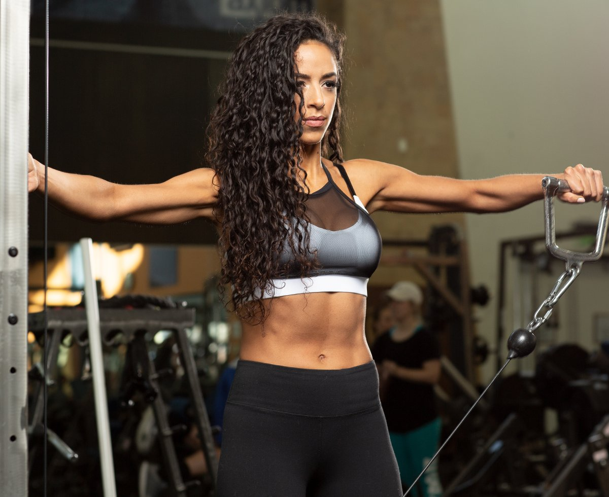

# Shoulder Workouts for Women: Add Shape and Size!

---

*Whatever your physique goals, these four workouts built around the best shoulder exercises for women can help you make it happen. Add muscle where you want it and build shape to enhance your overall physique!*

---

**Joanne Lee Cornish**  
July 26, 2021 • 9 min read

**Shoulder Workouts for Women | [Back Workouts for Women](https://shop.bodybuilding.com/blogs/training/back-workouts-for-women-build-the-shape-you-want) | [Leg Workouts for Women](https://shop.bodybuilding.com/blogs/news/leg-workouts-for-women-build-strong-sculpted-quads) | [Butt Workouts for Women](https://shop.bodybuilding.com/blogs/training/glute-workouts-for-women-get-a-bigger-butt) | [Arm Workouts for Women](https://shop.bodybuilding.com/blogs/training/arm-workouts-for-women-build-shape-size-and-strength) | [Upper-Body Workouts for Women](https://shop.bodybuilding.com/blogs/training/shape-building-upper-body-workouts-for-women) | [Strength Workouts for Women](https://shop.bodybuilding.com/blogs/training/these-workouts-are-how-strong-women-get-built)**

Whether you want to hit the stage, the beach, or just turn heads in a T-shirt, creating muscular and defined shoulders should be a high priority. Competitors must focus on it, but even if you're new to lifting, targeted shoulder training can give you some quick gains that will transform your physique in record time.

Adding mass to your quads or back is going to take time, but the three deltoid muscles of the shoulder are relatively small and even a tiny amount of muscle can make an enormous difference to any physique.

As a former Ms. Olympia competitor and a longtime trainer at Gold's Gym Venice, aka "the mecca," I've seen and performed countless shoulder workouts. These are some of my favorites, starting with a workout for beginners and moving on to a hardcore routine only for advanced ladies.

### What Every Woman Needs to Know About the Shoulder

The shoulder joint, also known as the glenohumeral joint, centers around the point where the humerus fits into an indentation on the scapula known as the glenoid cavity. Most of the muscles of the upper body connect around this joint, giving the shoulder a wide range of motion that is both a blessing and a curse.

Why a curse? Because your shoulder mobility can sometimes enable you to lift with seriously sketchy form, whether you realize it or not. More than almost every other body part, using the correct form and increasing your weight conservatively is essential for saving wear and tear on this joint! Nothing will impair your progress like a shoulder injury.

The deltoid itself is a triangular muscle group that covers the shoulder joint. It has three portions or "heads" with three distinct functions, although they all chip in to some degree on some of the best shoulder exercises, like presses.

**Anterior deltoid:** The anterior deltoid lifts the arm to the front and rotates the arm medially, or toward the midline of the body. The primary isolation movements for anterior delts are variations of front raises, which you can vary by using different hand positions—palms facing in, palms facing down, etc.

**Lateral deltoid:** The middle or lateral delt abducts the arm, orarm, or lifts it away from the body. Exercises for the lateral deltoid include any form of lateral raise, as well as an upright row—particularly with a wide grip.

**Rear deltoid:** The posterior or rear delt extends the arm behind the body and rotates the arm outward. Exercises for the rear deltoid include face pulls, rear delt flyes, and bent-over raises, among others.

**Outfit your home gym with [dumbbells](https://shop.bodybuilding.com/collections/dumbbells) and be ready for anything!**

## Shoulder-Building Workouts for Women

Unless we are involved in sports, day-to-day living rarely requires us to lift things above our head. If you are new to working out, please do not go straight into a heavy overhead press. Do a thorough warm-up with light weights—like 2-3 pounds for most women.

Here's my favorite warm-up for lifters of all levels!

### The Perfect Shoulder Warm-Up

**1. CIRCUIT**

Perform the exercises in order, resting as little as possible between exercises and sets.

**Standing dumbbell shoulder press**

3 sets, 5 reps (no rest)

**Dumbbell Lateral Raise**

3 sets, 5 reps (no rest)

**Dumbbell front raise**

3 sets, 5 reps (no rest)

**Bent-over dumbbell rear delt row**

3 sets, 5 reps (no rest)

## Beginner's Shoulder Workout for Women

Repeat this workout twice a week, with at least 72 hours in between each workout. Your form will start to feel locked in at about week 2 or 3, then you can start to increase the weights and use other variations of the same movements.

When you see the reps decreasing, it indicates an increase in the weight you should use. But remember, reps aren't a hard-and-fast rule—they're a guide. If the workout says 12 reps but you can get 3 more with good form, do the extra 3 reps. Then, increase the weight slightly during the next set. Alternately, if the sets say 12, but you can barely get 8, reduce the weight. Never sacrifice form for weight!

### Beginner's Shoulder Workout for Women

**1. Seated dumbbell shoulder press**

Increase the weight with each set, if possible.

4 sets, 12, 12, 10, 10 reps (rest 1 min.)

**2. Barbell front raise**

Increase the weight with each set, if possible.

4 sets, 12, 12, 10, 10 reps (rest 1 min.)

**3. Seated Dumbbell Side Raise**

Increase the weight with each set, if possible.

4 sets, 12, 12, 10, 10 reps (rest 1 min.)

**4. Reverse Pec-Deck**

Increase the weight with each set, if possible.

4 sets, 12, 12, 10, 10 reps (rest 1 min.)

**Trying to make the most of your beginner gains? A post-workout shake is a no-brainer. Earn it in the gym and enjoy!**

## Women's Overall Shoulder-Building Workout

This workout is for someone who isn't new to lifting, who wants to add quality size to each part of their deltoid, is pain-free, and understands good form. If you're wanting to add size, it'll help you do that, but if you're trying to slim down and just want your shoulders to stand out and look "toned," it fits the bill there, too.

Because this is an intense workout, I only recommend performing it once a week. Each time you do, I recommend switching variations of the same movement: dumbbell, machine, cable, barbell, and so on. No matter what movement you select, though, you should start with the same warm-up I used in the beginner's workout. Trust me: It works!

### Women's Overall Shoulder-Building Workout

**1. Seated dumbbell shoulder press**

Increase the weight across the first 4 sets. After each of the final 2 sets, perform a single dropset.

6 sets, 12, 10, 8, 8, 6, 6 reps (rest 90 sec.)

**2. Seated Dumbbell Side Raise**

Increase the weight across the first 4 sets. After each of the final 2 sets, perform a single dropset.

6 sets, 15, 12, 12, 10, 8, 8 reps (rest 1 min.)

**3. COMPOUND SET**

Perform the exercises in order, resting as little as possible between exercises and 1 min. between sets.

**Bent-over dumbbell rear delt row**

5 sets, 12, 10, 10, 8, 8 reps (no rest)

**Single-arm cable front raise**

5 sets, 12, 12, 10, 10, 10 reps (left side, no rest)

**Single-arm cable front raise**

5 sets, 12, 12, 10, 10, 10 reps (right side, rest 1 min.)

### Women's Width-Building Shoulder Workout

Make those shoulders pop by putting the focus on the lateral deltoids! You can do this workout for 4-6 weeks straight, or it may be one that you use every third shoulder workout, alternating it with some of the other workouts here.

### Women's Width-Building Shoulder Workout

**1. Smith machine shoulder press**

Increase the weight across the first 3 sets. If your shoulders can handle it, you can perform the presses behind your head.

5 sets, 15, 10, 8, 8, 8 reps (rest 1 min.)

**2. Dumbbell Lateral Raise**

Increase the weight across the first 4 sets. After each of the final 2 sets, perform a single dropset.

5 sets, 15, 12, 10, 8, 8 reps (rest 1 min.)

**3. SUPERSET**

Perform the exercises in order, resting as little as possible between exercises and 90 sec. between sets.

**Single-arm bent-over cable rear delt fly**

4 sets, 12, 12, 10, 10 reps (left side, no rest)

**Single-arm bent-over cable rear delt fly**

4 sets, 12, 12, 10, 10 reps (right side, no rest)

**Dumbbell front raise to lateral raise**

4 sets, 10-12 reps (rest 90 sec.)

**4. SINGLE-ARM CABLE LATERAL RAISE**

Perform all of the reps on one side before switching to the other side. Don't rest between sides and rest 1 min. between sets.

**Cable Lateral Raise**

4 sets, 12, 12, 10, 10 reps (left side, no rest)

**Cable Lateral Raise**

4 sets, 12, 12, 10, 10 reps (right side, rest 1 min.)

**High-volume shoulder training works better with the fatigue-fighting ingredients in the best [pre-workouts](https://shop.bodybuilding.com/collections/pre-intra-workout).**

### 

## Women's Advanced High-Volume Shoulder Workout

You're an experienced lifter, looking to shake up your shoulder workout and shock the muscles into some new development. Well, get ready!

This a personal favorite of mine, but it's a lot of work. You'll do eight exercises, totaling 40 sets, with both high and low reps. You can use this workout weekly for 4-6 weeks, or alternate it for every other shoulder workout with any of the other less-intense workouts here.

If you don't have access to a machine for lateral raises, either a resistance band or a single-arm cable raise will work. And on all moves, don't be afraid to lift lighter than you would for a workout with less volume.

### Women's Advanced High-Volume Shoulder Workout

**1. Seated dumbbell shoulder press**

Increase the weight across the first 4 sets.

5 sets, 20, 15, 10, 8, 8 reps (rest 90 sec.)

**2. Barbell front raise**

Use the same weight across all sets.

5 sets, 12 reps (rest 1 min.)

**3. Machine shoulder press**

Increase the weight across the first 4 sets.

5 sets, 20, 15, 10, 8, 8 reps (rest 90 sec.)

**4. Barbell upright row**

Use the same weight across all sets.

5 sets, 12 reps (rest 1 min.)

**5. Dumbbell Lateral Raise**

Increase the weight across the first 4 sets.

5 sets, 20, 15, 10, 8, 8 reps (rest 90 sec.)

**6. Standing crossed-cable rear delt fly**

Use the same weight across all sets.

5 sets, 10 reps (rest 1 min.)

**7. Barbell rear delt bent-over row**

Increase the weight across the first 4 sets.

5 sets, 20, 15, 10, 8, 8 reps (rest 1 min.)

**8. Machine Lateral Raise**

Use the same weight across all sets.

5 sets, 15 reps (rest 1 min.)