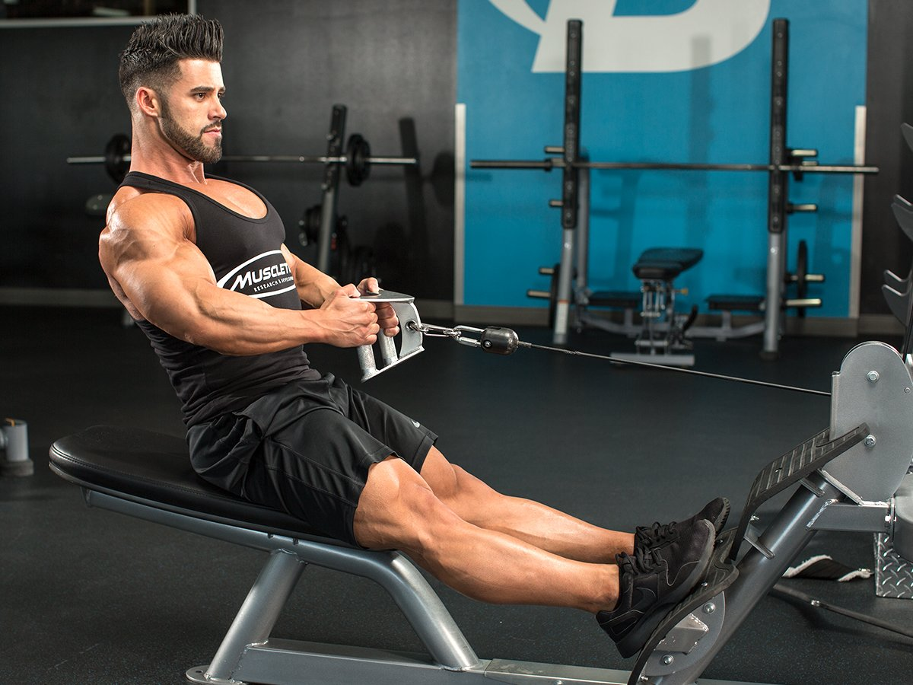

# The 5 Best Back Machines For Maximum Growth

---

*Want larger lats? Machines may be just what you've been looking for.*

---

**Roger Lockridge**  
 March 16, 2021 • 3 min read

Chest, shoulders, and arms are by far the most popular muscles to train, but the true sign of a beast in the gym is a massive, well-defined back. Wide lats with detailed knots in between leave no doubt in anyone's mind that—yeah, bro—you really do lift.

Basics like barbell rows, pull-ups, and deadlifts are all great options for building your back, but they're not the only options. Take machine work, for example: Machines can help you isolate an area and pack on more weight, while minimizing the risk of injury.

Many gyms are littered with back machines, but which ones produce the best results? I've put together my picks for the top five machines to help you take your back from good to great!

### **1. Assisted Pull-Up Machine**

This isn't a total knock on pull-downs, but let's face facts: Pull-ups are the superior back-building exercise. But what if you don't have the strength to do pull-ups on your own yet? In that case, this machine can be your greatest ally.

The assisted pull-up machine is literally designed to assist you in pulling yourself up, allowing you to focus on mastering form and completing reps. As you get stronger, progressively decrease the amount of assistance. Eventually you can start knocking out full pull-ups on your own.

**Tip:** Focus on the negative for building strength, using barely enough assistance to help you lift yourself back up for each repetition. Stay in the 8-10 rep range for 3-4 sets to build strength and mass while you work on form.

### **2. Pull-over Machine**

Dorian Yates won the Mr. Olympia six times in a row (1992-1997). Ever wonder why? Because when he turned around and hit a back pose, it was game over for the competition. His back was so awesome that he was nicknamed "The Shadow" because he had lats that could blot the sun.

Yates attributes the pull-over machine as a secret to his success. This machine helps you improve flexibility, get a deep stretch, and squeeze the lats hard on every rep. Try it and you'll see for yourself why Yates was such a "big" believer.

**Tip:** Since this is an isolation exercise, use it as a finisher on your big pull-up and deadlift days, aiming for 4 sets of 8-12 reps to squeeze as much blood as possible into those big back muscles.

### **3. T-Bar Row**

Many trainers forget the T-bar row is technically a machine movement. There is a pivot point preventing you from having total control of the weight, so it is not a "free" weight. Whether you shove the end of a bar in a corner or use a landmine or a station, the T-bar row is an excellent exercise to go heavy on.

If you use the free-standing version without the pad to lean on, your lower back benefits as well as your lats. Using a horizontal grip also targets the rhomboids, teres major, mid traps, and rear delts.

**Tip:** This is a chance to go super heavy on a row, so don't be afraid to pack on the weight and drop down to a 5x5 set-and-rep scheme to add massive weight and volume to your workout.

### **4. Low Seated Row**

I like the low version of the row machine because you can use different attachments to serve different purposes. The rope can help you pull in tighter and get a better contraction, the wide handle helps develop the upper back, and the close-grip handle helps you focus on the lats.

The low seated row is a versatile option for targeting any back-training weakness, so let it serve you in developing a well-balanced upper body.

**Tip:** Maintain your posture! It's easy to try to throw momentum into the seated row, but a stable spine guarantees you isolate those back details. Work in that same 8-10 rep range, but keep that extra squeeze on the contraction and slow negative to maximize all this machine has to offer.

### **5. Back Extension Machine**

If you want to work on that Christmas tree in the lower back, this is a great choice for isolating that area. If you suffer from lower back issues, this exercise can also help you strengthen that area while keeping you safe in a fixed line of movement.

You may not get the big muscle pump that you get from working your other major back muscles, but the lower back is not something to be ignored. Developing this area can help you reach your physique and performance goals.

**Tip:** Add lower back on your leg or chest day to help round out your core strength with antagonist training, building up that all-important lumbar region when your other big muscles are already gassed.