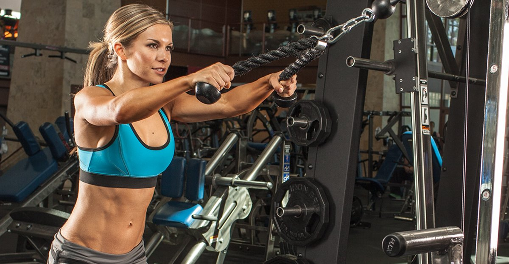
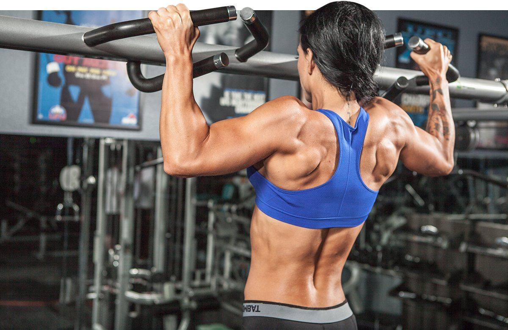
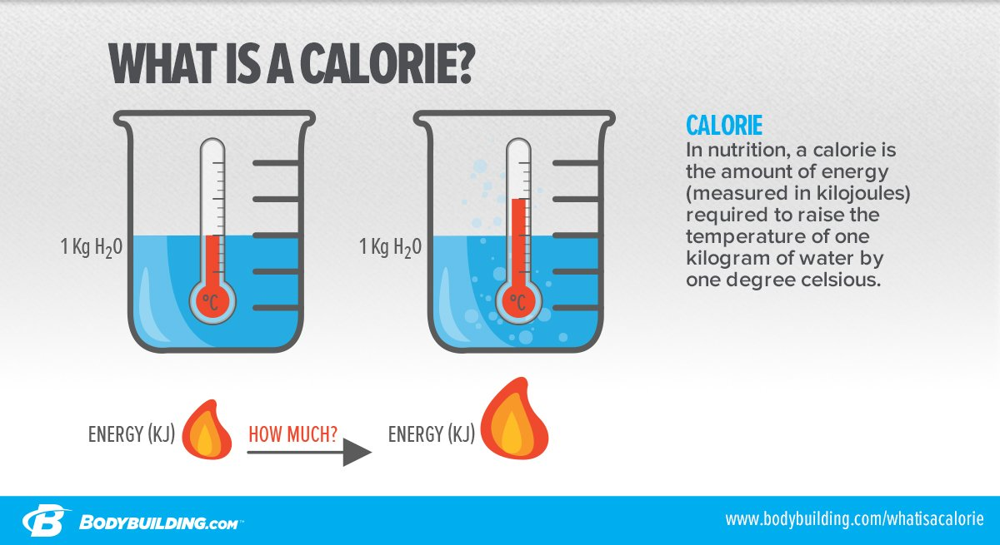

# Workouts For Women: Weight Training For A Better Body

---

*Here's all you need to know about weight training, nutrition, cardio, and supplements so you can walk into the gym and rock it!*

---

**Cassie Smith**  
 July 09, 2021 • 16 min read

Fitness can be intimidating. Even small, mom-and-pop gyms are usually full of weird-looking machines, equipment you don't know how to use, and unapproachable people lugging around milk cartons full of pink water. Most of us new to the world of weights will walk into a gym feeling immediately overwhelmed. There's so much going on it's difficult to even know where to begin!

That's when the non-scary elliptical calls your name. Your friendly neighborhood cardio machines have never failed you, so you jump on one and start swooshing. And that's where you stay, silently watching other people go about their awesome-looking workouts.

When you finally muster the courage to try some resistance training, you'll likely head over to the machines. You'll choose an open one, read the directions, and then try to copy whatever the model is doing in the pictures. "WTF am I doing?" you may ask yourself as you go through the motions. "Is this even right? I swear those directions don't make any sense. Good God, I hope no one is watching me!"

After your bout with the machines, you think about making your way to the dumbbell rack, but it's overrun with huge, muscle-bound guys doing their best to out-bro each other. Besides, what the hell would you even do once you had dumbbells in your hands?

If any of this sounds familiar, you're in dire need of a fitness overhaul! Thankfully, you've come to the right place. The Female Training Bible offers everything you need to walk into the gym with confidence so you can start building your happiest, strongest, best self.

Hundreds of thousands of women have followed this program and loved it so much, they’ve done it again and again. Now it’s your turn! Follow the full Female Training Bible program in BodyFit. You can track your workouts in the BodyFit app, swap out lifts to match your equipment, and watch demonstration videos of every movement in every workout!

We've done all the prep for you—all you have to do is follow along!

## Training: Weight Training For A Better Body

Many women worry that weight training will somehow transform them into Hulk-ettes, so they spend hours doing cardio in order to maintain their "feminine" figure. The truth is, women just don't have the hormonal support to gain muscle mass like men. The hormone testosterone is responsible for large increases in muscle mass. Women's testosterone levels are a fraction of men's. That means you can bench press without concerning yourself about how much chest hair you might grow.

There are women, typically professional bodybuilders, who look masculine. It takes many, many years of dedication and a particular lifestyle to achieve this sort of muscularity. Unless you have goals of becoming the next star in female bodybuilding, you don't ever need to worry about looking too masculine.

You're right about one thing, though: training with weights will increase your lean muscle mass. That's a good thing! The more muscle you have, the more calories your body will burn. The more calories you burn, the leaner you'll get. Increased muscle mass will also add shape to your arms, take inches from your tummy, and even add some roundness to your booty! When women's magazines talk about "tone," they're really talking about strong muscles.

### Curve Appeal: Your 12-Week Weight Training Program

This program is meant to improve your strength, muscle size, and conditioning simultaneously. Each four-week block will build upon the strength and skill you learn from the previous four weeks.

The general format for every workout is as follows:

#### 1. Warm-up

Each of your workouts should include a warm-up that will activate your muscles, prepare your central nervous system for the workout, and increase your blood flow to your muscles. It's also a great idea to do foam rolling before each workout. For leg workouts, roll the quads, hamstrings, IT band, piriformis, and calves. For upper-body workouts, roll the shoulder, chest, triceps, and biceps.

#### 2. Activation Movement for Speed and Mobility

This movement is done for 20 reps. You don't have to do all 20 reps in one set. Choose a set and rep scheme which will allow you to perform all 20 reps without feeling fatigued.

#### 3. Prime Movement for Muscle Strength

Each workout will include a prime, compound movement. You will perform these compound movements for 5 sets of 5 reps. Be sure to challenge yourself with weight. Prime movements should be heavier than assistance movements. Rest 1-2 minutes between sets.

#### 4. Assistance Work for Muscle Shape

These exercises will help add shape to your musculature. Perform them for 8-12 reps. There's no need to go ultra heavy while you perform these movements. Rest on all assistance movements should be as short as possible, but not so short that you must reduce the weight.

#### 5. Conditioning for Cardiovascular Health and Fat Loss

Your cardio will come in a couple different forms. On each day you train with weights, you'll do 20 minutes of high-intensity intervals. Choose an interval scheme that's challenging, but not impossible. Thirty seconds of all-out work, followed by 1 minute of recovery is usually a good place to start. One day per week, you'll do 30-45 minutes of low-intensity cardio. On these days, you can jump on your favorite cardio machine for some extra fat-burning.

### Must-Haves For Building Your Own Program

If you're a DIY kind of girl, you might want to build your own program. If that's the case, here's what every weightlifting regimen needs:

### Compound Lifts

Compound lifts are lifts that take more than one muscle group to perform. If you want to add some strength-building aspects to your program, be sure to include one or two of these compound lifts in every workout you do.

Along with helping you build lean muscle, these movements are important for increasing your athleticism, strength, mobility, and cardiovascular fitness. Because you use more than one muscle group to do these lifts, you need more energy (calories) to perform them.

Squats, for example, will give you more bang for your workout buck than leg press because you have to use more of your muscles and, therefore more energy, to do them.

#### Example Compound Lifts

* Squats
* Deadlift
* Lunges
* Pull-up
* Dips
* Bench press
* Push press
* Push-up

### Accessory Lifts

Accessory or isolation lifts are used as partners to compound lifts. Depending on the volume of your compound lift, you can add 2-4 accessory lifts per day.

Bodybuilding programs are often built on isolation movements. Isolation movements are single-joint exercises. These are used to increase the shape and size of a body part—if you want to improve your aesthetics, isolation lifts are perfect.

For example, if you'd like to isolate your biceps, then you'd do biceps curls. To isolate your calves, you'd do exercises like calf raises which exclusively target your calf muscles.

For more exercises and how to perform them properly, check out our Exercise Database!

#### Example Accessory/Isolation Lifts

* Biceps curl
* Triceps extension
* Triceps push-down
* Calf raise
* Leg curl
* Leg extension
* Front raise

### Choosing Sets and Reps

The bodybuilder standby for sets and reps is usually 3-4 sets of 8-12 reps. That's usually the right rep range for muscle growth (hypertrophy). If you're a beginner, make sure your first rep looks just like your last rep. If you fail on the 8th rep, use lighter weight. If you're unfamiliar with many of the movements, stick with lighter weight until you have a great foundation and feel comfortable challenging yourself; this will help you avoid injury.

Shape is great for your muscles, but strength is also important. To work on your strength, do heavier compound movements in the 4-6 rep range. Traditionally, compound lifts are done with fewer reps and isolation/accessory movements are done with lighter weight for more reps.

### Rest

The less time you rest between sets, the more difficult and intense your workout will be. Short rest periods (30-45 seconds) will tax your muscles and your cardiovascular system. Longer rest periods (1-2 minutes) will give you more time to recover before you hit your next set.

### Progression

Progression is the secret ingredient for every successful training program. It's the reason your body changes over time. You can't do the exact same movements using the exact same weight for weeks and weeks and weeks and expect new results. You have to constantly push yourself. Once you develop a solid base, increase the weights, increase the reps, or decrease the rest periods.

### Cardio

Your cardio regimen should depend entirely on your goals, likes, and dislikes. Here are some options:

#### High Intensity Interval Training (HIIT)

HIIT cardio is the most effective for fat-burning, and it's actually really easy to do. Choose a cardio machine, a piece of equipment like a Kettlebell, or just use your bodyweight. The point is to do intervals of movement as intensely as you can. At first, go for something like 30 seconds of work followed by one minute of rest. Do these intervals for 20 minutes. As you get better, you can increase the work time and decrease the rest time.

#### Weight Training

If you *loathe* cardio and don't want to go anywhere near a treadmill, you can still burn fat effectively. Decrease your rest periods during weight training. If you generally rest 90 seconds between sets, start resting just 60 seconds. The minimal rest will keep your heart rate up and help your body use more energy.

#### Low Intensity Steady State (LISS)

This is probably the most popular form of cardio for most women. Who hasn't spent 30 minutes on the elliptical? However, LISS may not be the most effective way to burn fat. LISS is often utilized by bodybuilders or other competitors on extremely low-carb diets who just don't have the energy to do 20 minutes of high-intensity cardio.

#### Endurance Training

If you want and like to run, then you'll definitely want some long-duration rides or runs in your program. If you're training for a marathon, half marathon, or even a 5k, do your long runs on days that you're not lifting. That way, you'll have maximum energy to put into your training.

## Nutrition: Food For A Better Body

Most people dread the word "diet" because it dredges up images of celery stick buffets and long lists of no-no foods. While it's hard to shake this negative association, it's important to learn that "diet" isn't a bad word. Before the media beat its true definition to a bloody pulp, a diet was simply any and all foods consumed by a person. Your diet, or the food you eat, is a crucial aspect to supporting your fitness goals.

The nutrition section of most weight training guides will try to shove a boilerplate nutrition plan in your face, but that's not how we roll. We want to instill the idea that—metabolically and physiologically—your body is unique. What works for someone else may not work for you. Understanding how your own body works and discovering your dietary needs are important concepts to remember as you form your own nutritional strategy.

### All About Calories

Calories are essentially food energy that your body uses to power its daily functions like breathing, regulating your heartbeat, digestion, and so on. The number of calories a food provides depends on its makeup. Every food is made of a combination of carbohydrates, protein, and fat. Collectively, these are called "macronutrients."

Everybody requires a minimum number of calories to, well, live. This minimum number is called the basal metabolic rate (BMR) and can be influenced by the amount of lean muscle mass a person has. The overall number of calories your body uses on a daily basis is the sum of your BMR and additional calories you use walking, standing, sleeping, exercising, driving, and even laughing. Altogether they comprise the total energy expenditure (TEE), or your daily caloric needs.

Everybody's TEE is a little different, so a diet which works for your BFF may not work for you. Generally, men have a higher TEE than women because they have more muscle mass.

### Macronutrients, Baby!

The three macronutrients are: protein, carbs, and fat. Together they make up all the calories, or food energy, in the food you eat. They're important to distinguish because each has a different role in the body.

#### Protein

Protein is a key component to building lean muscle and transforming your body. No, eating more protein won't suddenly make your muscles huge. Building lean muscle though, is essential to that "toned" look everybody's going for. Protein is made up of amino acids, which are the body's building blocks for a number of functions, including making muscle protein.

Lifting weights causes stress and damage within muscle fibers, which then need to be repaired. This see-saw of muscle breakdown (catabolism) during exercise and repair (anabolism) during rest help you become stronger and fitter overtime.

The general guideline for an active individual's intake of protein is about one gram of protein per pound of bodyweight. If you weigh 135 pounds, you would aim to eat approximately 135 grams of protein. Since it's difficult to consume that much protein in two or three meals, people tend to spread it out over multiple meals and ensure that some form of protein accompanies every meal.

Each gram of protein provides 4 calories.

**Good Sources of Protein:**

* Lean meats
* Eggs
* Milk
* Greek yogurt
* Quinoa
* Nuts
* Beans
* Soy

#### Fat

**Poor fat:** so misunderstood and neglected. Dietary fats got a bad rap due to a major landmark study from the 80s that—very erroneously—concluded dietary fats promote incidences of heart attacks and other illnesses. As a result of this, the government promoted eating as little fat as possible and corporations rolled out their fat-free and reduced fat foods to save everyone from their exploding hearts.

In reality, fats demand a rightful spot on your plate; they are integral to maintaining optimal health. After all, they are a macronutrient that your body *needs* to function. Essential fatty acids (EFAs) like omega-6 and omega-3s help keep you feeling full, cushion vital organs, assist with absorbing fat-soluble vitamins, maintain proper brain cognition and development, and are responsible for a slew other benefits.

The only fat you should avoid is trans fat, which the food industry adds to food to extend shelf life. Check food labels for any form of "hydrogenated oils;" this immediately marks a food product as something you shouldn't eat. Keep dietary fats in; throw trans fats out!

Moreover, fat does not make you fat. The notion that ingested fat quickly buries itself into your tissues has long been debunked. Gaining weight is normally attributed to eating *too many* calories, more than what your body knows to do with.

Each gram of fat provides 9 calories.

**Good Sources of Fat:**

* Avocados
* Olive oil
* Coconut oil
* Grassfed butter/Ghee
* Nuts

#### Carbohydrates

Carbohydrates are another macronutrient which shares fat's bad reputation. Despite what many people would have you believe, carbs are not evil.

Carbohydrates constitute all sugars, including single-molecule simple sugars and double compound sugars. When three or more sugar molecules are strung together, they form complex carbohydrates in foods like potatoes, oatmeal, broccoli, and myriad vegetables.

The majority of your carbohydrates should come from these complex carbs because they take a little longer to digest, making you feel fuller for longer, and don't raise blood sugar as quickly as simple sugars. The added bonus is that complex carbs pack a whole lot of nutritional love in the form of vitamins, minerals, and fiber. Both simple and complex carbs have a place in your diet, but long-term success in managing blood sugar levels and weight can depend on limiting your intake of simple sugars.

Each gram of carbohydrates provides 4 calories.

**Good Sources of Carbs:**

* Oatmeal
* Vegetables like broccoli, spinach, potatoes
* Bananas
* Berries
* Brown rice
* Yogurt
* Low-fat milk

### Should I go low carb to lose weight?

One popular recommendation for weight loss is going "low carb." The range for what exactly constitutes low-carb varies among different individuals, but in general the target range runs between eating fewer than 50-150 grams of carbs per day. Fifty grams of carbs is equal to about one cup of raisin bran cereal or two slices of bread. It's not difficult to hit that target in one meal, or even a snack. To replace your carb-noshing habits, you'd have to include higher amounts of good fats and protein in your diet.

While many people advocate eating a low-carb diet for weight loss, it's not always ideal. Weight loss may come easily at first, but chronically low amounts of carbohydrates could have negative downstream effects in the long run. A woman's delicately balanced hormone system can be disrupted by low carb availability, which could bring about unwanted side effects like loss of bone density and chronic sleep deprivation. On a low-carb diet, some women may experience stopped or irregular periods because the body perceives chronically low energy levels as starvation and stress.

That said, some women can thrive on a low-carb diet. If you want to experiment with low carbohydrates, it's important to monitor your body's response closely.

### Your Body Type and Your Nutrition

The ratio of how many calories you get from proteins, carbs, and fats is important to your body composition. The general macronutrient composition split is 40 percent carbs, 30 percent fat, and 30 percent protein, but that ratio doesn't work for everybody. For a more accurate and personal macronutrient ratio, it's a good idea to figure out your body type. An individual's body type is more than just physique; it provides crucial information on how your body responds to and processes the macronutrients.

Body types are classified into three categories:

#### Ectomorph

* In general, ectomorphs are lean with smaller bone structures and limbs, have a high metabolism, and can tolerate higher amounts of carbohydrates.
* They look like: long-distance runners
* Recommended macronutrients ratio: 50% carbohydrates, 30% protein, 20% fat

#### Mesomorph

* Mesomorphs tend to marry the best of both worlds, offering balanced abilities to gain muscle and stay lean relatively easily. They are of medium sized bone structure and look athletic.
* They look like: bodybuilders, gymnasts
* Recommended macronutrients ratio: 40% carbohydrates, 30% protein, 30% fat

#### Endomorph

* Endormorphs are built to be larger and more powerful. They tend to have larger bone structures for strength. Because of their size, they do better on a higher fat and a lower carbohydrate intake.
* They look like: powerlifters
* Recommended macronutrients ratio: 25% carbohydrates, 35% protein, 40% fat

Rarely do people fit perfectly in these boxes. People often display mixed characteristics.

### Portion Control

Calorie counting is a popular technique to keep track of portion sizes and the amount of calories in them. This meticulous record-keeping of daily food intake certainly has its benefits, but who wants to maintain spreadsheets of their food for the rest of their lives?

Calorie counting should not be a life-long endeavor. It just doesn't effectively work in the long term. Studies show that calorie counting is prone to inaccuracy by upward of 25 percent—even if you triple-check your calculations and sources! The discrepancy arises from measurement errors on food labels, serving sizes and measurements which are impossible to reproduce consistently, different food quality, and a whole lot of guesswork.

A more manageable way to track your eating habits is to identify reasonable portion sizes. Most restaurants in America shove heaping piles of food in your face to appeal to your economical compass. More food means more value for your money, right? Getting more Bang Bang Chicken and Shrimp for your buck merely means you pay for it elsewhere, like your waistline. And it's not just at restaurants. People pile their plates high with Grandma's spaghetti even when they're at home.

Studies have shown that when given enormous food portions, people will override their internal satiety systems and gobble up every last morsel long after they "feel" full—and not really realize they're doing it.

#### Get a Handle on Portion Control

Eating until you feel "full" is not always the best way to determine your portion sizes. Instead, we recommend using the most convenient and personalized measurement tool at your disposal: your hands

* Use your palm to determine your protein intake
* Use your balled fist to determine your vegetables
* Use your cupped hand to determine your carbs
* Use your thumb to determine your fat

Assuming you eat approximately four meals per day, here's the portion recommendation at each meal:

#### For Ectomorphs

* 2 cupped hands of carbs
* 1 palm of protein
* 1 balled fist of veggies
* 1/2 thumb of fat

#### For Mesomorphs

* 1 cupped hand of carbs
* 1 palm of protein
* 1 balled fist of vegetables
* 1 thumb of fat

#### For Endomorphs

* 1/2 cupped hand of carbs
* 1 palm of protein
* 1 balled fist of vegetables
* 2 thumbs of fat

These are good general guidelines because your hands are proportional to your body size. Be flexible and adjust your portions according to how you feel and the way you look. For example, if you've been gaining unwanted weight, try reducing your carbs to half of your cupped hands per meal and your fat to half of your thumb.

### Meal Frequency

Whether you eat many small meals throughout the day or wolf down all your food in two meals, meal frequency should revolve around your schedule and what's comfortable for you. As long as you get in the right foods in the right amounts any way you can, when you eat is simply a matter of preference.

#### Example: One-Day Meal Plan for a 125-pound Female Mesomorph

**Breakfast**

* Egg Whites 5
* Oatmeal 1/2 cup

**Morning Snack**

* Protein Shake 1 scoop with water
* Apple (medium) 1

**Lunch**

* Lean Meat (poultry, beef, fish, etc.) 4 oz
* Brown Rice 1/3 cup
* Green Vegatables 1 cup

**Post Workout**

* Protein Shake 1 scoop with water
* Almonds (or cashews, peanuts, walnuts, etc.) 1 oz
* Banana 1

**Dinner**

* Lean Meat (poultry, beef, fish, etc.) 4 oz
* Green Vegatables 1 cup
* Avocado 1/3

**Snack**

* Protein Shake 1 scoop with water
* Peanut Butter (or almond butter) 1 tbsp

## Supplements: For A Better Body

Primarily, your diet should consist of whole foods. Sometimes, though, you can't get all the necessary nutrients from eating whole foods—even if you think your diet is perfect. That's where supplements swoop in. Supplements should complement your diet of whole foods; they should never be a replacement for something you intentionally leave out of your diet.

### The Basics

We know! The list of available supplements is long and confusing! Here are the three most basic products that every healthy woman should take, no matter her fitness level:

#### Multivitamin

A basic multivitamin offers the full gamut of nutrients your body needs. The dosage amount for each nutrient can vary greatly from brand to brand. It's worth exploring the multivitamins made specifically for women; we tend to have a greater deficiency in nutrients like folate, vitamin B12, and iron.

#### Fish Oil

Fish oil supplementation is generally safe for everyone. Study after study has promoted the benefits of having high Omega-3 fatty acids in our diet. More importantly, fish oil supplements provide us with EPA (eicosapentaenoic acid) and DHA (docosahexanoic acid) fatty acids, which are star players in cognitive health and development.

Research suggests that DHA and EPA have positive effects on lowering the risk of various cancers, help prevent neural degenerative diseases like Alzheimer's, keep chronic, harmful inflammation at bay, and may even improve insulin sensitivity. Really, there's no reason *not to* take fish oil supplements.

#### Protein Supplement

The protein demands of a heavily worked body can be hard to stomach—literally. A sizeable five-ounce portion of chicken breast contains approximately 30 grams of protein. For a 130-pound woman, getting enough protein means eating the equivalent of more than a pound of chicken each day!

Instead of wolfing down chicken after chicken, a protein shake which offers 25 grams of protein per serving really comes in handy. Shakes offer convenience, they taste great, and can be used in a variety of smoothie and baking recipes for an added oomph of protein.

### Advanced Supplements

Once you think you've established a regular pattern of healthy eating and supplementation, you might want to consider graduating to these more advanced performance supplements to support your fitness goals.

#### Branched Chain Amino Acids

Just as protein forms the building block of muscle, branched chain amino acids (BCAAs, for short) are essential building blocks of protein. The three BCAAs are leucine, isoleucine, and valine. These three amino acids help provide the basis for protein synthesis, and research shows that consuming BCAAs before a workout can increase protein uptake into muscle tissue and improve post-workout recovery.

BCAAs are also a low-calorie, low-carb option instead of sports drinks. Adding five grams of BCAAs in and around your training can help reduce muscle breakdown and support muscle recovery and repair.

#### Probiotics

Each one of us is flush with billions of bacteria in our digestive tract. Yay for bacteria! Good bacteria helps your body digest your food and absorb nutrients much more effectively.

With probiotics, you usher in healthy, beneficial flora. You may find these good bacteria labeled as *Lactobacillus* and *Bifidobacterium* on the labels of yogurt, kefir, fermented foods, and on high-quality probiotic capsules. Make sure the supplement is from a reputable brand!

#### Vitamin D

While your body naturally produces vitamin D when you're under the sun, you're likely vitamin D deficient, especially if you have an office job or live in a region in which sunshine is a rare luxury. This deficiency affects overall health, and some studies suggest it may even hamper athletic performance and recovery from exercise. If you can't get enough vitamin D from the sun or from your diet, taking a supplement would be the next best thing.